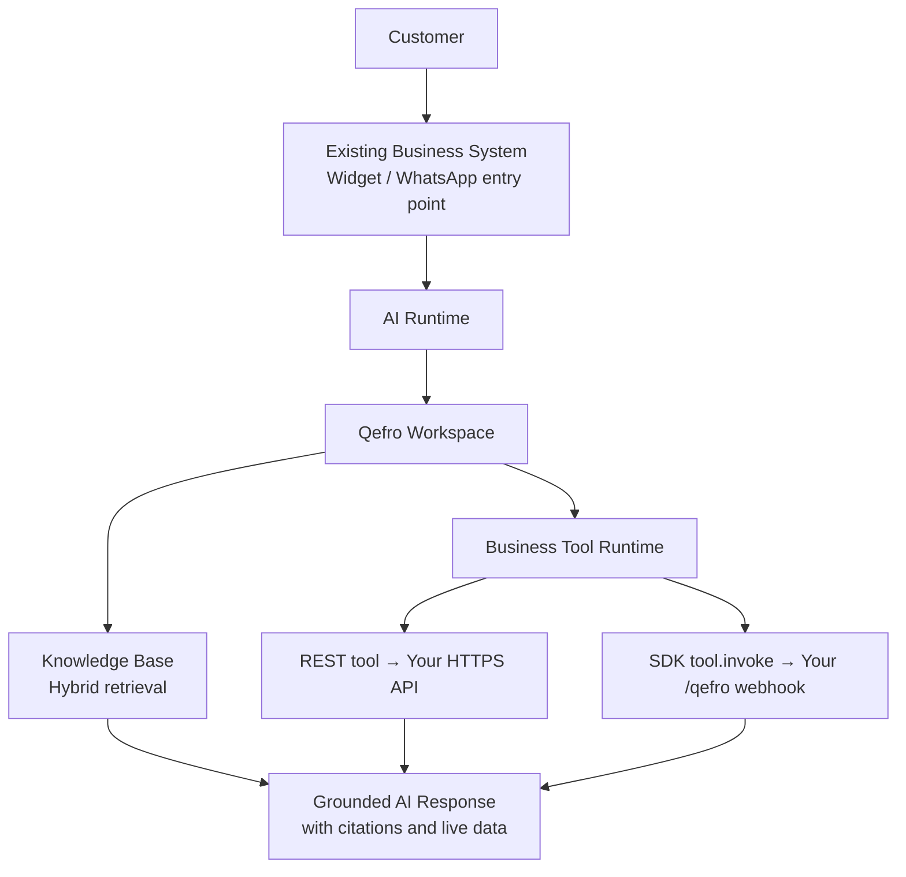

Your business already runs on a CRM, an ERP, a helpdesk, or a homegrown platform. Qefro is designed to plug into that stack — not replace it. This guide compares the two supported integration paths for **Business Tools** — **REST / OpenAPI** and the official **JavaScript and Rust Backend SDKs** — with working code for both so you can pick the right one for your team.

<!-- truncate -->

## Why Integrate with Qefro?

Most companies that adopt AI-powered customer support already have systems that hold the answers customers need:

- **CRM** — customer records, account history, ownership
- **ERP** — orders, inventory, invoicing
- **Helpdesk** — tickets, macros, resolution history
- **Internal dashboards** — operational and support tooling
- **Ecommerce platforms** — carts, orders, returns
- **Customer portals** — self-service account management
- **Mobile apps** — in-app support surfaces
- **Desktop applications** — point-of-sale and back-office software

Replacing any of these to add AI would be expensive and risky. Instead, Qefro integrates *with* them. The [Knowledge Base](/docs/platform/knowledge-platform) answers policy and FAQ questions from your documents, and [Business Tools](/docs/business-tools) let the assistant **execute real actions** in your systems — "Where is order ORD-1002?", "Create a ticket", "Cancel my subscription" — with live data from your APIs.

:::info
The AI never calls your APIs directly. Every action flows through the shared [Business Tool Runtime](/docs/business-tools/runtime), which validates parameters, applies encrypted credentials, and logs every invocation — whether the tool is REST or SDK.
:::

## Two Integration Approaches

There are two supported ways to connect your backend, and both register Business Tools in the same workspace and execute through the same runtime. The difference is **how Qefro reaches your backend**:

1. **REST / OpenAPI** — Qefro acts as the HTTP client and calls your existing HTTPS API directly. Configure a tool manually or bulk-import an OpenAPI 3.x spec.
2. **Backend SDK** — the official **JavaScript** (`@qefro-ai/backend`) or **Rust** (`qefro-backend-sdk`) framework runs *in your backend* and exposes one signed webhook (`POST /qefro`) that Qefro calls.

As a rule of thumb: use **REST** when you already have HTTPS endpoints and operations are CRUD-like. Use the **SDK** when customer authentication (OTP, login), multi-step workflows, or organization logic belongs in your code.

## Option 1: REST API

With a REST Business Tool, Qefro calls your API — it substitutes URL parameters, applies the encrypted credential, validates schemas against your `input_schema`, and logs every call. If your platform exposes an HTTPS endpoint, it can become a Business Tool.

Benefits:

- **Works with any language** — your API can be Python, Java, C#, Go, PHP, anything that serves HTTPS
- **OpenAPI compatible** — import an OpenAPI 3.x spec to bulk-create tools from existing operations
- **Easy to debug** — dry-run tools from the Admin Console or with `curl`, inspect execution logs per call
- **Suitable for microservices** — each service exposes its own endpoints; each becomes its own tool
- **Ideal for existing systems** — no new dependency, no redeploy; point Qefro at what you already run

### Defining a REST tool

A manual REST tool is method + URL template + JSON Schema. Path placeholders like `{order_id}` map to `input_schema` properties that the LLM fills from conversation:

```text
GET https://api.example.com/orders/{order_id}
```

```json
{
  "type": "object",
  "properties": {
    "order_id": { "type": "string", "description": "Order ID such as ORD-1001" }
  },
  "required": ["order_id"]
}
```

Remaining parameters become the query string on `GET` or the JSON body on `POST`/`PUT`/`PATCH`. Invalid LLM parameters are rejected by input validation *before* they ever reach your API.

### Testing with curl

You can dry-run any tool with sample arguments through the Admin API:

```bash
curl -sS -X POST \
  -H "Authorization: Bearer $ADMIN_JWT" \
  -H "Content-Type: application/json" \
  https://api.qefro.com/api/v1/tools/$TOOL_ID/test \
  -d '{"arguments": {"order_id": "ORD-1001"}}'
```

And review what actually happened in production:

```bash
curl -sS -H "Authorization: Bearer $ADMIN_JWT" \
  https://api.qefro.com/api/v1/tools/$TOOL_ID/logs
```

### Authentication

Each REST tool has one auth mode. Qefro stores the credential encrypted and applies it only at execution time:

| Mode | Outbound behavior | Use when |
| --- | --- | --- |
| `NONE` | No credential header | Public read APIs |
| `API_KEY` | `X-API-Key: <secret>` | Vendor / internal service keys |
| `BEARER_TOKEN` | `Authorization: Bearer <secret>` | Service-account bearer tokens |
| `END_USER_IDENTITY` | Forwards the signed-in customer's JWT | Customer-scoped APIs on the Widget |

`END_USER_IDENTITY` is the key one for customer-facing actions: when your app calls `widget.identify()` with a user JWT, Qefro forwards it as `Authorization: Bearer` on the outbound call, and **your API validates it** — Qefro never becomes your identity provider. See [Identity forwarding](/docs/business-tools/identity-forwarding).

:::note
Only HTTPS URLs are accepted, and the runtime rejects private IPs and cloud metadata hosts (SSRF protection). Secrets live encrypted in Qefro — never in widget JavaScript or in OpenAPI specs you upload.
:::

## Option 2: Official SDK

The Backend SDK inverts the model: instead of configuring HTTP calls in the console, you register **tool handlers in code**, running in your own backend. Qefro discovers them over one signed webhook using four protocol messages — `ping`, `tools.list`, `tool.invoke`, and `tool.resume`. Qefro currently provides two official SDKs:

- **JavaScript SDK** — [`@qefro-ai/backend`](https://www.npmjs.com/package/@qefro-ai/backend) for Node.js and TypeScript
- **Rust SDK** — [`qefro-backend-sdk`](https://docs.rs/qefro-backend-sdk) for async Rust on Tokio

Both target feature parity, so choosing one is a question of your stack, not of capability. The SDK shines where REST gets awkward: customer lookup and authorization (OTP inside chat, via challenge/resume), multi-step workflows, and business rules that span several internal services.

## JavaScript Example

Install the SDK and set the signing secret shared with the Admin Console:

```bash
npm install @qefro-ai/backend
export QEFRO_SIGNING_SECRET="your-signing-secret"
```

Then create the app, register a tool handler, and listen on the webhook path:

```typescript
import { Qefro } from '@qefro-ai/backend';

// Verify incoming webhook signatures with the shared secret
const app = new Qefro({
  signingSecret: process.env.QEFRO_SIGNING_SECRET!,
});

// Register a Business Tool handler — discovered via Sync Tools
app.tool(
  {
    name: 'order_status_check',
    description: 'Look up order by ID when customer provides order_id.',
    auth: 'none',
    input_schema: {
      type: 'object',
      properties: { order_id: { type: 'string' } },
      required: ['order_id'],
    },
  },
  async (ctx) => {
    const orderId = String(ctx.parameters.order_id).toUpperCase();
    return orderService.getStatus(orderId);
  },
);

// One signed webhook handles ping, tools.list, tool.invoke, tool.resume
await app.listen({ port: 8088, path: '/qefro' });
```

Deploy, then in the Admin Console create an **SDK Connection** (webhook URL + signing secret), hit **Test Connection**, and run **Sync Tools** to register the handlers into your workspace. Full walkthrough: [Register SDK Business Tools](/docs/guides/register-sdk-business-tools).

:::tip
When a customer must prove who they are *inside the chat*, add a Customer Provider with `app.customer({ lookup, authorize })`. Your `authorize()` can return a `challenge` (e.g. email OTP), and Qefro relays the code and resumes the tool via `tool.resume` — no login page required. See [Challenge / Resume](/docs/business-tools/challenge-resume).
:::

## Rust Example

Add the dependencies:

```toml
[dependencies]
qefro-backend-sdk = "1"
tokio = { version = "1", features = ["macros", "rt-multi-thread", "signal"] }
```

The same handler, fully async on Tokio:

```rust
use qefro_backend_sdk::{ListenOptions, Qefro, QefroConfig, ToolAuthMode, ToolMetadata};
use serde_json::json;

#[tokio::main]
async fn main() -> anyhow::Result<()> {
    // Verify incoming webhook signatures with the shared secret
    let app = Qefro::new(QefroConfig::new(std::env::var("QEFRO_SIGNING_SECRET")?));

    // Register a Business Tool handler — discovered via Sync Tools
    app.tool(
        ToolMetadata {
            name: "order_status_check".into(),
            description: Some("Look up order by ID when customer provides order_id.".into()),
            auth: ToolAuthMode::None,
            input_schema: Some(json!({
                "type": "object",
                "properties": { "order_id": { "type": "string" } },
                "required": ["order_id"]
            })),
            ..Default::default()
        },
        |ctx| async move {
            Ok(json!({
                "order_id": ctx.parameters.get("order_id"),
                "status": "shipped"
            }))
        },
    );

    // One signed webhook handles ping, tools.list, tool.invoke, tool.resume
    let handle = app.listen(ListenOptions { port: 8088, host: None, path: None }).await?;
    println!("listening on {}", handle.url);
    tokio::signal::ctrl_c().await?;
    handle.close().await;
    Ok(())
}
```

Every incoming request is HMAC-SHA256 signed (`X-Qefro-Signature`, `X-Qefro-Timestamp`); the framework verifies signatures and routes protocol messages so you only write handlers.

### Why teams prefer the SDKs

- **Type safety** — tool definitions and handler contexts are checked at compile time
- **Built-in authentication** — signature verification and challenge/resume orchestration are handled for you
- **Better developer experience** — handlers live next to your domain code, with autocomplete and typed errors
- **Cleaner code** — no webhook plumbing; `app.listen()` covers the whole protocol
- **Easier upgrades** — add or rename a handler, redeploy, re-run Sync Tools
- **Automatic serialization** — return structured JSON; the runtime maps it into chat safely

## REST API or SDK?

| Feature | REST API | JavaScript SDK | Rust SDK |
| --- | --- | --- | --- |
| Learning curve | Low — configure existing endpoints | Low — familiar npm workflow | Moderate — requires async Rust |
| Boilerplate | None in your code (config in console) | Minimal — handlers only | Minimal — handlers only |
| Type safety | Your API's — Qefro validates JSON Schema | Full TypeScript types | Full compile-time types |
| Language support | Any language that serves HTTPS | Node.js / TypeScript | Rust |
| Performance | One HTTP hop | Webhook + your handler logic | Webhook + zero-cost async handlers |
| Ease of use | High for CRUD; awkward for multi-step | High, incl. OTP / challenge flows | High, incl. OTP / challenge flows |
| Best use case | Existing APIs, vendor SaaS, OpenAPI specs | Node/Next.js/Express backends with auth flows | Axum / Actix / Tokio services with auth flows |

Real products mix both: core domain logic in SDK handlers, vendor APIs (Stripe, Shippo) as REST tools. See [Mixed integrations](/docs/business-tools/mixed-integrations).

## Example Architecture

Whichever path you choose, the flow through the platform is the same:



The workspace enforces tenancy, the knowledge base supplies grounded facts, the tool runtime executes actions against your systems — and the response flows back to whatever channel your customer is already using.

## Best Practices

A few rules that hold regardless of the integration path:

- **Store API keys securely** — REST tool secrets and SDK signing secrets are encrypted at rest in Qefro; on your side, use environment variables or a secret manager, never source control.
- **Never expose secrets in frontend code** — widget JavaScript is public; credentials belong in tool config or your backend only.
- **Use HTTPS** — the runtime rejects plain-HTTP tool URLs outright.
- **Handle API errors gracefully** — return clear error shapes; the runtime maps them to user-safe text, and the REST executor retries transient failures with bounded backoff (design writes to be idempotent).
- **Rotate credentials regularly** — rotate REST secrets via the Admin Console and SDK signing secrets per connection; each connection has an Enabled kill switch.
- **Prefer SDKs for new projects** — typed handlers and native OTP/challenge flows beat hand-rolled auth endpoints.
- **Use REST for unsupported languages** — any HTTPS API can be a tool, no SDK required.

:::tip
Importing an OpenAPI spec is like granting broad API access: always preview the operations and deselect `DELETE`, bulk-export, and admin paths before applying. See [Import OpenAPI](/docs/guides/import-openapi).
:::

## Which Should You Choose?

**Use the REST API when:**

- Your backend is in a language without an official SDK (Python, Java, Go, C#, PHP, …)
- You're building microservices and each already exposes clean CRUD endpoints
- You're connecting existing enterprise systems or vendor SaaS APIs — especially with an OpenAPI spec to import

**Use the JavaScript SDK when:**

- You're building Node.js services
- You're integrating Qefro into Next.js applications
- You're adding tool handlers alongside existing Express APIs

**Use the Rust SDK when:**

- You're building high-performance backends where latency and throughput matter
- You're using Axum for your API layer
- You're using Actix for your web services
- You're already on the Tokio async runtime

And whenever customers must log in or verify via OTP *inside the chat*, prefer the SDK — challenge/resume is native there, while REST would force you to build and orchestrate your own OTP API.

## Conclusion

Both integration paths lead to the same place: the same workspace, the same Business Tool runtime, and grounded answers backed by your knowledge base and live systems. **REST** offers universal compatibility — any HTTPS API in any language becomes a tool, with OpenAPI import for bulk onboarding. The **JavaScript and Rust SDKs** provide the best developer experience — typed handlers, signed webhooks, and native customer authentication flows.

There is no wrong choice, only the one that fits your stack. If you already have an API, register it as a REST tool and confirm the flow with the console's Test Tool. If you're writing new Node.js or Rust code — or need OTP in chat — start with the SDK. For the full decision matrix, see [REST vs Backend SDK](/docs/business-tools/rest-vs-sdk).
