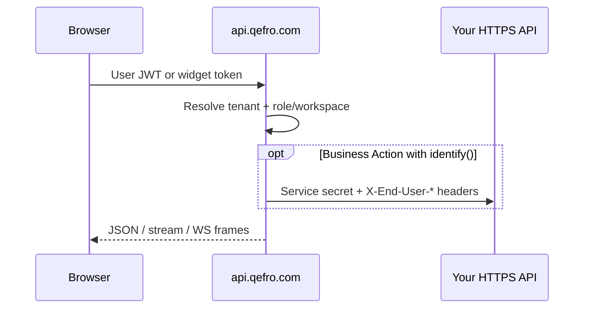

import {
  InfoBox,
  Warning,
  RelatedTopics,
  FaqAccordion,
  WorkflowCard,
  ApiEndpointCard,
} from '@site/src/components';

# API Authentication

All API traffic is **HTTPS** to `https://api.qefro.com`. Qefro uses different credentials for different trust boundaries — do not reuse an Owner JWT inside the public website.

## Short definition (citation-ready)

> Qefro authenticates Admin Console and Internal Portal callers with user JWTs, the website widget with a publishable widget token, Business Tools with optional end-user headers (`X-End-User-Token` / `X-End-User-Session`), and platform operators with Super Admin credentials.

## Credential matrix

| Client | Credential | How it is sent |
| --- | --- | --- |
| Admin Console / Internal Portal / most REST | User JWT | `Authorization: Bearer <user_jwt>` |
| GraphQL (`POST /graphql`) | User JWT | Same Bearer header |
| Website Widget (HTTP + WS) | Widget token | `Authorization: Bearer <widget_token>` or WS `?token=` |
| Business Tools (end user) | End-user JWT or session | `X-End-User-Token` and/or `X-End-User-Session` |
| Super Admin | Admin JWT | From `POST /api/v1/admin/auth/login` |
| Metrics (optional) | `METRICS_AUTH_TOKEN` | `Authorization: Bearer …` when not public |

Platform conceptual overview: [Platform Authentication](/docs/platform/authentication).

## Architecture



## 1. User JWT (members & admins)

Signup, login, OTP verification, and password reset are primarily exposed through **GraphQL** on `POST /graphql` (Admin Console). After login you receive a Bearer JWT scoped to a tenant and role (`owner` / `admin` / `member`).

```bash
# Example: call a REST route with a console user JWT
curl -sS -H "Authorization: Bearer $USER_JWT" \
  https://api.qefro.com/api/v1/billing/plans
```

```typescript
await fetch('https://api.qefro.com/graphql', {
  method: 'POST',
  headers: {
    Authorization: `Bearer ${userJwt}`,
    'Content-Type': 'application/json',
  },
  body: JSON.stringify({query: '{ __typename }'}),
});
```

### Session management

| Method | Path | Purpose |
| --- | --- | --- |
| GET | `/api/v1/me/sessions` | List your sessions |
| DELETE | `/api/v1/me/sessions/:jti` | Revoke a session (jti) |
| GET | `/api/v1/org/members/:id/sessions` | Admin: list member sessions |
| DELETE | `/api/v1/org/members/:id/sessions/:jti` | Admin: revoke member session |

JWTs are revocable via session `jti` stored server-side (Redis-backed).

## 2. Widget token (Customer AI)

The widget token is a **publishable** channel key created with the organization. It authenticates the embed — not an end user.

| Surface | Auth |
| --- | --- |
| `GET /widget.js` | Public script |
| `GET /ws/chat?token=…` | Widget token query param |
| `POST /api/v1/widget/*` | Bearer widget token (and/or handler-specific rules) |

Rotate via Admin Console / GraphQL `rotate_widget_token` after incidents. Never confuse it with CRM admin secrets.

## 3. End-user identity (Business Tools)

When the assistant must call your API as a logged-in shopper/user, the host app calls widget `identify()`, and Qefro forwards:

| Header | Meaning |
| --- | --- |
| `X-End-User-Token` | End-user JWT from your IdP/app |
| `X-End-User-Session` | Opaque session string your API understands |

Your API must authorize the end user. Qefro’s tool secret alone must not imply “act as anyone.” Details: [Identity Forwarding](/docs/platform/identity-forwarding).

## 4. Super Admin

<ApiEndpointCard
  method="POST"
  path="/api/v1/admin/auth/login"
  description="Platform operator login. Returns an admin JWT for /api/v1/admin/* routes — not for tenant day-to-day use."
/>

Tenant Admins cannot call Super Admin APIs.

## 5. Public / unauthenticated routes

These do **not** use a user JWT:

| Path | Notes |
| --- | --- |
| `GET /health`, `GET /ready` | Liveness / readiness |
| `GET /api/v1/public/tenant-branding` | Portal chrome |
| `GET /api/v1/public/tenant-slug-available` | Signup helper |
| `GET /chat/:tenant_slug` | Public chat page |
| `POST /api/v1/billing/webhook` | Razorpay signature |
| `GET\|POST /api/v1/whatsapp/webhook` | Meta verify + inbound |

## Workflow

<WorkflowCard
  title="Call the API safely"
  steps={[
    {title: 'Pick the credential', description: 'User JWT vs widget token vs admin.'},
    {title: 'Send Bearer over HTTPS only', description: 'No tokens in query strings for Admin APIs.'},
    {title: 'Handle 401/403', description: 'Refresh session or check RBAC/Teams.'},
    {title: 'Revoke on logout/incident', description: 'DELETE /me/sessions/:jti.'},
    {title: 'Forward end-user headers for tools', description: 'Only when identify() is in play.'},
  ]}
/>

## Best practices

- Prefer memory / httpOnly cookie patterns appropriate to each client (Admin Console vs your site)
- Rotate widget tokens after staff changes or embed leaks that enable abuse
- Use least-privilege Members for Employee AI; keep Owner count small
- Never commit JWTs, widget tokens, or Meta/Razorpay secrets to git

<Warning>
Putting an Owner JWT in website JavaScript is an incident. Use the widget token for Customer AI and identify() for end-user tool authz.
</Warning>

## FAQ

<FaqAccordion
  items={[
    {
      question: 'Is there a long-lived tenant API key product?',
      answer:
        'Automation today uses user JWTs from tightly scoped service accounts/console sessions. Prefer short-lived tokens and session revocation.',
    },
    {
      question: 'Why 401 on org RBAC routes with a widget token?',
      answer:
        'Org RBAC routes under /api/v1/org/ require a user JWT. Widget tokens are only for widget HTTP routes and /ws/chat.',
    },
    {
      question: 'Are auth endpoints rate limited?',
      answer:
        'Yes — login/OTP/signup paths use Redis-backed abuse controls. See Rate Limits.',
    },
  ]}
/>

## Related topics

<RelatedTopics
  topics={[
    {label: 'REST APIs', to: '/docs/api/rest-apis'},
    {label: 'Examples', to: '/docs/api/examples'},
    {label: 'Error Codes', to: '/docs/api/error-codes'},
    {label: 'Rate Limits', to: '/docs/api/rate-limits'},
    {label: 'Platform Authentication', to: '/docs/platform/authentication'},
    {label: 'Identity Forwarding', to: '/docs/platform/identity-forwarding'},
    {label: 'RBAC', to: '/docs/platform/rbac'},
  ]}
/>
