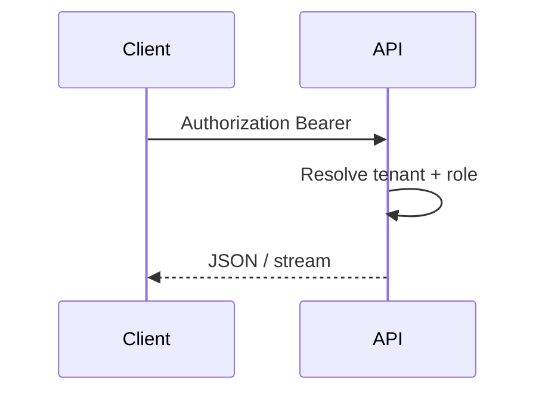

import {
  InfoBox,
  Warning,
  RelatedTopics,
  FaqAccordion,
  WorkflowCard,
  ApiEndpointCard,
} from '@site/src/components';

# API Authentication


**API authentication** uses HTTPS to `https://api.qefro.com`.

| Client | Credential |
| --- | --- |
| Admin Console / portal / most REST | `Authorization: Bearer <user_jwt>` |
| Website Widget | Widget token on WS query/`Authorization` |
| End-user for tools | `X-End-User-Token` or `X-End-User-Session` |
| Super Admin | Token from `POST /api/v1/admin/auth/login` |
| GraphQL | User JWT on `POST /graphql` |

## Introduction

Signup/login/OTP also available via GraphQL and REST auth handlers with Redis-backed abuse rate limits.

## Why it exists

Different surfaces need different trust levels without sharing Owner JWTs to browsers.

## Concepts

- User JWT / session jti (revocable)
- Widget token (rotatable publishable key)
- Forwarded end-user identity

## Architecture



## Workflow

<WorkflowCard title="Call the API" steps={[
  {title: 'Sign in', description: 'Obtain user JWT from Admin Console login.'},
  {title: 'Call REST or GraphQL', description: 'Include Bearer header.'},
  {title: 'Handle 401/403', description: 'Refresh session or check RBAC.'},
]} />

## Code examples

```bash
curl -sS -H "Authorization: Bearer $USER_JWT" \
  -H "Content-Type: application/json" \
  https://api.qefro.com/api/v1/billing/plans
```

```typescript
await fetch('https://api.qefro.com/graphql', {
  method: 'POST',
  headers: {
    Authorization: `Bearer ${userJwt}`,
    'Content-Type': 'application/json',
  },
  body: JSON.stringify({ query: '{ __typename }' }),
});
```

## Best practices

- Store JWTs in memory/httpOnly patterns appropriate to your client
- Rotate widget tokens after incidents

## Security notes

<Warning>
Never commit JWTs or widget tokens to git. Prefer environment injection in CI.
</Warning>

## FAQ

<FaqAccordion items={[
  {question: 'Is there a long-lived API key product?', answer: 'Day-to-day automation uses user JWTs / console sessions today. Prefer server-side jobs with tightly scoped accounts.'},
]} />

## Related topics

<RelatedTopics topics={[
  {label: 'REST APIs', to: '/docs/api/rest-apis'},
  {label: 'Webhooks', to: '/docs/api/webhooks'},
  {label: 'Platform Authentication', to: '/docs/platform/authentication'},
]} />


