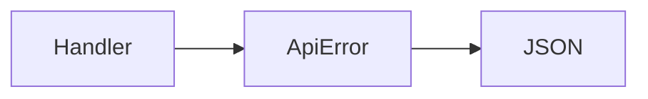

import {
  InfoBox,
  Warning,
  RelatedTopics,
  FaqAccordion,
  WorkflowCard,
  ApiEndpointCard,
} from '@site/src/components';

# Error Codes


**Error responses** typically include a machine-readable `code` and human `message` (see API `ApiError` JSON). Common situations:

| Situation | What to check |
| --- | --- |
| 401 | Missing/expired user JWT or widget token |
| 403 | RBAC — Member lacking workspace/team grant |
| 404 | Wrong id / tenant scoping |
| 429 | Rate limit or plan quota |
| 400 | Validation / bad signature (billing, WhatsApp) |

## Introduction

GraphQL errors follow GraphQL conventions; REST uses HTTP status + JSON body.

## Why it exists

Clients need stable codes for retries vs user-visible failures.

## Concepts

- `code` string
- HTTP status
- Validation errors

## Architecture



## Workflow

<WorkflowCard title="Debug" steps={[
  {title: 'Read status + code', description: 'Do not retry all 4xx.'},
  {title: 'Check authz', description: 'Role and workspace grants.'},
  {title: 'Check quotas', description: 'Billing plan limits.'},
]} />

## Code examples

```json
{
  "code": "FORBIDDEN",
  "message": "Insufficient permissions"
}
```

## Best practices

- Log `request` correlation ids when present
- Map 429 to exponential backoff

## Security notes

<Warning>
Do not echo raw upstream tool errors containing secrets to end users.
</Warning>

## FAQ

<FaqAccordion items={[
  {question: 'Where are codes defined?', answer: 'Domain/API error modules in the backend map to stable code strings.'},
]} />

## Related topics

<RelatedTopics topics={[
  {label: 'Rate Limits', to: '/docs/api/rate-limits'},
  {label: 'REST APIs', to: '/docs/api/rest-apis'},
]} />


