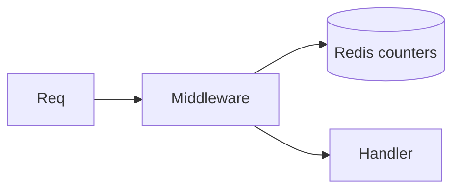

import {
  InfoBox,
  Warning,
  RelatedTopics,
  FaqAccordion,
  WorkflowCard,
  ApiEndpointCard,
} from '@site/src/components';

# Rate Limits


**Rate limits** protect auth and runtime surfaces:

| Area | Behavior (implementation) |
| --- | --- |
| Login / OTP / forgot / reset | Per-email Redis limits (e.g. login ~20/15m) |
| Widget HTTP | `rate_limit_middleware` on widget routes |
| WebSocket | ~30 messages / 60s style checks |
| Tool test | Limited per tenant (e.g. 60 window) |
| Plan quotas | Messages/documents/users/business tools |

Exceeding limits returns a rate-limited API error.

## Introduction

Quotas (`messages_limit`, `documents_limit`, …) are plan-level and enforced in middleware (`check_messages_limit_*`, `check_documents_limit`).

## Why it exists

Public widget endpoints and auth forms are internet-facing.

## Concepts

- Abuse rate limit
- Plan quota
- Tool test throttle

## Architecture



## Workflow

<WorkflowCard title="If you are limited" steps={[
  {title: 'Backoff', description: 'Retry with jitter.'},
  {title: 'Check plan', description: 'Upgrade if messages quota exhausted.'},
  {title: 'Contact support', description: 'support@qefro.com for sustained Enterprise needs.'},
]} />

## Code examples

```bash
# Expect 429-style errors when limited — reduce chat spam in tests
```

## Best practices

- Cache plan list responses
- Don’t hammer `/tools/:id/test` in CI loops

## Security notes

<InfoBox>
Auth rate limits intentionally avoid account enumeration (constant responses on some flows).
</InfoBox>

## FAQ

<FaqAccordion items={[
  {question: 'Are limits identical for all plans?', answer: 'Abuse limits are platform-wide; conversation/document quotas vary by plan.'},
]} />

## Related topics

<RelatedTopics topics={[
  {label: 'Error Codes', to: '/docs/api/error-codes'},
  {label: 'Deployment', to: '/docs/platform/deployment'},
]} />


