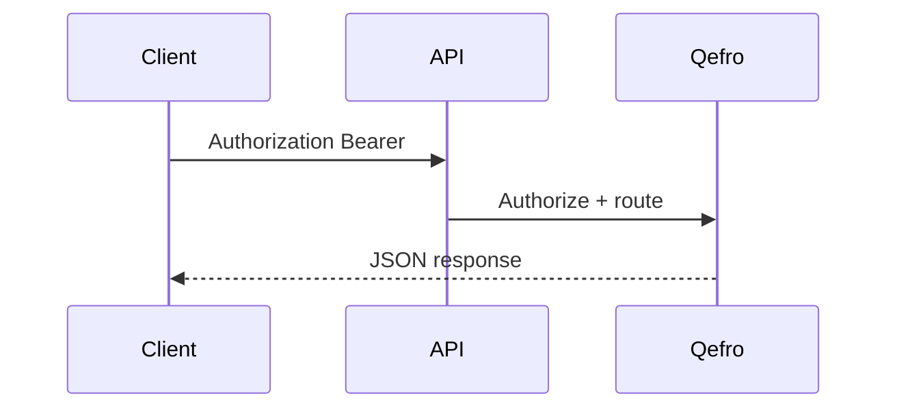

import {
  InfoBox,
  Warning,
  RelatedTopics,
  FaqAccordion,
  WorkflowCard,
} from '@site/src/components';

# Rate Limits

**Rate Limits** — Request budgets and backoff guidance.

## Introduction

This page documents rate limits for builders integrating with `https://api.qefro.com`. Full OpenAPI export will plug into this section as it is published.

## Why it exists

Stable API contracts let customers automate Admin Console workflows and embed Qefro safely.

## Concepts

- Base URL: `https://api.qefro.com`
- JSON request/response bodies
- Bearer authentication for server-side clients

## Architecture

Clients call versioned REST endpoints; webhooks deliver async events.



## Workflow

<WorkflowCard
  title="API usage"
  steps={[
    {title: 'Obtain credentials', description: 'Create an API token in the Admin Console (Developer settings).'},
    {title: 'Call endpoints', description: 'Use HTTPS + Bearer token.'},
    {title: 'Handle errors', description: 'Map status codes and error.code fields.'},
    {title: 'Subscribe webhooks', description: 'Verify signatures before processing.'},
  ]}
/>

## Code examples

```bash
curl -sS \
  -H "Authorization: Bearer $QEFRO_TOKEN" \
  -H "Content-Type: application/json" \
  https://api.qefro.com/api/v1/billing/plans
```

```python
import os, urllib.request
req = urllib.request.Request(
    "https://api.qefro.com/api/v1/billing/plans",
    headers={"Authorization": f"Bearer {os.environ['QEFRO_TOKEN']}"},
)
print(urllib.request.urlopen(req).read().decode())
```

```typescript
const res = await fetch('https://api.qefro.com/api/v1/billing/plans', {
  headers: { Authorization: `Bearer ${process.env.QEFRO_TOKEN}` },
});
```

## Best practices

- Store tokens in a secrets manager
- Prefer workspace-scoped tokens when available
- Log `request_id` / correlation IDs on failures

## Security notes

<Warning>
Rotate tokens after teammate offboarding. Do not commit tokens to git.
</Warning>

## FAQ

<FaqAccordion items={[
  {
    "question": "Is OpenAPI available?",
    "answer": "Structure is prepared here; publish your OpenAPI document under static/openapi when ready."
  },
  {
    "question": "Which languages are supported?",
    "answer": "Any HTTP client. Examples cover cURL, TypeScript, and Python."
  }
]} />

## Related topics

<RelatedTopics topics={[
  {
    "label": "Authentication",
    "to": "/docs/api/authentication"
  },
  {
    "label": "Webhooks",
    "to": "/docs/api/webhooks"
  },
  {
    "label": "Error Codes",
    "to": "/docs/api/error-codes"
  },
  {
    "label": "Identity Forwarding",
    "to": "/docs/platform/identity-forwarding"
  }
]} />

