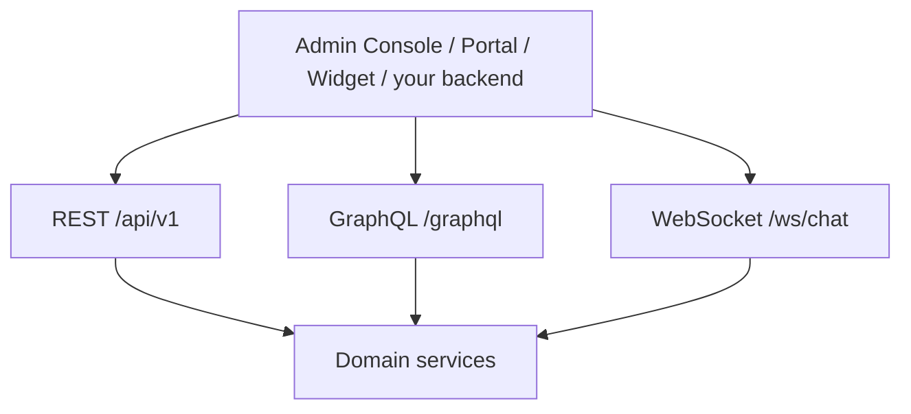

import {
  InfoBox,
  Warning,
  RelatedTopics,
  FaqAccordion,
  WorkflowCard,
  ApiEndpointCard,
} from '@site/src/components';

# REST APIs

Qefro’s versioned HTTP API lives at **`https://api.qefro.com`**. REST covers multipart uploads, webhooks, streaming chat, widget fallbacks, billing, org RBAC, and Business Tools. Day-to-day Admin Console reads/writes also use **GraphQL** at `POST /graphql` with the same user JWT.

## Short definition (citation-ready)

> The Qefro REST surface under `/api/v1` is the programmatic contract for documents, conversations, billing, widget channels, organization RBAC, Business Tools, and provider webhooks — authenticated primarily with user JWTs or widget tokens.

Auth details: [API Authentication](/docs/api/authentication). Copy-paste samples: [Examples](/docs/api/examples).

## Base URL and conventions

| Item | Value |
| --- | --- |
| Base | `https://api.qefro.com` |
| Version prefix | `/api/v1/…` (plus a few top-level routes) |
| JSON | `Content-Type: application/json` unless multipart |
| Errors | HTTP status + `{ "code", "message" }` — see [Error Codes](/docs/api/error-codes) |
| Quotas | Message/document limits enforced by middleware on chat/upload routes |

## Highlighted endpoints

<ApiEndpointCard method="GET" path="/api/v1/billing/plans" description="List sellable plans and entitlement limits (messages, documents, users, business tools)." />
<ApiEndpointCard method="POST" path="/api/v1/documents" description="Multipart document upload into a workspace (enforces documents quota)." />
<ApiEndpointCard method="POST" path="/api/v1/tools/:id/test" description="Execute a Business Tool test invocation with encrypted credentials." />
<ApiEndpointCard method="POST" path="/api/v1/billing/webhook" description="Razorpay webhook receiver (signature verified)." />

## Health and ops

| Method | Path | Auth | Purpose |
| --- | --- | --- | --- |
| GET | `/health` | Public | Liveness |
| GET | `/ready` | Public | Readiness |
| GET | `/metrics` | Bearer `METRICS_AUTH_TOKEN` or public flag | Prometheus metrics |

## Widget and realtime chat

| Method | Path | Auth | Purpose |
| --- | --- | --- | --- |
| GET | `/widget.js` | Public | Embeddable widget script |
| GET | `/ws/chat` | Widget token (`?token=`) | Streaming Customer AI WebSocket |
| POST | `/api/v1/widget/chat` | Widget token | HTTP chat fallback (message quota) |
| GET | `/api/v1/widget/settings` | Widget token | Widget settings bootstrap |
| POST | `/api/v1/widget/leads` | Widget token | Lead capture |
| POST | `/api/v1/widget/messages/:id/feedback` | Widget token | Message feedback |
| POST | `/api/v1/widget/conversations/:id/handoff` | Widget token | Human handoff trigger |
| GET | `/api/v1/widget/conversations/:id/messages` | Widget token | Conversation messages |
| POST | `/api/v1/widget/identity/clear` | Widget token | Clear identify() state |
| POST | `/api/v1/widget/stt` | User JWT or widget token | Speech-to-text |
| POST | `/api/v1/widget/tts` | User JWT or widget token | Text-to-speech |

Guides: [Deploy Website Widget](/docs/guides/deploy-website-widget), [Identity Forwarding](/docs/platform/identity-forwarding).

## Documents (knowledge)

| Method | Path | Auth | Purpose |
| --- | --- | --- | --- |
| POST | `/api/v1/documents` | User JWT | Multipart upload (`workspace_id` + file); documents quota |
| POST | `/api/v1/documents/text` | User JWT | Create document from raw text; documents quota |
| POST | `/api/v1/documents/:id/reindex` | User JWT | Rebuild index for a document |
| GET | `/api/v1/documents/:id/view` | Authorized viewer | View/download document content |

Additional crawl/console flows may use GraphQL. Concept: [Knowledge Platform](/docs/platform/knowledge-platform).

## Authenticated chat and conversations

| Method | Path | Auth | Purpose |
| --- | --- | --- | --- |
| POST | `/api/v1/chat` | User JWT | Chat (message quota) |
| POST | `/api/v1/chat/stream` | User JWT | Streaming chat (message quota) |
| GET | `/api/v1/conversations` | User JWT | List conversations |
| PATCH | `/api/v1/conversations/:id` | User JWT | Rename conversation |
| DELETE | `/api/v1/conversations/:id` | User JWT | Delete conversation |
| PUT | `/api/v1/conversations/:id/status` | User JWT | Update status |
| GET | `/api/v1/conversations/:id/messages` | User JWT | List messages |
| POST | `/api/v1/conversations/:id/messages` | User JWT | Send agent message |

Optional end-user headers on chat: `X-End-User-Token`, `X-End-User-Session`.

## Sessions (self)

| Method | Path | Auth | Purpose |
| --- | --- | --- | --- |
| GET | `/api/v1/me/sessions` | User JWT | List your sessions |
| DELETE | `/api/v1/me/sessions/:jti` | User JWT | Revoke session |

## Tenant analytics and integrations config

| Method | Path | Auth | Purpose |
| --- | --- | --- | --- |
| GET | `/api/v1/tenant/analytics` | User JWT | Tenant analytics |
| GET | `/api/v1/tenant/feedbacks` | User JWT | Feedback list |
| GET/POST | `/api/v1/tenant/crm` | User JWT | CRM connector config |
| GET/POST | `/api/v1/tenant/handoff` | User JWT | Handoff webhook config |

## Billing (Razorpay)

| Method | Path | Auth | Purpose |
| --- | --- | --- | --- |
| GET | `/api/v1/billing/plans` | User JWT | List plans |
| POST | `/api/v1/billing/checkout` | User JWT | Start checkout |
| POST | `/api/v1/billing/confirm` | User JWT | Confirm payment |
| GET | `/api/v1/billing/subscription` | User JWT | Current subscription |
| POST | `/api/v1/billing/subscription` | User JWT | Cancel (also `POST /billing/cancel`) |
| POST | `/api/v1/billing/cancel` | User JWT | Cancel subscription |
| GET | `/api/v1/billing/payments` | User JWT | Payment history (incl. failures) |
| POST | `/api/v1/billing/webhook` | Razorpay signature | Provider webhook |

See [Webhooks](/docs/api/webhooks). Prefer idempotent clients on confirm/capture paths.

## Team invitations (membership)

| Method | Path | Auth | Purpose |
| --- | --- | --- | --- |
| GET | `/api/v1/team/members` | User JWT | List members |
| DELETE | `/api/v1/team/members/:id` | User JWT | Remove member |
| POST | `/api/v1/team/invite` | User JWT | Invite member |
| GET | `/api/v1/team/invitations` | User JWT | List invitations |
| POST | `/api/v1/team/invitations/:id/revoke` | User JWT | Revoke invitation |
| POST | `/api/v1/team/accept-invite` | User JWT / invite flow | Accept invitation |
| GET | `/api/v1/team/invite-preview` | Public/preview | Preview invite |
| POST | `/api/v1/team/switch-tenant` | User JWT | Switch active tenant |
| GET | `/api/v1/team/my-tenants` | User JWT | List tenants for user |

## Organization RBAC (Teams / workspaces / audit)

| Method | Path | Auth | Purpose |
| --- | --- | --- | --- |
| GET | `/api/v1/org/roles` | Member+ | Role catalog |
| GET | `/api/v1/org/members` | Member+ | Member profiles |
| GET | `/api/v1/org/members/:id` | Member+ | Member profile |
| PUT | `/api/v1/org/members/:id/role` | Admin/Owner rules | Change role |
| PUT | `/api/v1/org/members/:id/status` | Admin/Owner rules | Change status |
| GET | `/api/v1/org/members/:id/sessions` | Admin | List sessions |
| DELETE | `/api/v1/org/members/:id/sessions/:jti` | Admin | Revoke session |
| POST | `/api/v1/org/transfer-ownership` | Owner | Transfer ownership |
| GET/POST | `/api/v1/org/teams` | Admin patterns | List/create teams |
| GET/PATCH/DELETE | `/api/v1/org/teams/:id` | Admin patterns | Team CRUD |
| PUT | `/api/v1/org/teams/:id/members` | Admin | Set team members |
| PUT | `/api/v1/org/teams/:id/members/:user_id/write` | Admin | Document write flag |
| PUT | `/api/v1/org/teams/:id/workspaces` | Admin | Grant workspaces |
| GET | `/api/v1/org/workspaces` | Member+ | List workspaces |
| GET | `/api/v1/org/workspaces/:id` | Member+ | Get workspace |
| PUT | `/api/v1/org/workspaces/:id/teams` | Admin | Set workspace teams |
| GET | `/api/v1/org/audit-logs` | Admin/Owner | Audit trail |

Guides: [Configure RBAC](/docs/guides/configure-rbac), [Teams](/docs/platform/teams).

## Business Tools (integrations + OpenAPI)

| Method | Path | Auth | Purpose |
| --- | --- | --- | --- |
| GET/POST | `/api/v1/workspaces/:workspace_id/integrations` | User JWT | List/create integrations |
| POST | `/api/v1/workspaces/:workspace_id/integrations/import/preview` | User JWT | OpenAPI preview (URL) |
| POST | `/api/v1/workspaces/:workspace_id/integrations/import/preview/upload` | User JWT | OpenAPI preview (upload) |
| POST | `/api/v1/workspaces/:workspace_id/integrations/import/apply` | User JWT | Apply import |
| GET/PATCH/DELETE | `/api/v1/integrations/:id` | User JWT | Integration CRUD |
| POST | `/api/v1/integrations/:id/reimport` | User JWT | Reimport OpenAPI |
| GET/POST | `/api/v1/workspaces/:workspace_id/tools` | User JWT | List/create tools |
| GET/PATCH/DELETE | `/api/v1/tools/:id` | User JWT | Tool CRUD |
| POST | `/api/v1/tools/:id/test` | User JWT | Test invocation |
| GET | `/api/v1/tools/:id/logs` | User JWT | Execution logs |

Guides: [Connect REST APIs](/docs/guides/connect-rest-apis), [Import OpenAPI](/docs/guides/import-openapi), [Register SDK Business Tools](/docs/guides/register-sdk-business-tools), [Secure Business Actions](/docs/guides/secure-business-actions).

## SDK Connections (backend framework)

| Method | Path | Auth | Purpose |
| --- | --- | --- | --- |
| GET/POST | `/api/v1/org/sdk-connections` | Owner/Admin JWT | List / create signed webhook connections |
| PATCH/DELETE | `/api/v1/org/sdk-connections/:id` | Owner/Admin JWT | Update / rotate secret / delete |
| POST | `/api/v1/org/sdk-connections/:id/test` | Owner/Admin JWT | Signed `ping` health check |
| POST | `/api/v1/org/sdk-connections/:id/sync-tools` | Owner/Admin JWT | `tools.list`; optional `auto_register` + `workspace_id` |

Guide: [Register SDK Business Tools](/docs/guides/register-sdk-business-tools). Framework: [SDK Framework](/docs/v1/sdk-framework).

## WhatsApp

| Method | Path | Auth | Purpose |
| --- | --- | --- | --- |
| GET | `/api/v1/whatsapp/webhook` | Meta verify token | Webhook verification |
| POST | `/api/v1/whatsapp/webhook` | Meta signature | Inbound messages |

Growth+ entitlement. Guide: [Deploy WhatsApp AI](/docs/guides/deploy-whatsapp-ai).

## Public tenant helpers

| Method | Path | Auth | Purpose |
| --- | --- | --- | --- |
| GET | `/chat/:tenant_slug` | Public | Public chat page |
| GET | `/api/v1/public/tenant-branding` | Public | Portal/widget branding bootstrap |
| GET | `/api/v1/public/tenant-slug-available` | Public | Slug availability |

## Super Admin (platform operators)

Requires JWT from `POST /api/v1/admin/auth/login`.

| Method | Path | Purpose |
| --- | --- | --- |
| POST | `/api/v1/admin/auth/login` | Admin login |
| GET/POST | `/api/v1/admin/tenants` | List/create tenants |
| GET/PUT/DELETE | `/api/v1/admin/tenants/:id` | Tenant CRUD |
| POST | `/api/v1/admin/tenants/:id/suspend` | Suspend |
| POST | `/api/v1/admin/tenants/:id/unsuspend` | Unsuspend |
| POST | `/api/v1/admin/tenants/:id/impersonate` | Impersonate |
| GET/PUT | `/api/v1/admin/tenants/:id/quotas` | Quotas |
| GET | `/api/v1/admin/analytics/*` | Fleet analytics |
| GET | `/api/v1/admin/usage/*` | LLM usage |
| GET/POST | `/api/v1/admin/plans` | Plan admin |
| GET/PUT/DELETE | `/api/v1/admin/plans/:id` | Plan CRUD |
| GET/PUT | `/api/v1/admin/settings` | Platform settings |
| GET/PUT | `/api/v1/admin/whatsapp/config` | Global WA config |
| GET | `/api/v1/admin/whatsapp/configs` | List WA configs |
| GET | `/api/v1/admin/emails` | Email logs |
| GET | `/api/v1/admin/payments` | All payments |

Not for tenant day-to-day integrations.

## GraphQL

| Method | Path | Auth | Purpose |
| --- | --- | --- | --- |
| POST | `/graphql` | User JWT | Admin Console operations (workspaces, login/register/OTP, settings, …) |
| GET | `/graphql` | Optional | Playground only when `ENABLE_GRAPHQL_PLAYGROUND=true` |

User **login / register / OTP / password reset** are GraphQL mutations, not REST.

## Discovery workflow

<WorkflowCard
  title="Integrate against REST"
  steps={[
    {title: 'Obtain the right credential', description: 'User JWT vs widget token — see Authentication.'},
    {title: 'Hit /health', description: 'Confirm environment.'},
    {title: 'Start with one group', description: 'Documents, tools, or billing.'},
    {title: 'Handle errors + 429', description: 'Error Codes and Rate Limits.'},
    {title: 'Add webhooks last', description: 'Verify signatures before processing.'},
  ]}
/>

## Best practices

- Always send `workspace_id` where uploads/tools require it
- Prefer idempotent billing confirm clients
- Use tool `/test` before enabling chat invocation
- Treat Admin Console network traces as a living complement until a public OpenAPI file ships

<Warning>
Webhook routes must verify Razorpay signatures or Meta challenges before mutating state. Never process unsigned bodies.
</Warning>

## FAQ

<FaqAccordion
  items={[
    {
      question: 'Where is the downloadable OpenAPI file?',
      answer:
        'Not published as a static artifact yet. This page mirrors the live Rust route table; OpenAPI import is for *your* APIs into Business Tools.',
    },
    {
      question: 'Should I use REST or GraphQL?',
      answer:
        'Use REST for uploads, webhooks, widget HTTP, billing, org RBAC, and tools. Use GraphQL for console-style queries/mutations (including auth).',
    },
    {
      question: 'Do route paths change?',
      answer:
        'Treat /api/v1 as stable; read Release Notes for additions. Confirm critical paths in a staging org before production automation.',
    },
  ]}
/>

## Related topics

<RelatedTopics
  topics={[
    {label: 'API Authentication', to: '/docs/api/authentication'},
    {label: 'Examples', to: '/docs/api/examples'},
    {label: 'Error Codes', to: '/docs/api/error-codes'},
    {label: 'Rate Limits', to: '/docs/api/rate-limits'},
    {label: 'Webhooks', to: '/docs/api/webhooks'},
    {label: 'SDKs', to: '/docs/api/sdks'},
    {label: 'Business Tools', to: '/docs/platform/business-tools'},
    {label: 'Register SDK Business Tools', to: '/docs/guides/register-sdk-business-tools'},
  ]}
/>
