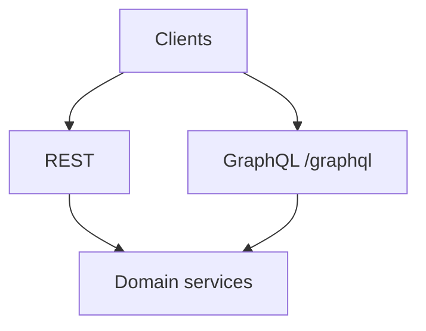

import {
  InfoBox,
  Warning,
  RelatedTopics,
  FaqAccordion,
  WorkflowCard,
  ApiEndpointCard,
} from '@site/src/components';

# REST APIs

**REST APIs** complement GraphQL. Important groups:

### Health
- `GET /health`, `GET /ready`

### Widget
- `POST /api/v1/widget/chat`, settings, leads, feedback, handoff, identity/clear, STT/TTS
- `GET /widget.js`, `GET /ws/chat`

### Documents
- `POST /api/v1/documents`, `/documents/text`, `POST /documents/:id/reindex`

### Chat (authenticated users)
- `POST /api/v1/chat`, `/chat/stream`
- Conversations CRUD under `/api/v1/conversations/*`

### Billing (Razorpay)
- `GET /api/v1/billing/plans`
- `POST /api/v1/billing/checkout`, `/confirm`, `/cancel`
- `GET /api/v1/billing/subscription`, `/payments`
- `POST /api/v1/billing/webhook`

### Business Tools
- `/api/v1/workspaces/:id/integrations|tools` …
- `/api/v1/tools/:id/test|logs`

### Organization RBAC
- `/api/v1/org/*`, `/api/v1/team/*`

### WhatsApp
- `GET|POST /api/v1/whatsapp/webhook`

### Public
- `/api/v1/public/tenant-branding`, `tenant-slug-available`
- `/chat/:tenant_slug`

## Introduction

OpenAPI export can be added under `static/openapi/` as the contract freezes; this page lists the live route groups from the Rust API.

## Why it exists

Multipart uploads, webhooks, and streaming chat are awkward in pure GraphQL — REST covers them.

## Concepts

- `/api/v1` version prefix
- Tenant scoping via auth
- Quota middleware on messages/documents

## Architecture

## Workflow

<WorkflowCard title="Discover endpoints" steps={[
  {title: 'Auth', description: 'Obtain user JWT or widget token.'},
  {title: 'Hit health', description: 'Confirm environment.'},
  {title: 'Use group APIs', description: 'Documents, tools, billing as needed.'},
]} />

## Code examples

<ApiEndpointCard method="GET" path="/api/v1/billing/plans" description="List sellable plans and limits (messages, documents, users, business tools)." />
<ApiEndpointCard method="POST" path="/api/v1/documents" description="Multipart document upload into a workspace (enforces documents quota)." />
<ApiEndpointCard method="POST" path="/api/v1/billing/webhook" description="Razorpay webhook receiver (signature verified)." />

## Best practices

- Prefer idempotent clients on billing confirm
- Always send `workspace_id` where required

## Security notes

<InfoBox>
Webhook routes verify signatures / Meta challenges before mutating state.
</InfoBox>

## FAQ

<FaqAccordion items={[
  {question: 'Where is the OpenAPI file?', answer: 'Structure is ready for publication; until then use this reference + Admin Console network tab.'},
]} />

## Related topics

<RelatedTopics topics={[
  {label: 'Authentication', to: '/docs/api/authentication'},
  {label: 'Error Codes', to: '/docs/api/error-codes'},
  {label: 'Webhooks', to: '/docs/api/webhooks'},
  {label: 'Examples', to: '/docs/api/examples'},
]} />

