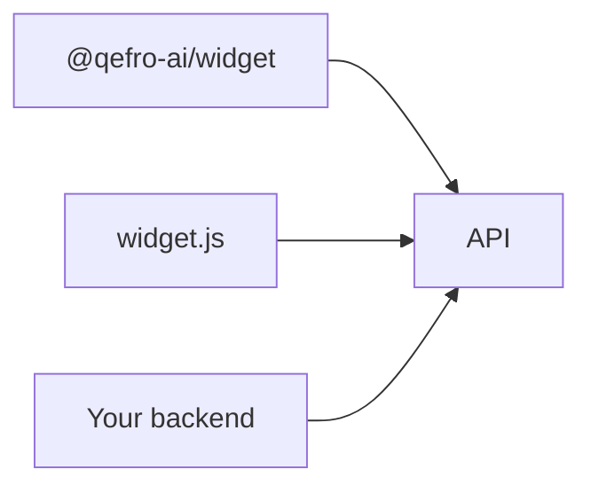

import {
  InfoBox,
  Warning,
  RelatedTopics,
  FaqAccordion,
  WorkflowCard,
  ApiEndpointCard,
} from '@site/src/components';

# SDKs


**SDKs** today center on the embeddable widget:

- npm: `@qefro-ai/widget`
- CDN: `https://cdn.qefro.com/widget.js`

Server integrations use ordinary HTTPS clients against `api.qefro.com` (REST + GraphQL).

## Introduction

The widget exposes `open`, `setContext`, `identify`, `setAuthToken`, and `clearIdentity`.

## Why it exists

Most customers embed chat in a website; npm/CDN coverage matters more than a dozen language SDKs.

## Concepts

- Widget SDK
- REST/GraphQL via fetch/curl

## Architecture



## Workflow

<WorkflowCard title="Choose a client" steps={[
  {title: 'Browser', description: 'Use widget SDK.'},
  {title: 'Backend automation', description: 'User JWT + REST.'},
]} />

## Code examples

```bash
npm install @qefro-ai/widget
```

```javascript
import { Widget } from '@qefro-ai/widget';
const widget = new Widget({
  token: process.env.QEFRO_WIDGET_TOKEN,
  endpoint: 'https://api.qefro.com',
});
```

## Best practices

- Pin widget CDN versions in enterprise change control if you mirror the script
- Keep server secrets off the client

## Security notes

<Warning>
Do not ship Owner JWTs inside frontend bundles.
</Warning>

## FAQ

<FaqAccordion items={[
  {question: 'Python/Rust SDKs?', answer: 'Use HTTP. Examples are in the Examples page.'},
]} />

## Related topics

<RelatedTopics topics={[
  {label: 'Website Widget', to: '/docs/platform/website-widget'},
  {label: 'Examples', to: '/docs/api/examples'},
]} />


