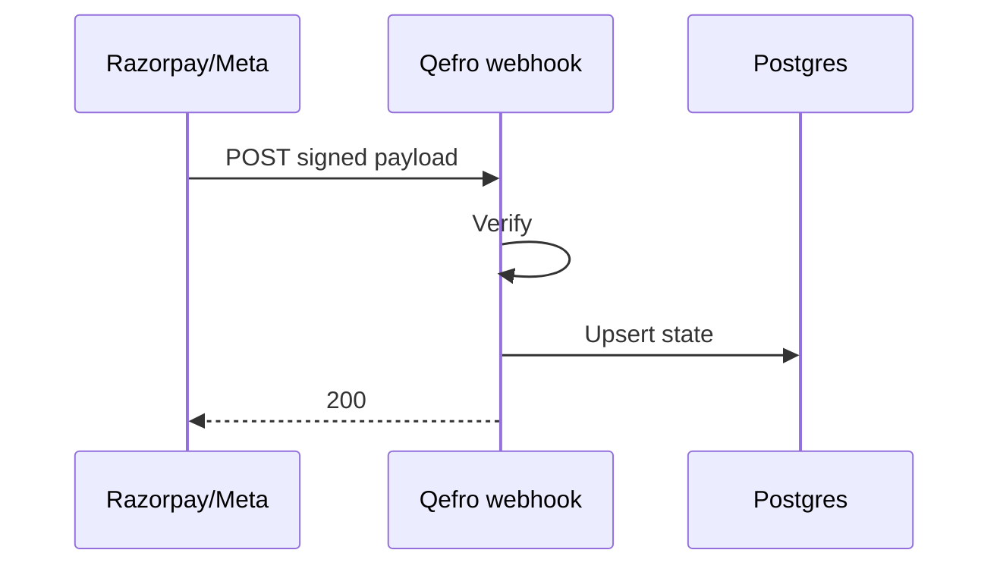

import {
  InfoBox,
  Warning,
  RelatedTopics,
  FaqAccordion,
  WorkflowCard,
  ApiEndpointCard,
} from '@site/src/components';

# Webhooks


**Webhooks** Qefro consumes:

### Billing (Razorpay)
- `POST /api/v1/billing/webhook`
- Verifies Razorpay signature
- Handles events including `payment.captured`, `payment.failed`, subscription lifecycle events
- Failed payments stored with `error_code` / `error_reason` / `error_description`
- Activation is idempotent on `payment_id` and order-level capture

### WhatsApp (Meta)
- `GET /api/v1/whatsapp/webhook` — verification
- `POST /api/v1/whatsapp/webhook` — inbound messages

## Introduction

Configure Razorpay to send events to `https://api.qefro.com/api/v1/billing/webhook` and enable `payment.failed` for support visibility.

## Why it exists

Async payment and messaging systems must notify Qefro without polling.

## Concepts

- Signature verification
- Idempotent processing
- Acknowledge-even-on-unknown (where safe)

## Architecture



## Workflow

<WorkflowCard title="Enable billing webhooks" steps={[
  {title: 'Dashboard', description: 'Razorpay → Webhooks → api.qefro.com/api/v1/billing/webhook.'},
  {title: 'Subscribe events', description: 'Include payment.captured and payment.failed.'},
  {title: 'Test', description: 'Complete a test payment; confirm /billing/payments.'},
]} />

## Code examples

```text
https://api.qefro.com/api/v1/billing/webhook
https://api.qefro.com/api/v1/whatsapp/webhook
```

## Best practices

- Keep webhook secrets only in server env
- Treat duplicate deliveries as normal (idempotency)

## Security notes

<Warning>
Reject unsigned payloads. Do not expose webhook URLs that skip verification.
</Warning>

## FAQ

<FaqAccordion items={[
  {question: 'Do you send outbound webhooks to customers?', answer: 'Handoff/CRM webhooks can be configured per tenant and are SSRF-validated before egress.'},
]} />

## Related topics

<RelatedTopics topics={[
  {label: 'REST APIs', to: '/docs/api/rest-apis'},
  {label: 'Security Overview', to: '/docs/security/overview'},
  {label: 'WhatsApp', to: '/docs/platform/whatsapp'},
]} />


