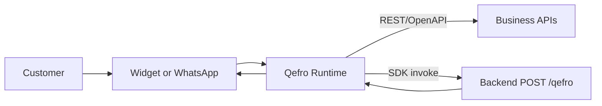

Qefro V1 architecture is stable.

## Locked foundation
- REST and OpenAPI tools
- SDK framework and SDK connections
- Customer lookup and authorization
- Suspend and resume
- Tool discovery and metadata
- Protocol versioning

## Design principle
Use existing abstractions. Prefer polish, reliability, and documentation.
