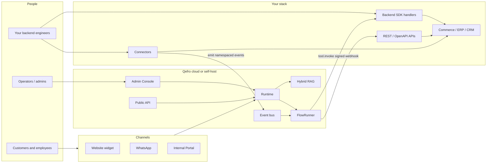

import { InfoBox, RelatedTopics, WorkflowCard } from '@site/src/components';

# Qefro architecture

This page answers: **what are the moving parts, who owns what, and where does work run?**

Use it when evaluating Qefro, onboarding engineers, or explaining the product to stakeholders. For a shorter intro, see [Introduction → Architecture](/docs/introduction/architecture). For multi-tenant isolation details, see [Multi-tenant AI Architecture](/docs/concepts/multi-tenant-ai-architecture).

## One-sentence model

> **Configure** knowledge, tools, and Marketplace apps in the Admin Console; **execute** chat and flows in a single Runtime (RAG + FlowRunner + event bus); **reach customers and employees** through channels; **run domain logic** in installable `/qefro` SDK apps or via REST/OpenAPI / Backend SDK webhooks. Connectors only **emit events** — they never run a second orchestrator.

## System map



## Layers

| Layer | Responsibility | Not responsible for |
| --- | --- | --- |
| **Admin Console** (`app.qefro.com`) | Workspaces, knowledge, Marketplace install, People, Marketing, RBAC, billing UX | Running app / ERP business logic |
| **Runtime** | Chat orchestration, RAG retrieval, FlowRunner, event ingest/dispatch, tool invoke, approvals | Hosting your ERP |
| **Solutions plane** | Catalog, install/upgrade, managed app lifecycle, capability sync, portal UI render | Per-tenant forks of packages |
| **Channels** | Widget, WhatsApp, Internal Portal, chat API | Defining flow graphs |
| **SDK apps** (`/qefro`) | Domain tools, `ctx.storage`, Hub/marketing/org registrations | Platform campaign delivery / RBAC |
| **Backend SDK Connection** | Your tools over signed webhooks (Business Tools path) | Emitting platform-wide events without the bus |
| **Connectors** | Normalize external webhooks → Qefro event envelopes (+ optional tool packs) | Owning FlowRunner or long-running workflows |
| **REST / OpenAPI tools** | Call APIs with credentials stored encrypted in Qefro | Arbitrary code execution in Qefro |

## Solutions plane

Installable apps are a first-class plane next to assistants and Business Tools:

```mermaid
flowchart LR
  Dev[App builder] -->|qefro create-app / publish| Cat[Catalog]
  Cat --> SS[solution-service]
  Ops[Admin] -->|Marketplace install| SS
  SS -->|managed image or endpoint| App[/qefro process]
  Portal[Portal renderer] -->|manifest UI| SS
  Runtime[Runtime tool invoker] -->|appId/tool| App
  App -->|capabilities.list| Reg[Marketing / org / Hub registries]
```

| Piece | Role |
| --- | --- |
| **solution-service** | Package catalog, installations, settings, capability sync, onboarding |
| **Managed app** | Docker (or external) process exposing signed `/qefro`; ADR-003: the process **is** the app |
| **Marketplace** | Tenant-facing install / upgrade UX over the shared catalog |
| **Portal renderer** | Declarative `ui/*` from the package → staff pages under `/app/solutions/…` |
| **Capability registries** | Apps declare marketing audiences, org workflow caps, etc.; platform owns execution |

Deep dive: [Solutions architecture](/docs/solutions/architecture), [Managed apps](/docs/solutions/managed-apps), [Build your first app](/docs/solutions/build-your-first-app).

**SDK Connection vs SDK app:** a Backend SDK **webhook** is a Business Tool connection to your backend. An **SDK app** is an installable Marketplace package with its own `/qefro`. See [Core concepts](/docs/introduction/concepts).

## Execution paths (same engine)

All of these eventually use **FlowRunner** (and/or the chat pipeline) inside one Runtime:

1. **Chat intent** — user message → model may select a Business Flow or tool.
2. **Event** — connector or API emits `namespace.event` → matching flow `metadata.trigger`.
3. **Schedule** — cron-style trigger materializes an event → FlowRunner.
4. **Webhook** — inbound HTTP mapped to an event or flow start.
5. **Resume** — approval granted or challenge verified continues a waiting run.

There is **no parallel workflow engine inside connectors**. See [Event-driven triggers](/docs/guides/event-driven-triggers).

## Data and tenancy

```text
Organization (tenant)
  └── Teams + RBAC (Owner / Admin / Member)
        └── AI Workspaces
              ├── Knowledge (indexed documents)
              ├── Marketplace app installations (/qefro)
              ├── Business Tools (REST / OpenAPI / SDK Connection)
              ├── Business Flows (versioned)
              ├── Customer Hub bindings (People)
              ├── Conversations + messages
              └── Channel bindings (widget, WhatsApp, …)
```

- Knowledge and conversations are **workspace-scoped**.
- Installable apps are **catalog packages** installed per workspace (settings overlay).
- Secrets for REST tools are **encrypted at rest**; SDK secrets sign webhooks to **your** origin or the managed app.
- Audit and tool invocation logs support support and compliance workflows.

## Control vs data plane

| Plane | Examples |
| --- | --- |
| **Control** | Create workspace, upload docs, Accept flow version, manage members, configure WhatsApp |
| **Data / runtime** | Chat messages, RAG chunks, flow runs, event records, tool.invoke payloads |

Operators mostly use the control plane. Developers extend the data plane with tools, events, and Customer Provider.

## Identity and trust boundaries

1. **Org users** — JWT to Admin Console and org APIs.
2. **Widget / channel sessions** — channel-specific tokens; optional `identify()` for known customers.
3. **Customer Provider** — your backend authorizes high-risk tools and challenges (OTP, etc.).
4. **SDK webhook** — HMAC (or equivalent) over body + timestamp; tools never run unauthenticated against Qefro’s trust of your origin.

Deep links: [Identity & authentication](/docs/platform/identity-and-authentication), [Challenges](/docs/developer/concepts/challenges), [Business Tool runtime](/docs/business-tools/runtime).

## What Qefro deliberately is not

| Not this | Why it matters |
| --- | --- |
| A general visual automation canvas (n8n-class) | Flows are **AI + business process** graphs with RAG, channels, and approvals — not arbitrary ETL |
| A low-level agent graph library (LangGraph-class) | You get a **productized Runtime** and Admin Console, not a framework you host and invent UX for |
| A full human contact-center inbox | Human handoff exists; deep agent desktop is not the core product |
| A replacement CRM / ERP | Qefro **calls** systems of record via tools and hosts **domain apps** that use Customer Hub + managed storage — not a full CRM replacement |

Comparisons: [Qefro vs n8n](/docs/compare/n8n-vs-qefro), [Qefro vs LangGraph](/docs/compare/langgraph-vs-qefro).

## Deployment shapes

- **Qefro Cloud** — multi-tenant SaaS (typical).
- **Self-host / Docker** — compose stack (`api`, `llm-service`, `retrieval`, portals, nginx). See [Self-hosting](/docs/developer/self-hosting/overview) and [Production deployment](/docs/guides/production-deployment).

## Mental model for new engineers

<WorkflowCard
  title="First week architecture checklist"
  steps={[
    {title: 'Draw the tenant tree', description: 'Org → workspace → knowledge/tools/apps/channels.'},
    {title: 'Trace one chat tool call', description: 'Widget → API → model → tool.invoke → SDK app or Connection → response.'},
    {title: 'Trace one Marketplace install', description: 'Publish → catalog → install → /qefro healthy → staff UI.'},
    {title: 'Trace one event flow', description: 'Connector emit → bus → FlowRunner → steps → complete.'},
    {title: 'Read security boundaries', description: 'What never leaves your VPC (SDK Connection handlers) vs managed apps.'},
  ]}
/>

## Related topics

<RelatedTopics
  topics={[
    {label: 'Introduction architecture', to: '/docs/introduction/architecture'},
    {label: 'Solutions architecture', to: '/docs/solutions/architecture'},
    {label: 'Build your first app', to: '/docs/solutions/build-your-first-app'},
    {label: 'Runtime', to: '/docs/developer/concepts/runtime'},
    {label: 'Events', to: '/docs/developer/concepts/events'},
    {label: 'vs n8n', to: '/docs/compare/n8n-vs-qefro'},
    {label: 'vs LangGraph', to: '/docs/compare/langgraph-vs-qefro'},
    {label: 'Multi-tenant architecture', to: '/docs/concepts/multi-tenant-ai-architecture'},
  ]}
/>
