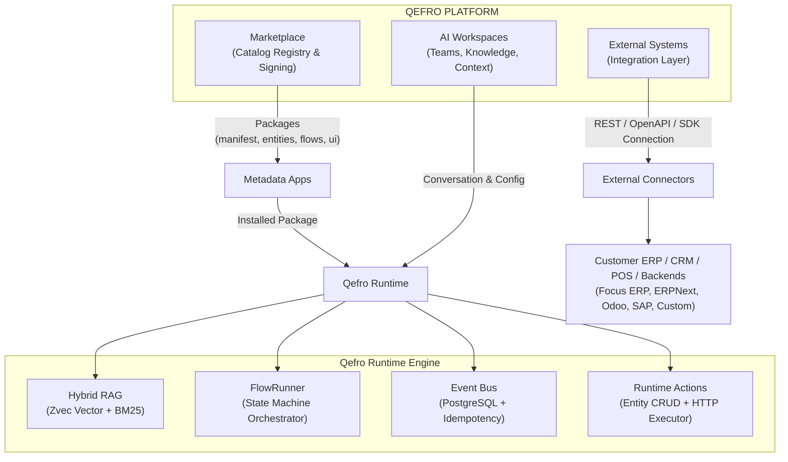
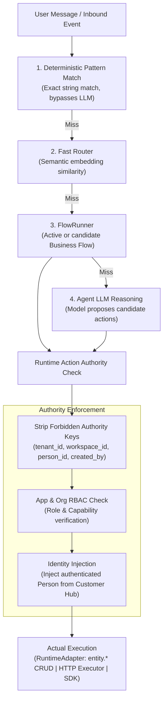

import { InfoBox, RelatedTopics, WorkflowCard } from '@site/src/components';

# Qefro Architecture

This document defines the canonical architecture of Qefro as of October 2026: **the system topology, execution planes, trust boundaries, and component ownership.**

---

## 1. High-Level Canonical Architecture

Qefro coordinates AI Workspaces, declarative Marketplace Apps, and external enterprise systems through a single multi-tenant runtime:


```mermaid
flowchart TD
  subgraph PLATFORM["QEFRO PLATFORM"]
    direction TB
    WS["AI Workspaces\n(Teams, Knowledge, Context)"]
    MKT["Marketplace\n(Catalog Registry & Signing)"]
    EXT["External Systems\n(Integration Layer)"]
  end

  MKT -->|"Packages\n(manifest, entities, flows, ui)"| META["Metadata Apps"]
  META -->|"Installed Package"| RT["Qefro Runtime"]
  WS -->|"Conversation & Config"| RT

  subgraph RUNTIME["Qefro Runtime Engine"]
    direction TB
    RAG["Hybrid RAG\n(Zvec Vector + BM25)"]
    FR["FlowRunner\n(State Machine Orchestrator)"]
    BUS["Event Bus\n(PostgreSQL + Idempotency)"]
    ACT["Runtime Actions\n(Entity CRUD + HTTP Executor)"]
  end

  RT --> RAG
  RT --> FR
  RT --> BUS
  RT --> ACT

  EXT -->|"REST / OpenAPI / SDK Connection"| CONN["External Connectors"]
  CONN --> EXT_SYS["Customer ERP / CRM / POS / Backends\n(Focus ERP, ERPNext, Odoo, SAP, Custom)"]
```

---

## 2. Two Distinct Application & Integration Models

The platform enforces a strict architectural boundary between native business applications and external integrations. They are **not** hosting variants of the same application model:

```text
┌──────────────────────────────────────────────────────────────────────────────────┐
│ MODEL A: METADATA MARKETPLACE APP                                                │
│                                                                                  │
│   Developer ──▶ App Generator ──▶ Metadata Package ──▶ Marketplace Registry      │
│                                                              │                   │
│                                                       Workspace Install          │
│                                                              ▼                   │
│                                                        Qefro Runtime             │
│                                              (Entities · Flows · UI · Events)    │
│                                                                                  │
│   • No application server or Docker container required                           │
│   • Executed natively by Qefro Runtime                                           │
│   • Managed storage triple-isolated (tenant_id / workspace_id / installation_id) │
└──────────────────────────────────────────────────────────────────────────────────┘

┌──────────────────────────────────────────────────────────────────────────────────┐
│ MODEL B: EXTERNAL SYSTEM INTEGRATION                                             │
│                                                                                  │
│   Qefro Runtime (FlowRunner) ──▶ REST / OpenAPI / SDK Connection ──▶ Ext Backend │
│                                                                      (ERP / POS) │
│                                                                                  │
│   • Connects to existing external systems of record                              │
│   • Runs on customer or third-party infrastructure                               │
│   • Backend SDK communicates over HMAC-signed webhooks (`/qefro`)                │
└──────────────────────────────────────────────────────────────────────────────────┘
```

---

## 3. Platform Layers and Responsibilities

| Layer | Primary Responsibilities | What It Does NOT Do |
|---|---|---|
| **Admin Console** (`app.qefro.com`) | Tenant onboarding, AI Workspace configuration, team RBAC, knowledge document ingestion, Marketplace browsing and installation. | Never executes live chat turns or business workflows directly. |
| **Qefro Runtime** (`ai-customer-support`) | Chat orchestration, RAG context construction, candidate tool selection, action authority validation, FlowRunner step execution, entity mutations, and event emission. | Does not run arbitrary customer code or host third-party application servers. |
| **Marketplace Registry & Installer** | Package validation, Ed25519 cryptographic signing, catalog discovery, workspace installation, version management, and UI bundle storage. | Never runs application logic; it manages package distributions. |
| **FlowRunner** | Deterministic multi-step business flow state machine. Handles step advancement, parameter resolution, conditions, delays, external waits, and resumes. | Does not allow unauthenticated or unauthorized action execution. |
| **Channels** | Inbound and outbound message processing for Website Widget, WhatsApp Cloud API, Instagram Messaging API, and authenticated REST Chat APIs. | Never bypasses workspace tenancy or runtime action authorization. |
| **External SDK Connections** | Signed HTTPS webhook bridge (`/qefro`) allowing Qefro to invoke actions in customer-hosted backends (e.g. Focus ERP, Yaaz, custom ERPs). | Cannot invoke Marketplace entity operations or access Qefro runtime storage. |
| **Connectors (Shared Pool)** | Shared, stateless webhook receivers normalizing upstream events (e.g., Stripe, Shopify, Razorpay) into standard Qefro event envelopes. | Connectors never run workflow logic; they only emit events onto the bus. |

---

## 4. Execution Pipeline & Action Authority

Qefro enforces the principle that **the model is never the authority boundary**.

When an end user interacts with Qefro via chat or when an event triggers an automation, the runtime executes a four-tier pipeline:


```mermaid
flowchart TD
  UserMsg["User Message / Inbound Event"] --> Tier1["1. Deterministic Pattern Match\n(Exact string match, bypasses LLM)"]
  Tier1 -->|Miss| Tier2["2. Fast Router\n(Semantic embedding similarity)"]
  Tier2 -->|Miss| Tier3["3. FlowRunner\n(Active or candidate Business Flow)"]
  Tier3 -->|Miss| Tier4["4. Agent LLM Reasoning\n(Model proposes candidate actions)"]

  Tier3 --> AuthCheck["Runtime Action Authority Check"]
  Tier4 --> AuthCheck

  subgraph SECURITY_ENFORCEMENT["Authority Enforcement"]
    direction TB
    Strip["Strip Forbidden Authority Keys\n(tenant_id, workspace_id, person_id, created_by)"]
    RBAC["App & Org RBAC Check\n(Role & Capability verification)"]
    Inject["Identity Injection\n(Inject authenticated Person from Customer Hub)"]
  end

  AuthCheck --> Strip --> RBAC --> Inject --> Exec["Actual Execution\n(RuntimeAdapter: entity.* CRUD | HTTP Executor | SDK)"]
```

1. **Model Proposes, Runtime Authorizes:** The LLM produces candidate actions and parameter values.
2. **Authority Stripping:** The runtime unconditionally strips protected parameters (`tenant_id`, `workspace_id`, `installation_id`, `person_id`, etc.) from untrusted inputs.
3. **RBAC & Capability Verification:** The runtime validates that the workspace and caller have the required capability and role before execution.
4. **Identity Injection:** Identity fields (such as `person_id`) are injected server-side from the authenticated session, never from model text.
5. **Execution:** Only validated actions reach the `RuntimeAdapter` (for Marketplace entity operations) or `SDKAdapter` (for external systems).

---

## 5. FlowRunner: Single Canonical Workflow Engine

All workflows in Qefro execute through **FlowRunner**, whether triggered by conversational intent, business events, cron schedules, or incoming webhooks.

There is **no secondary workflow engine**:

- Connectors do **not** run workflows; they emit events.
- Marketplace Apps define flows as metadata (`workflows/*.yaml`), which compile into FlowRunner definitions.
- FlowRunner manages step execution, state transitions, variables, retries, and waiting states (user input, file uploads, human approvals, or identity challenges).

See **[FlowRunner Architecture](/docs/developer/concepts/flows)** and **[Define Business Flows](/docs/guides/define-business-flows)** for details.

---

## 6. Tenancy & Isolation Hierarchy

Qefro guarantees strict multi-tenant isolation at every layer:

```text
Organization (Tenant)
  └── Teams & Org RBAC (Owner / Admin / Member)
        └── AI Workspaces
              ├── Knowledge Base & RAG Index (Isolated Vector Collection)
              ├── Channel Connections (Widget, WhatsApp, Instagram)
              ├── Customer Hub (People records scoped to tenant)
              └── Marketplace App Installations
                    ├── Metadata Bundle (manifest, entities, flows, ui)
                    ├── Installation Settings (operating configs)
                    └── Runtime Managed Storage (triple-keyed)
```

### Triple-Keyed Data Isolation

Every record stored by Marketplace Apps is triple-keyed in runtime storage:

```text
Key = (tenant_id, workspace_id, installation_id)
```

No query can execute without all three keys present in the authenticated `StorageContext`. Data from one installation or workspace can never bleed into another.

---

## 7. What Qefro Deliberately Is Not

To maintain architectural clarity, Qefro explicitly avoids these legacy or mismatched patterns:

- **Not an Application Container Host:** Qefro does not run customer Docker containers or deploy customer application code in the cloud. Marketplace Apps are pure declarative metadata.
- **Not a Replacement for Enterprise ERPs:** Qefro does not replace SAP, NetSuite, or Focus ERP. It connects to them as the intelligent reasoning and action layer via SDK Connections and REST APIs.
- **Not a Generic Graph Framework:** Qefro does not require developers to hand-code Python LangGraph loops or maintain ad-hoc agent states. Business flows are declarative, auditable, and state-machine backed.

---

## Related Documentation

<RelatedTopics
  topics={[
    {label: 'Runtime Architecture', to: '/docs/developer/concepts/runtime'},
    {label: 'Marketplace Architecture', to: '/docs/solutions/architecture'},
    {label: 'Integration Models', to: '/docs/developer/integration-models'},
    {label: 'FlowRunner Concepts', to: '/docs/developer/concepts/flows'},
    {label: 'Multi-Tenant Security', to: '/docs/concepts/multi-tenant-ai-architecture'},
    {label: 'Compare with n8n', to: '/docs/compare/n8n-vs-qefro'},
    {label: 'Compare with LangGraph', to: '/docs/compare/langgraph-vs-qefro'},
  ]}
/>
