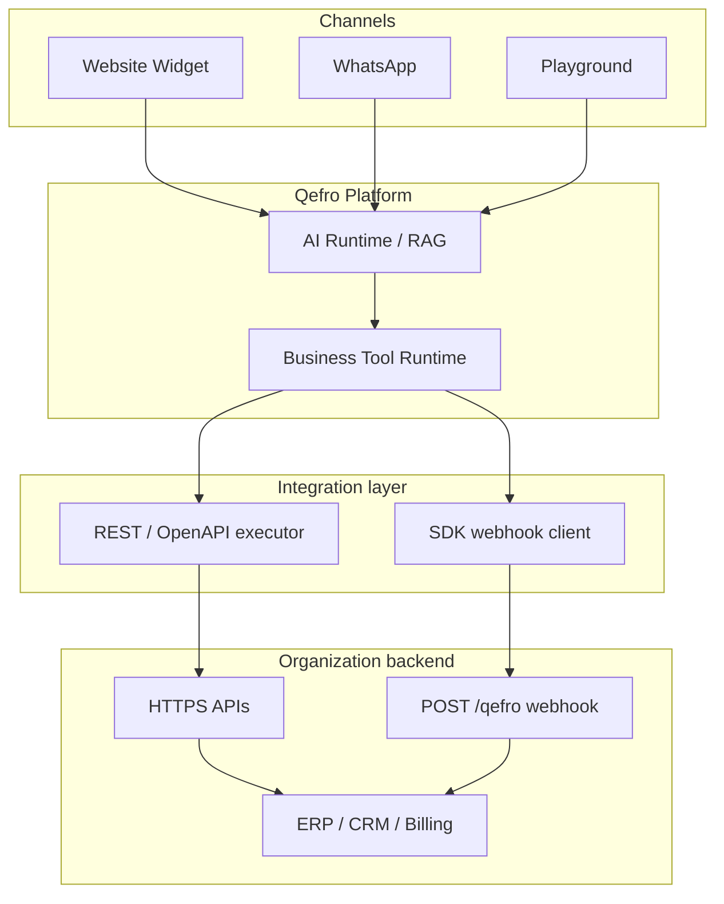
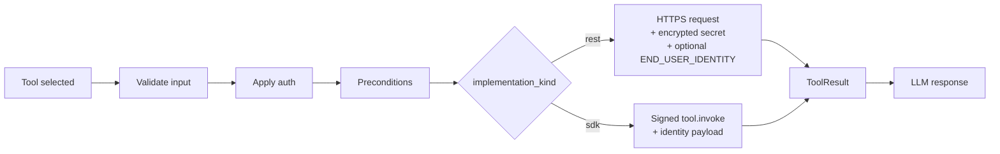
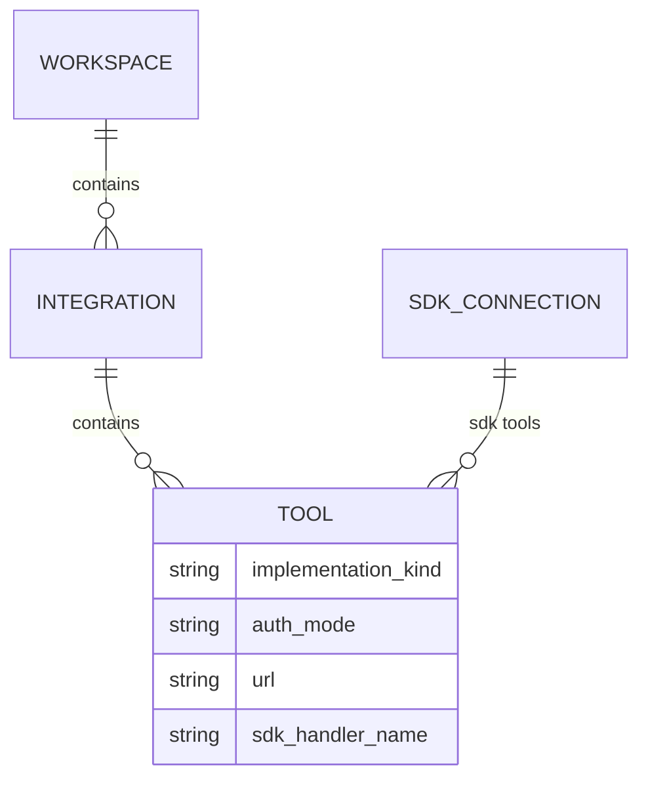

import { RelatedTopics } from '@site/src/components';

# Business Tools Architecture

Business Tools share one **execution pipeline** in the Qefro runtime. REST/OpenAPI and Backend SDK differ only in the **last mile** — how Qefro reaches your organization backend.

## System context

## Design principles

1. **Workspace scope** — Tools belong to one workspace; the assistant only sees tools for the active workspace.
2. **Single runtime** — Validation, auth, preconditions, logging, and LLM grounding are shared.
3. **Org-owned identity** — Qefro does not replace your IdP. SDK handlers and REST APIs enforce authorization.
4. **Fail closed** — SSRF blocks, auth failures, and precondition gaps stop execution — the model must not invent success.
5. **Auditability** — Every execution is logged (`tool_execution_logs`).

## REST vs SDK divergence point

| Stage | REST | SDK |
| --- | --- | --- |
| Credentials | Encrypted API key / bearer on tool | Signing secret on SDK Connection |
| End-user auth | `END_USER_IDENTITY` forwards JWT/session | Identity attributes + your `authorize()` |
| URL | Real HTTPS template | Internal placeholder; execution uses webhook |
| Discovery | Manual or OpenAPI import | `tools.list` + Sync Tools |

## Admin Console model

- **Integration** — Folder for related tools (`Shop backend`, `SDK: Order status`, OpenAPI import).
- **Tool** — Invocable operation (`rest_order_status`, `my_orders_list`).
- **SDK Connection** — Org-level webhook + signing secret (not workspace-scoped).

## Protocol boundaries

### REST / OpenAPI

Qefro is the **HTTP client**. Your API receives standard HTTP with configured auth headers and optional [identity forwarding](/docs/business-tools/identity-forwarding).

### Backend SDK

Qefro is the **webhook caller**. Your `@qefro-ai/backend` app receives signed JSON:

| Message | Purpose |
| --- | --- |
| `ping` | Health check |
| `tools.list` | Sync Tools discovery |
| `tool.invoke` | Execute handler |
| `tool.resume` | Continue after challenge |

Protocol details: [SDK Framework](/docs/v1/sdk-framework), [SDK synchronization](/docs/business-tools/sdk-synchronization).

## Multi-tenant isolation

- Tools, integrations, and execution logs are **tenant-scoped**.
- Widget tokens bind chat to a tenant + optional workspace.
- SSRF validation applies to every outbound URL and SDK webhook.

See [Security](/docs/business-tools/security) and [Tenant isolation](/docs/security/tenant-isolation).

## Related topics

<RelatedTopics
  topics={[
    {label: 'Runtime pipeline', to: '/docs/business-tools/runtime'},
    {label: 'REST / OpenAPI', to: '/docs/business-tools/rest-openapi'},
    {label: 'Backend SDK', to: '/docs/business-tools/backend-sdk'},
    {label: 'V1 Architecture', to: '/docs/v1/architecture'},
    {label: 'Multi-tenant AI', to: '/docs/concepts/multi-tenant-ai-architecture'},
  ]}
/>
