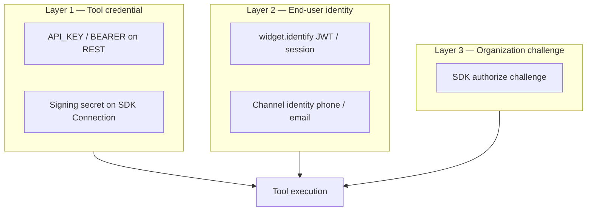
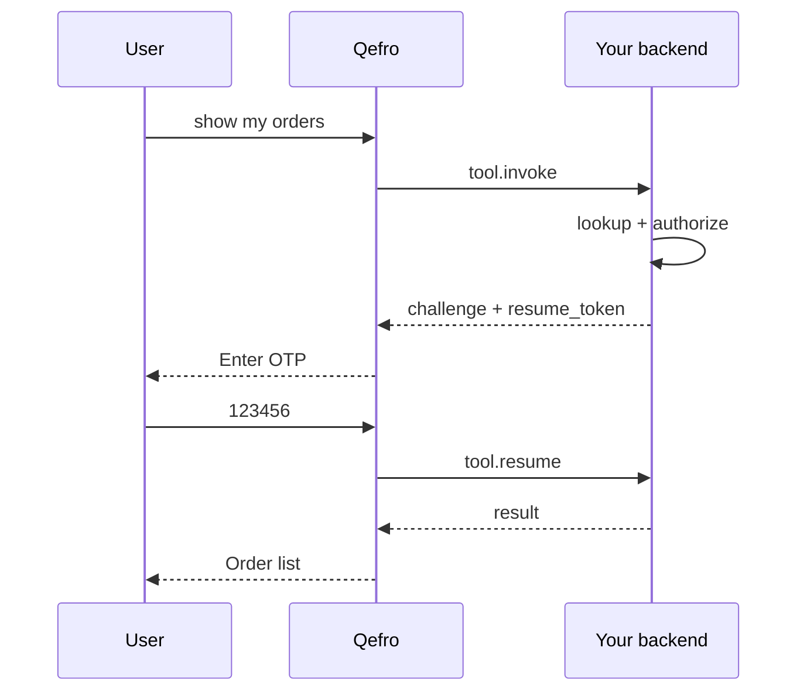

import { InfoBox, Warning, RelatedTopics, FaqAccordion } from '@site/src/components';

# Business Tool Authentication

Qefro is **not** an Identity Provider. Your organization owns:

- Customer directory / lookup
- Login and OTP issuance
- JWT and session lifecycle
- Authorization decisions

Qefro **orchestrates** conversations and tool execution — it forwards identity material and calls your configured integrations under your rules.

## Credential layers



| Layer | REST | SDK |
| --- | --- | --- |
| Service credential | `API_KEY`, `BEARER_TOKEN` | HMAC signing secret |
| End-user forward | `END_USER_IDENTITY` | Identity attrs on webhook (not raw JWT) |
| Org challenge | Rare (custom preconditions) | `customer.authorize()` + `tool.resume` |

## Required auth levels

Configured per tool as **Who can use this?**

| Level | Meaning | Typical channel |
| --- | --- | --- |
| `public` | Anonymous may trigger (if `allow_from_chat`) | Public FAQ + order-by-ID |
| `verified_channel` | Channel verified identity (Widget after `identify()`, WhatsApp phone) | Account tools with REST forward |
| `organization_challenge` | SDK OTP / login via Customer Provider | `my_orders_list` with OTP |

Sync Tools sets `organization_challenge` when SDK `authentication_methods` is non-empty.

## Challenge, suspend, resume



- **Challenge** — Handler needs more input (OTP, MFA).
- **Suspend** — Runtime waits; no handler re-entry until resume.
- **Resume** — Next user message (or structured response) sent as `tool.resume`.

See [Challenge / Resume](/docs/business-tools/challenge-resume).

## Authentication context (SDK)

On successful `authorize`, return optional `auth` payload:

```json
{
  "type": "bearer_token",
  "access_token": "...",
  "expires_in": 900,
  "customer_id": "cust-alice"
}
```

Downstream handler code uses `ctx.customer.require()` after authorization succeeds.

## Conversation context reuse

- Resolved identity attributes may persist in **conversation variables** for the session.
- OTP success does not automatically log the user into your main app — scope is the chat + tool execution.
- `clearIdentity()` on Widget clears forwarded JWT for subsequent tool calls.

## Expiration

- Forwarded JWTs: your API validates expiry; Widget should `setAuthToken()` on refresh.
- SDK-issued tokens in `auth` block: enforce TTL in your handler.
- Resume tokens: short-lived; expired resume → user must restart flow.

## What Qefro does not do

- Send SMS/email OTP itself
- Store customer passwords
- Replace OAuth/OIDC in your product
- Validate JWT signatures for your API (your API does)

<InfoBox>
Configure OTP, login URLs, and directory lookup in **your** SDK Customer Provider or REST API — not in Admin Console OTP fields.
</InfoBox>

## FAQ

<FaqAccordion
  items={[
    {
      question: 'Portal admin email vs customer email?',
      answer:
        'Portal supplies the logged-in admin email for identity resolution on Playground. Do not map admin UUIDs to commerce customer_id. Widget and WhatsApp use end-user identity.',
    },
    {
      question: 'Can REST tools use OTP?',
      answer:
        'Only if you build an HTTP OTP API. Prefer SDK for native challenge/resume.',
    },
  ]}
/>

## Related topics

<RelatedTopics
  topics={[
    {label: 'Identity forwarding (REST)', to: '/docs/business-tools/identity-forwarding'},
    {label: 'Identity resolution (SDK)', to: '/docs/business-tools/identity-resolution'},
    {label: 'Customer Provider', to: '/docs/v1/customer-provider'},
    {label: 'Identity & Authentication (platform)', to: '/docs/platform/identity-and-authentication'},
  ]}
/>
