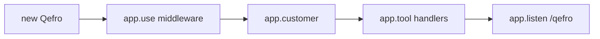

import { InfoBox, Warning, RelatedTopics, FaqAccordion, ApiEndpointCard } from '@site/src/components';

# Backend SDK Integration

The **Backend SDK** (`@qefro-ai/backend` / `qefro-backend-sdk`) runs in **your** backend. You register handlers; Qefro discovers and invokes them over a signed webhook (`POST /qefro`).

Full walkthrough: [Register SDK Business Tools](/docs/guides/register-sdk-business-tools).  
Protocol reference: [SDK Framework](/docs/v1/sdk-framework).

## When to use the SDK

- Customer **lookup** and **authorization** (OTP, login, session reuse).
- Multi-step **challenge / resume** flows.
- Business rules that do not map to a single REST call.
- You want handlers in code with type-safe tooling.

## Project setup

### TypeScript

```bash
npm install @qefro-ai/backend
export QEFRO_SIGNING_SECRET="your-signing-secret"
```

### Rust

```bash
cargo add qefro-backend-sdk
```

## Framework lifecycle



1. **`new Qefro({ signingSecret })`** — Verify incoming signatures.
2. **`app.customer({ lookup, authorize })`** — Optional Customer Provider.
3. **`app.tool(definition, handler)`** — Register Business Tool handlers.
4. **`app.listen({ port, path: '/qefro' })`** — HTTP server for protocol messages.

## Register a tool

```typescript
app.tool(
  {
    name: 'order_status_check',
    description: 'Look up order by ID when customer provides order_id.',
    auth: 'none',
    input_schema: {
      type: 'object',
      properties: { order_id: { type: 'string' } },
      required: ['order_id'],
    },
  },
  async (ctx) => {
    const orderId = String(ctx.parameters.order_id).toUpperCase();
    return orderService.getStatus(orderId);
  },
);
```

### Tool definition fields

| Field | Purpose |
| --- | --- |
| `name` | Stable id — synced as `sdk_handler_name` |
| `description` | LLM-facing summary |
| `input_schema` | JSON Schema for parameters |
| `auth` | `none` \| `optional` \| `required` |
| `authentication_methods` | e.g. `email_otp` — Sync may set `organization_challenge` |
| `lookup` | `{ required: ['email'] }` — runtime resolves before invoke |
| `permissions` | Enforced in your handler |
| `timeout` | Hint (seconds) |

## Customer Provider

```typescript
app.customer({
  async lookup(ctx) {
    // Resolve customer from identity attributes Qefro already collected
    const email = ctx.identity?.email ?? ctx.parameters?.email;
    return directory.findByEmail(email);
  },
  async authorize(ctx) {
    const customer = ctx.customer;
    if (!customer) return { kind: 'not_found' };

    if (!ctx.response) {
      await otp.send(customer.email);
      return {
        kind: 'challenge',
        challenge: {
          type: 'email_otp',
          message: 'Enter the 6-digit code sent to your email.',
          destination_hint: maskEmail(customer.email),
        },
      };
    }

    if (!(await otp.verify(customer.email, ctx.response))) {
      return { kind: 'denied' };
    }

    return {
      kind: 'success',
      customer,
      auth: {
        type: 'bearer_token',
        access_token: await tokens.issue(customer.id),
        expires_in: 900,
      },
    };
  },
});
```

Authorize outcomes: `success`, `challenge`, `denied`, `not_found`.

See [Challenge / Resume](/docs/business-tools/challenge-resume) and [Authentication](/docs/business-tools/authentication).

## Protocol messages

| Type | Direction | Handler |
| --- | --- | --- |
| `ping` | Qefro → you | Returns `pong` |
| `tools.list` | Qefro → you | Returns registered tools |
| `tool.invoke` | Qefro → you | Runs handler |
| `tool.resume` | Qefro → you | Continues after challenge |

### Example `tool.invoke` payload (simplified)

```json
{
  "protocol_version": "1",
  "type": "tool.invoke",
  "request_id": "req-uuid",
  "conversation_id": "conv-uuid",
  "channel": "widget",
  "tool": "my_orders_list",
  "parameters": { "limit": 5 },
  "identity": {
    "email": "alice@example.com",
    "channel": "widget"
  }
}
```

Signed headers: `X-Qefro-Protocol`, `X-Qefro-Timestamp`, `X-Qefro-Signature` (`v1=<hmac>`).

## Identity in SDK webhooks

The SDK receives **identity attributes**, not raw end-user JWT secrets:

- `email`, `phone`, `customer_id`, `user_id`
- `channel` (`widget`, `whatsapp`, `portal`, …)
- Verification / auth level metadata

For Widget **REST-style** forwarding of JWTs, use REST tools with `END_USER_IDENTITY`.  
For SDK, use `lookup.required` + Customer Provider. See [Identity resolution](/docs/business-tools/identity-resolution).

## SDK Connection and Sync Tools

**SDK Connections** link Qefro to your `@qefro-ai/backend` webhook. **Sync Tools** discovers handlers via `tools.list` and registers them as workspace Business Tools.

| Field | Purpose |
| --- | --- |
| Name | Admin label |
| Webhook URL | Public HTTPS `POST /qefro` |
| Signing secret | Shared HMAC (`QEFRO_SIGNING_SECRET`) |
| Enabled | Kill switch |

### Setup workflow

1. **SDK Connections** → webhook URL + signing secret.
2. **Test Connection** — signed `ping` → `pong` + `sdk_version`.
3. Select workspace → **Sync Tools** (`tools.list` + optional auto-register).

<ApiEndpointCard method="POST" path="/api/v1/org/sdk-connections/:id/test" description="Signed ping; updates connection health." />

<ApiEndpointCard method="POST" path="/api/v1/org/sdk-connections/:id/sync-tools" description="tools.list + optional auto_register into workspace." />

```json
{
  "workspace_id": "uuid",
  "auto_register": true,
  "enable_new_tools": true
}
```

| Sync writes | Source |
| --- | --- |
| `implementation_kind` | `sdk` |
| `sdk_handler_name` | Tool `name` from `tools.list` |
| `description`, `input_schema` | From handler metadata |
| `preconditions.lookup_required` | Tool `lookup.required` |
| `required_auth_level` | `organization_challenge` when auth methods set |

<Warning>
Sync **without** `workspace_id` and `auto_register` only refreshes connection metadata — tools will not appear in chat until registered to a workspace.
</Warning>

After you add or rename handlers, deploy your backend and run **Sync Tools** again. Guide: [Register SDK Business Tools](/docs/guides/register-sdk-business-tools).

## Return values

Return structured JSON. Include clear `message` fields for the LLM. Throw or return error shapes the runtime maps to user-safe text.

## Examples repository

| Example | Path |
| --- | --- |
| Order status + OTP | [order-status](https://github.com/qefro-ai/qefro-js-backend-sdk/tree/main/examples/order-status) |
| REST identity mock | [rest-order-api](https://github.com/qefro-ai/qefro-js-backend-sdk/tree/main/examples/rest-order-api) |
| Banking, healthcare, CRM | [examples/](https://github.com/qefro-ai/qefro-js-backend-sdk/tree/main/examples) |

Catalog: [Examples](/docs/business-tools/examples).

## FAQ

<FaqAccordion
  items={[
    {
      question: 'Do I implement /ping myself?',
      answer: 'No. app.listen() handles ping, tools.list, tool.invoke, and tool.resume.',
    },
    {
      question: 'Why does synced SDK tool show a placeholder URL?',
      answer:
        'SDK tools execute via webhook + sdk_handler_name, not the URL field. The placeholder is internal.',
    },
  ]}
/>

## Related topics

<RelatedTopics
  topics={[
    {label: 'Register SDK (guide)', to: '/docs/guides/register-sdk-business-tools'},
    {label: 'Runtime', to: '/docs/business-tools/runtime'},
    {label: 'Customer Provider', to: '/docs/v1/customer-provider'},
    {label: 'Challenge / Resume', to: '/docs/business-tools/challenge-resume'},
  ]}
/>
