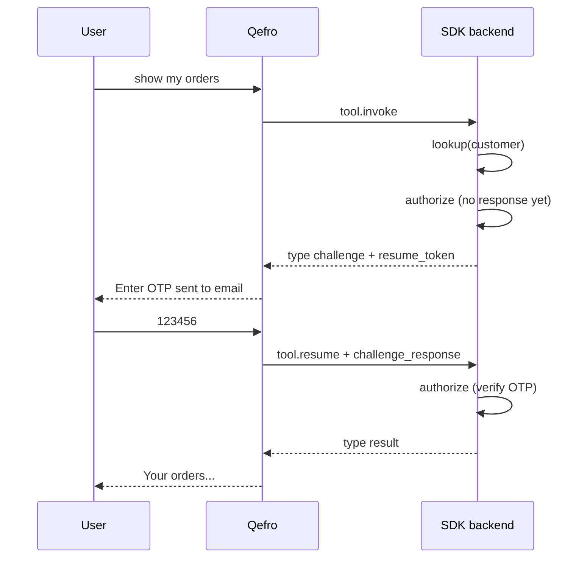

import { RelatedTopics } from '@site/src/components';

# Challenge and Resume

When a SDK handler needs user input mid-flight (OTP, MFA, confirmation code), your **`customer.authorize()`** returns a **challenge**. Qefro suspends execution until the user replies, then sends **`tool.resume`**.

## Flow



## Authorize outcomes

| `kind` | Meaning | Qefro action |
| --- | --- | --- |
| `success` | Customer authorized | Run handler |
| `challenge` | Need user input | Show message; wait for resume |
| `denied` | Auth failed | User-safe error |
| `not_found` | Unknown customer | User-safe error |

### Challenge payload

```json
{
  "type": "challenge",
  "resume_token": "uuid",
  "challenge": {
    "type": "email_otp",
    "message": "Enter the 6-digit code sent to your email.",
    "destination_hint": "a***@example.com"
  }
}
```

## tool.resume

Qefro sends the user's next message as `challenge_response` (or structured field per protocol):

```json
{
  "type": "tool.resume",
  "tool": "my_orders_list",
  "resume_token": "uuid",
  "challenge_response": "123456",
  "conversation_id": "...",
  "identity": { "email": "alice@example.com" }
}
```

Your authorize function receives `ctx.response` on resume.

## Channels

Challenge/resume works on:

- Website Widget
- WhatsApp (user reply becomes resume)
- Admin Playground / Test Chat

## Best practices

- Keep OTP messages short — the LLM may paraphrase your `message`.
- Use `destination_hint` masked (never full secrets).
- Idempotent resume — duplicate OTP attempts should return `denied`, not throw.
- Expire resume tokens quickly in production (framework stores in-memory in dev).

## Related topics

<RelatedTopics
  topics={[
    {label: 'Authentication', to: '/docs/business-tools/authentication'},
    {label: 'Customer Provider', to: '/docs/v1/customer-provider'},
    {label: 'order-status example', to: 'https://github.com/qefro-ai/qefro-js-backend-sdk/tree/main/examples/order-status'},
  ]}
/>
