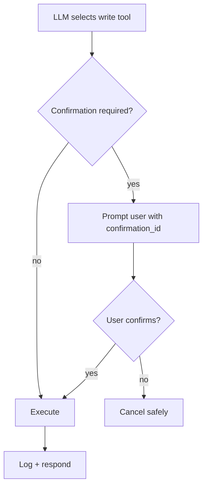

import { Warning, RelatedTopics } from '@site/src/components';

# Confirmation Flow

For sensitive **write** actions (refunds, deletes, subscription changes), the runtime may require an explicit **confirmation** before executing the tool — even after authentication succeeds.

## When confirmation applies

- Tool or org policy marks action as requiring confirmation.
- User must reply with an approved confirmation token (e.g. `/confirm <id>` in internal flows).
- Prevents accidental one-shot destructive calls from model over-eagerness.

## Design recommendations

- Use confirmation for **irreversible** operations only — too many confirmations hurt UX.
- Prefer idempotent APIs so retries are safe.
- Return clear pre-confirmation summaries (“Refund $49 to card •••• 4242?”).
- Log confirmation grants in execution metadata.

## REST vs SDK

| Path | Pattern |
| --- | --- |
| REST | Two-step API (preview + commit) or single tool with `confirmation` precondition |
| SDK | Handler checks conversation vars for `confirmation=true` after runtime gate |

Pilot with read-only tools first; add confirmation when enabling writes.

<Warning>
Confirmation complements — does not replace — API-side authorization. Your backend must still verify the user may perform the action.
</Warning>

## Related topics

<RelatedTopics
  topics={[
    {label: 'Runtime', to: '/docs/business-tools/runtime'},
    {label: 'Secure Business Actions', to: '/docs/guides/secure-business-actions'},
    {label: 'Best practices', to: '/docs/business-tools/best-practices'},
  ]}
/>
