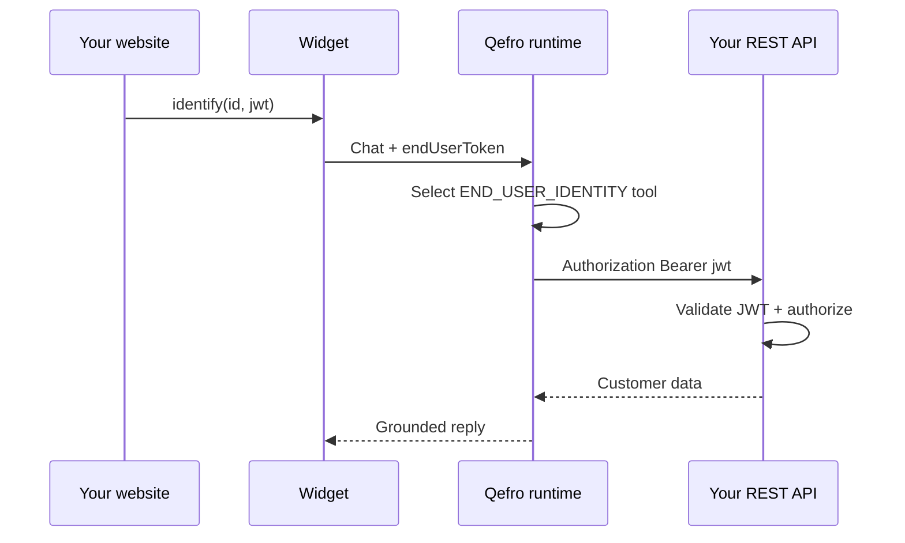

import {
  InfoBox,
  Warning,
  RelatedTopics,
  FaqAccordion,
  WorkflowCard,
} from '@site/src/components';

# Identity Forwarding (REST)

**Identity forwarding** applies to **REST / OpenAPI Business Tools** with auth mode **`END_USER_IDENTITY`**.

Qefro forwards the end-user credential your host app supplied via `widget.identify()` when calling your HTTPS API. Qefro does **not** validate your JWT — your API remains the authority.

Widget API reference: [Platform identity forwarding](/docs/platform/identity-forwarding).

:::info REST only
Backend SDK webhooks do **not** receive raw JWT/session secrets. SDK tools use [identity resolution](/docs/business-tools/identity-resolution) (email, phone, customer_id attributes) plus your Customer Provider.
:::

## When to use

- Customer is logged into **your** website.
- Your API expects `Authorization: Bearer <user_jwt>` or session header.
- You want Qefro to call the API **as the customer**, not as a shared service account.

## Widget setup

```javascript
const widget = new AIWidget.Widget({
  token: 'YOUR_WIDGET_TOKEN',
  endpoint: 'https://api.qefro.com',
  workspaceId: 'YOUR_WORKSPACE_ID',
});

widget.identify({
  id: user.id,
  email: user.email,
  name: user.name,
  auth: {
    mode: 'jwt',
    token: userJwtFromYourAuthSystem,
  },
});
```

| `auth.mode` | Qefro forwards on REST call |
| --- | --- |
| `jwt` | `Authorization: Bearer <token>` |
| `session` | `X-Session-Id: <token>` |
| `none` | Profile only (id/email/name) — insufficient for `END_USER_IDENTITY` |

Also sent on chat transport: `X-End-User-Token` / `X-End-User-Session` (WebSocket fields `endUserToken` / `endUserSession`).

## Admin Console tool config

| Field | Value |
| --- | --- |
| Method / URL | Your customer-scoped endpoint |
| Credential type | **Forward signed-in user** (`END_USER_IDENTITY`) |
| Who can use | **Verified channel** |
| Secret | Leave empty |
| Workspace | Required — bind widget with `workspaceId` |

## Runtime flow



## Additive identity headers

Qefro may also attach (without overwriting `Authorization`):

- `X-Qefro-User-ID`, `X-Qefro-User-Email`, `X-Qefro-Phone`
- `X-Qefro-Channel`, `X-Qefro-Authentication-Level`

Use these for logging or secondary checks; **authorize on the forwarded JWT** in your API.

## Test without widget

Admin **Test Tool** accepts optional `user_jwt`:

```bash
curl -sS -X POST \
  -H "Authorization: Bearer $ADMIN_JWT" \
  -H "Content-Type: application/json" \
  https://api.qefro.com/api/v1/tools/$TOOL_ID/test \
  -d '{"user_jwt":"dev-jwt-alice"}'
```

Example mock: [rest-order-api/identity/me](https://github.com/qefro-ai/qefro-js-backend-sdk/tree/main/examples/rest-order-api).

## Channel support

| Channel | END_USER_IDENTITY |
| --- | --- |
| Website Widget | Supported after `identify()` |
| WhatsApp | Session/JWT if channel provides equivalent |
| Internal Portal | **Blocked** — use Widget for customer forward tests |

## Best practices

- Use opaque stable `id` in `identify()`, not email alone.
- Short JWT TTL + `widget.setAuthToken(freshJwt)` on refresh.
- `await widget.clearIdentity()` on logout.
- Never put tokens in `setContext()` — context is page metadata only.

<Warning>
Do not paste Admin Console `localStorage.token` into widget config — that is your **admin** JWT, not the end-user credential.
</Warning>

## FAQ

<FaqAccordion
  items={[
    {
      question: 'Does SDK support END_USER_IDENTITY?',
      answer:
        'No. SDK uses identity attributes on the webhook. Use REST for raw JWT forward, or SDK lookup + authorize for OTP flows.',
    },
    {
      question: 'Anonymous widget users?',
      answer:
        'Do not call identify(). END_USER_IDENTITY tools require verified_channel — they will not run until identify() provides auth.',
    },
  ]}
/>

## Related topics

<RelatedTopics
  topics={[
    {label: 'Platform: Identity Forwarding', to: '/docs/platform/identity-forwarding'},
    {label: 'Identity resolution (SDK)', to: '/docs/business-tools/identity-resolution'},
    {label: 'REST / OpenAPI', to: '/docs/business-tools/rest-openapi'},
    {label: 'Deploy Website Widget', to: '/docs/guides/deploy-website-widget'},
  ]}
/>
