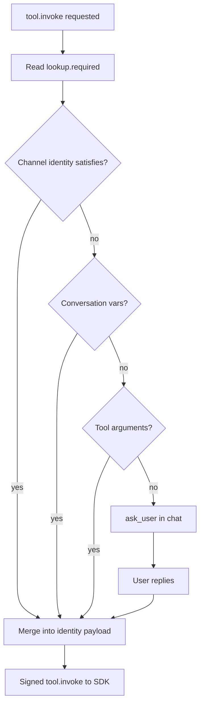

import { InfoBox, RelatedTopics, FaqAccordion } from '@site/src/components';

# Identity Resolution (SDK)

SDK tools can advertise **`lookup.required`** — identity attributes the Qefro runtime must resolve **before** `tool.invoke`.

This is separate from [REST identity forwarding](/docs/business-tools/identity-forwarding): the SDK receives **attributes** (`email`, `phone`), not raw JWT secrets.

## Advertise in handler

```typescript
app.tool(
  {
    name: 'my_orders_list',
    description: 'List orders for the current customer.',
    auth: 'required',
    lookup: { required: ['email'] },
    input_schema: {
      type: 'object',
      properties: {
        email: { type: 'string', description: 'When channel did not provide email' },
      },
    },
  },
  async (ctx) => {
    const customer = ctx.customer.require();
    return orderService.listForCustomer(customer.id);
  },
);
```

Use `lookup: { required: ['phone'] }` for phone-first flows (common on WhatsApp).

Sync Tools stores this as `preconditions.lookup_required` on the Business Tool.

## Resolution order



1. **Verified / channel identity** — Portal email, WhatsApp phone, Widget after partial identify.
2. **Conversation variables** — Previously collected values in thread.
3. **Tool arguments** — LLM-filled parameters.
4. **Ask user** — Prompt for missing attribute.

## Channel behavior matrix

| Channel | `lookup: email` | `lookup: phone` |
| --- | --- | --- |
| **Portal / Playground** | Admin login email auto | Asks user for phone |
| **WhatsApp** | Asks user for email | WhatsApp phone auto |
| **Widget (anonymous)** | Asks user for email | Asks user for phone |
| **Widget + identify()** | Uses profile email if present | Uses profile if present |

After resolution, your **`customer.lookup`** matches the directory — Qefro does not hardcode channel rules in your handler.

## Example flows

### Widget + email lookup + OTP

1. User: “show my orders”
2. Runtime: missing email → asks user
3. User: `alice@example.com`
4. Runtime: invokes SDK with `identity.email`
5. SDK: `lookup` → `authorize` challenge (OTP)
6. User: OTP → `tool.resume` → order list

### WhatsApp + phone lookup

1. User: “my orders”
2. Runtime: phone from WhatsApp satisfies `lookup.required: ['phone']`
3. SDK: lookup by phone → OTP if configured

### Portal + email

1. Playground uses admin email automatically for `lookup: email`
2. SDK lookup must recognize that email in **your** customer directory

<InfoBox>
Do not map Portal admin UUID to commerce `customer_id`. Only use emails/phones your directory knows.
</InfoBox>

## REST tools and lookup

`lookup.required` is primarily an **SDK sync** feature. REST tools typically encode parameters in URL/body and use `END_USER_IDENTITY` for auth — not SDK-style lookup preconditions.

## Related topics

<RelatedTopics
  topics={[
    {label: 'Authentication', to: '/docs/business-tools/authentication'},
    {label: 'Challenge / Resume', to: '/docs/business-tools/challenge-resume'},
    {label: 'Identity forwarding (REST)', to: '/docs/business-tools/identity-forwarding'},
    {label: 'order-status example', to: 'https://github.com/qefro-ai/qefro-js-backend-sdk/tree/main/examples/order-status'},
  ]}
/>
