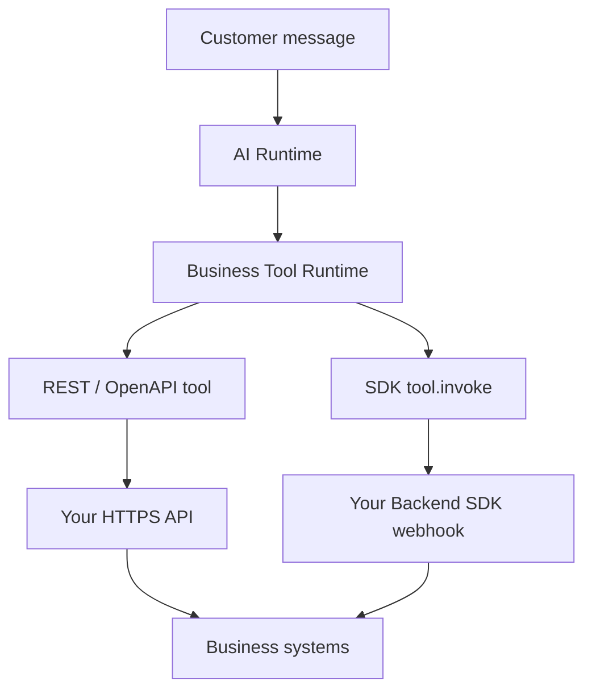

import {
  InfoBox,
  Warning,
  RelatedTopics,
  FaqAccordion,
  WorkflowCard,
} from '@site/src/components';

# Business Tools Overview

**Business Tools** are workspace-scoped connectors that let Qefro assistants **execute actions** in your systems — order lookups, ticket creation, inventory checks, subscription changes, and more.

The AI does not call your APIs directly. Every action flows through the **shared Business Tool runtime**, whether the tool is implemented as REST/OpenAPI or as a **Backend SDK** handler.

## Knowledge Base vs Business Tools

| Capability | Knowledge Base | Business Tools |
| --- | --- | --- |
| Data source | Documents, websites, uploaded files | Your live APIs / backend handlers |
| Answers | Static or indexed content | Real-time system of record |
| Examples | “What is your return policy?” | “Where is order ORD-1002?” |
| Auth | Workspace content access | Per-tool credentials + optional end-user identity |
| Changes | Re-index when docs change | Re-test when APIs or handlers change |

Most production assistants use **both**: RAG for policies and FAQs, Business Tools for account-specific actions.

## Business Tools vs Business Actions

| Term | Meaning |
| --- | --- |
| **Business Tool** | Configuration — URL, method, auth, schema, or SDK handler name |
| **Business Action** | One runtime invocation of that tool during chat |

See [What are Business Actions?](/docs/concepts/business-actions).

## Two integration paths (same runtime)

| Path | When to use | Admin Console surface |
| --- | --- | --- |
| [**REST / OpenAPI**](/docs/business-tools/rest-openapi) | Existing HTTPS APIs, vendor CRUD, OpenAPI specs | REST tab, OpenAPI import |
| [**Backend SDK**](/docs/business-tools/backend-sdk) | Customer auth, OTP, workflows, org-owned logic | SDK Connections + Sync Tools |

Compare in depth: [REST vs Backend SDK](/docs/business-tools/rest-vs-sdk).  
Mix both in one workspace: [Mixed integrations](/docs/business-tools/mixed-integrations).

## Real-world examples

| Use case | Typical path | Example tool |
| --- | --- | --- |
| Download invoice | SDK (`auth: required`) | `download_invoice` |
| Create support ticket | REST `POST` | `create_ticket` |
| Search CRM | REST / OpenAPI | `crm_contact_search` |
| Restart server (Employee AI) | REST with scoped key | `infra_restart_pod` |
| Generate report | REST async job | `report_generate` |
| Cancel subscription | SDK + authorize | `subscription_cancel` |
| Inventory lookup | REST `GET` | `inventory_balance_get` |

Runnable examples: [Examples catalog](/docs/business-tools/examples).

## Channels (V1)

| Channel | Business Tools |
| --- | --- |
| Website Widget | Supported |
| WhatsApp | Supported |
| Admin Playground | Supported (test chat) |
| Internal Portal | Knowledge only — **no** `END_USER_IDENTITY` forwarding yet |

## Where to start

<WorkflowCard
  title="First Business Tool"
  steps={[
    {title: 'Pick a workspace', description: 'Tools are workspace-scoped (e.g. Support vs HR).'},
    {title: 'Choose integration path', description: 'REST for existing APIs; SDK for auth-heavy flows.'},
    {title: 'Configure + test', description: 'Console Test Tool before enabling chat.'},
    {title: 'Enable for channel', description: 'Widget / WhatsApp; add identify() when needed.'},
    {title: 'Monitor logs', description: 'Review execution logs after pilot traffic.'},
  ]}
/>

### Step-by-step guides

- [Connect REST APIs](/docs/guides/connect-rest-apis) — manual REST tool
- [Import OpenAPI](/docs/guides/import-openapi) — bulk from spec
- [Register SDK Business Tools](/docs/guides/register-sdk-business-tools) — `@qefro-ai/backend`

### Deep dives

- [Business Tool Runtime](/docs/business-tools/runtime) — canonical architecture and pipeline
- [Authentication](/docs/business-tools/authentication)
- [Identity forwarding](/docs/business-tools/identity-forwarding) (REST)
- [Identity resolution](/docs/business-tools/identity-resolution) (SDK)
- [Parameters reference](/docs/business-tools/parameters-reference)

<InfoBox>
Qefro is an **orchestration runtime**, not an identity provider. Your organization owns customer lookup, login, OTP, JWT issuance, and authorization. Qefro forwards identity and executes tools under your configuration.
</InfoBox>

## FAQ

<FaqAccordion
  items={[
    {
      question: 'Do I need Business Tools on day one?',
      answer:
        'No. Many teams launch with knowledge-only Customer AI, then add tools when Q&A is stable.',
    },
    {
      question: 'REST or SDK?',
      answer:
        'REST for existing HTTPS APIs. SDK when authentication, OTP, or multi-step workflows belong in your backend. See REST vs SDK.',
    },
    {
      question: 'Where are secrets stored?',
      answer:
        'Encrypted at rest on REST tools and SDK connections. Never in widget JavaScript. See [Secrets](/docs/security/secrets).',
    },
  ]}
/>

## Related topics

<RelatedTopics
  topics={[
    {label: 'Runtime', to: '/docs/business-tools/runtime'},
    {label: 'REST vs SDK', to: '/docs/business-tools/rest-vs-sdk'},
    {label: 'Platform: Business Tools', to: '/docs/platform/business-tools'},
    {label: 'Secure Business Actions', to: '/docs/guides/secure-business-actions'},
    {label: 'Identity forwarding (REST)', to: '/docs/business-tools/identity-forwarding'},
  ]}
/>
