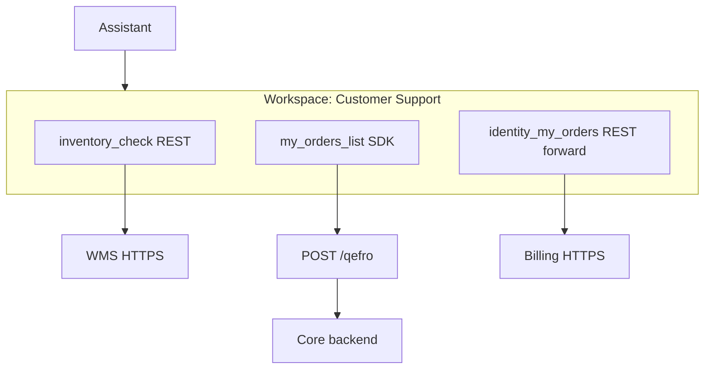

import { RelatedTopics } from '@site/src/components';

# Mixed REST and SDK Integrations

REST and SDK are **complementary**. The AI sees a flat list of Business Tools — it does not know or care which integration path backs each tool.

## Example workspace layout

| Tool | Path | Purpose |
| --- | --- | --- |
| `inventory_check` | REST `GET` | Real-time stock from WMS API |
| `shipping_quote` | REST / OpenAPI | Carrier rate API |
| `order_status_public` | SDK `auth: none` | Order by ID (no login) |
| `my_orders_list` | SDK `auth: required` | OTP + list for signed-in customer |
| `subscription_cancel` | SDK | Business rules + authorize |
| `invoice_pdf` | REST + `END_USER_IDENTITY` | Forward widget JWT to billing API |

## Pattern: REST for vendors, SDK for core domain

**When:** You integrate Stripe, Shopify, or a shipping carrier via REST, but customer identity and orders live in your monolith.

1. Import carrier OpenAPI → read-only quote/track tools.
2. Register core handlers in `@qefro-ai/backend` → OTP, order list, refunds policy engine.
3. Sync SDK into the **same workspace** as REST integrations.

## Pattern: public REST + authenticated SDK

**When:** Anonymous users can track by order ID; account holders get full history after OTP.

| Tool | Auth | Channel behavior |
| --- | --- | --- |
| `order_status_check` | SDK `auth: none` or REST public | Anyone with order ID |
| `my_orders_list` | SDK `auth: required` | OTP after email/phone lookup |

Example: [order-status](https://github.com/qefro-ai/qefro-js-backend-sdk/tree/main/examples/order-status) mock.

## Pattern: SDK identity + REST forward

**When:** Some microservices accept forwarded JWT (REST), others need SDK orchestration.

- Widget: `identify({ auth: { mode: 'jwt', token } })`
- Billing microservice: REST tool `END_USER_IDENTITY`
- Legacy ERP: SDK handler calls ERP with service account internally

Do **not** assume one identity mechanism covers all backends — configure per tool.

## Admin Console organization

- One **integration** per concern (`Shop backend`, `SDK: Production`, `OpenAPI: Shipping`).
- Same **workspace** for customer-facing assistants.
- Separate **internal workspace** for Employee AI tools (no customer OTP tools).

## Sync discipline

| Change | Action |
| --- | --- |
| New SDK handler | Re-run **Sync Tools** |
| OpenAPI spec update | **Reimport** preview → apply |
| REST URL change | PATCH tool in console |
| Rotated API key | Update encrypted secret |

## Related topics

<RelatedTopics
  topics={[
    {label: 'REST vs SDK', to: '/docs/business-tools/rest-vs-sdk'},
    {label: 'Examples', to: '/docs/business-tools/examples'},
    {label: 'Runtime', to: '/docs/business-tools/runtime'},
  ]}
/>
