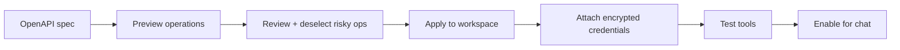

import { Warning, RelatedTopics, WorkflowCard, ApiEndpointCard } from '@site/src/components';

# OpenAPI Import

Import an **OpenAPI 3.x** document to bulk-create or update REST Business Tools in a workspace.

Hands-on guide: [Import OpenAPI](/docs/guides/import-openapi).

## Workflow

<WorkflowCard
  title="OpenAPI import"
  steps={[
    {title: 'Trim spec', description: 'Assistant-safe operations only.'},
    {title: 'Preview', description: 'POST .../import/preview — review operation list.'},
    {title: 'Apply selectively', description: 'Skip DELETE/admin unless required.'},
    {title: 'Encrypt auth', description: 'Map securitySchemes to stored secrets.'},
    {title: 'Reimport on API changes', description: 'Diff new write operations.'},
  ]}
/>

## API endpoints

<ApiEndpointCard method="POST" path="/api/v1/workspaces/:workspace_id/integrations/import/preview" description="Preview operations from URL or upload." />

<ApiEndpointCard method="POST" path="/api/v1/workspaces/:workspace_id/integrations/import/apply" description="Create/update integrations and tools from preview." />

<ApiEndpointCard method="POST" path="/api/v1/integrations/:id/reimport" description="Re-import from updated spec with matching rules." />

## Matching and updates

On reimport, Qefro matches operations by `operationId` or path+method:

- **New operations** — Created as disabled or enabled per apply options.
- **Existing operations** — Schemas and metadata updated; secrets preserved unless overwritten.
- **Removed operations** — May disable tools; review before apply.

## Security warnings

<Warning>
Treat OpenAPI import like granting a new automation user broad API access. Preview always — never blind-apply production admin specs.
</Warning>

- Deselect `DELETE`, bulk export, and admin paths.
- Prefer read-only `GET` for first rollout.
- Trim servers to environments Qefro can reach (public HTTPS).
- SSRF rules still apply post-import.

## Limitations

- MCP / GraphQL / SOAP — use manual REST or SDK (OpenAPI is REST-focused).
- Complex auth flows (OAuth device code) — may need manual header config.
- `END_USER_IDENTITY` — configure per tool after import if end-user JWT required.

## Related topics

<RelatedTopics
  topics={[
    {label: 'Import OpenAPI (guide)', to: '/docs/guides/import-openapi'},
    {label: 'REST / OpenAPI', to: '/docs/business-tools/rest-openapi'},
    {label: 'Security', to: '/docs/business-tools/security'},
  ]}
/>
