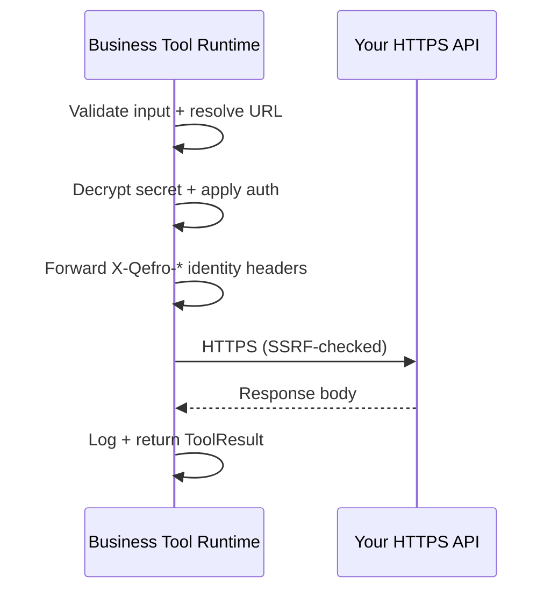

import {
  InfoBox,
  Warning,
  RelatedTopics,
  FaqAccordion,
  ApiEndpointCard,
} from '@site/src/components';

# REST / OpenAPI Integration

**REST Business Tools** let Qefro call your existing HTTPS APIs. Qefro acts as the HTTP client: it applies encrypted credentials, substitutes URL parameters, validates schemas, and logs every call.

For bulk import from a spec, see [OpenAPI import](/docs/business-tools/openapi-import).  
Step-by-step: [Connect REST APIs](/docs/guides/connect-rest-apis).

## When to use REST

- You already expose HTTPS endpoints (CRUD, vendor APIs, microservices).
- Authentication is API key, service bearer, or **forwarded end-user JWT** (`END_USER_IDENTITY`).
- Operations map cleanly to HTTP method + URL + JSON body.

## Configuration fields

| Field | Description |
| --- | --- |
| **Method** | `GET`, `POST`, `PUT`, `PATCH`, `DELETE` |
| **URL** | HTTPS template, e.g. `https://api.example.com/orders/{order_id}` |
| **Headers** | JSON object; internal keys prefixed `__` are not sent |
| **Auth mode** | See authentication modes below |
| **Secret** | Encrypted credential (API key or bearer) |
| **input_schema** | JSON Schema — LLM fills parameters |
| **output_schema** | Optional response validation |
| **timeout_seconds** | 1–120 (default 30) |
| **required_auth_level** | `public`, `verified_channel`, `organization_challenge` |
| **allow_from_chat** | Offer tool to anonymous widget users when `public` |

Full field reference: [Parameters reference](/docs/business-tools/parameters-reference).

## Authentication modes

| Mode | Outbound behavior | Use when |
| --- | --- | --- |
| **NONE** | No credential header | Public read APIs |
| **API_KEY** | `X-API-Key: <secret>` (or custom header via `__api_key_header`) | Vendor / internal service keys |
| **BEARER_TOKEN** | `Authorization: Bearer <secret>` | Service account bearer |
| **END_USER_IDENTITY** | `Authorization: Bearer <user JWT>` or `X-Session-Id` from `identify()` | Customer-scoped APIs on Widget |

Legacy aliases `FORWARD_USER_JWT` and `FORWARD_SESSION` map to **END_USER_IDENTITY**.

### END_USER_IDENTITY example

Admin tool config:

- URL: `https://api.example.com/rest/identity/my-orders`
- Auth: **Forward signed-in user**
- Who can use: **Verified channel**
- Secret: empty

Widget:

```javascript
widget.identify({
  id: 'cust-alice',
  email: 'alice@example.com',
  auth: { mode: 'jwt', token: userJwtFromYourApp },
});
```

Qefro forwards the JWT on the outbound REST call. Your API validates it.

See [Identity forwarding](/docs/business-tools/identity-forwarding).

## URL templates and parameters

Path placeholders use `{param_name}` matching `input_schema` properties:

```text
GET https://api.example.com/orders/{order_id}
```

Remaining parameters become query string (GET) or JSON body (POST/PUT/PATCH).

## Request pipeline



### Identity headers (additive)

When verified identity exists, Qefro may add (without overwriting your `Authorization`):

- `X-Qefro-User-ID`
- `X-Qefro-User-Email`
- `X-Qefro-Phone`
- `X-Qefro-Channel`
- `X-Qefro-Authentication-Level`

## Validation

- **Input** — Invalid LLM parameters → validation error (not sent to your API).
- **Output** — Optional `output_schema` check on response JSON.
- **HTTPS only** — HTTP URLs rejected.
- **SSRF** — Private IPs, link-local, and blocked metadata hosts rejected.

## Retries

The REST executor retries transient failures with bounded backoff. Non-idempotent writes should be designed idempotent on your API side — the model may retry logically via conversation.

## Secret management

- Secrets encrypted at rest; decrypted only at execution time.
- Never embed secrets in widget code or OpenAPI specs uploaded to chat.
- Rotate via Admin Console PATCH; empty string clears secret.

See [Secrets](/docs/security/secrets).

## Test and logs

<ApiEndpointCard method="POST" path="/api/v1/tools/:id/test" description="Dry-run tool with sample arguments and optional user_jwt for END_USER_IDENTITY tests." />

```bash
curl -sS -X POST \
  -H "Authorization: Bearer $ADMIN_JWT" \
  -H "Content-Type: application/json" \
  https://api.qefro.com/api/v1/tools/$TOOL_ID/test \
  -d '{"arguments":{"order_id":"ORD-1001"},"user_jwt":"eyJ..."}'
```

```bash
curl -sS -H "Authorization: Bearer $ADMIN_JWT" \
  https://api.qefro.com/api/v1/tools/$TOOL_ID/logs
```

## OpenAPI vs manual REST

| Approach | Best for |
| --- | --- |
| Manual REST | One endpoint, custom headers, pilots |
| OpenAPI import | Many operations from existing spec |

[OpenAPI import guide](/docs/business-tools/openapi-import).

<Warning>
OpenAPI import can expose write/delete operations. Always preview and deselect dangerous paths before apply.
</Warning>

## FAQ

<FaqAccordion
  items={[
    {
      question: 'Does REST support OTP?',
      answer:
        'Not natively. OTP belongs in the Backend SDK (customer.authorize + challenge/resume). REST can call an OTP API you build, but orchestration is cleaner in the SDK.',
    },
    {
      question: 'Can I mix API_KEY and END_USER_IDENTITY?',
      answer:
        'One auth_mode per tool. Use END_USER_IDENTITY when your API authorizes the end user. Use a separate service-account tool if you also need backend-only calls.',
    },
  ]}
/>

## Related topics

<RelatedTopics
  topics={[
    {label: 'Connect REST APIs (guide)', to: '/docs/guides/connect-rest-apis'},
    {label: 'OpenAPI import', to: '/docs/business-tools/openapi-import'},
    {label: 'Identity forwarding', to: '/docs/business-tools/identity-forwarding'},
    {label: 'REST vs SDK', to: '/docs/business-tools/rest-vs-sdk'},
  ]}
/>
