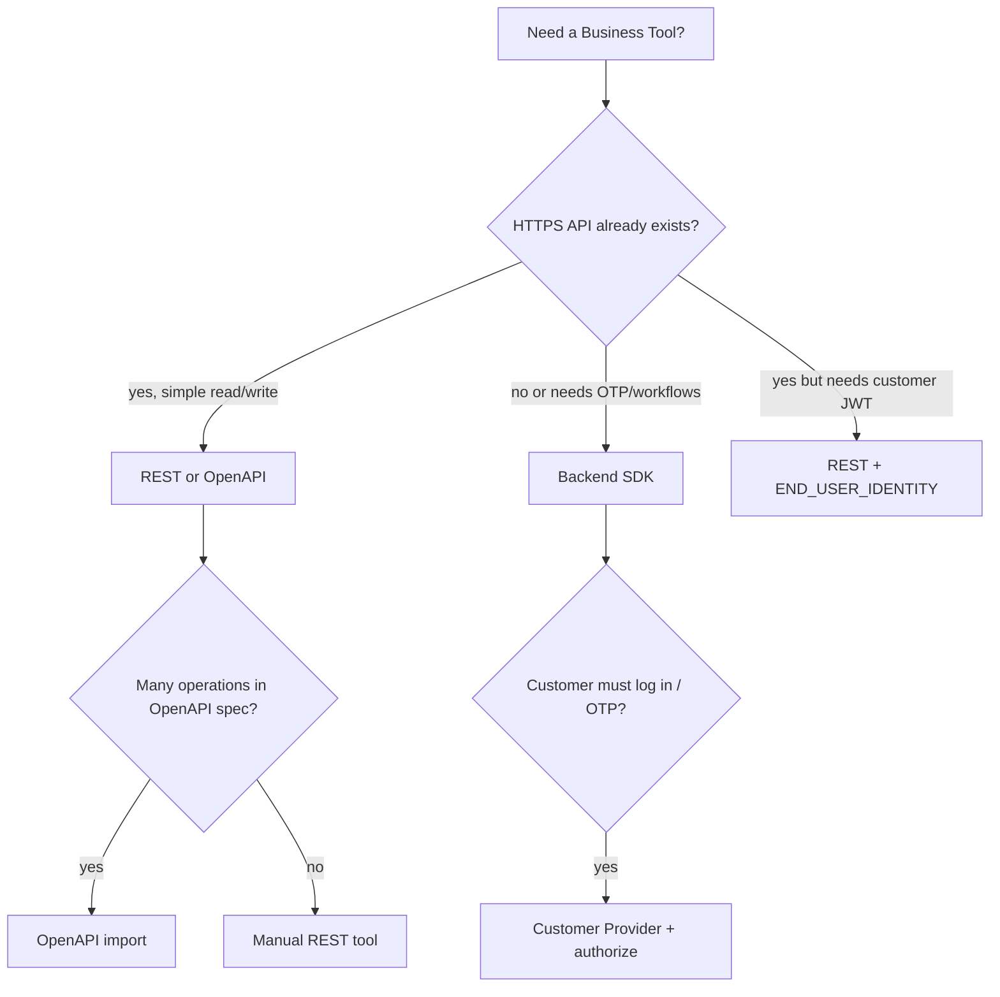

import { InfoBox, RelatedTopics } from '@site/src/components';

# REST vs Backend SDK

Both paths register **Business Tools** in the same workspace and execute through the **same runtime**. The difference is how Qefro reaches your organization backend.

## At a glance

| Dimension | REST / OpenAPI | Backend SDK |
| --- | --- | --- |
| **Best for** | Existing HTTPS APIs | Auth, workflows, org logic in code |
| **You implement** | HTTP endpoints (already exist) | Handlers + optional Customer Provider |
| **Qefro calls** | Your REST URL | Signed webhook `POST /qefro` |
| **Discovery** | Manual / OpenAPI import | `tools.list` + Sync Tools |
| **Service auth** | API_KEY, BEARER_TOKEN | Signing secret (HMAC) |
| **End-user auth** | `END_USER_IDENTITY` (forward JWT/session) | `lookup` + `authorize()` challenge/resume |
| **Raw JWT to your code** | Yes (REST forward) | **No** — identity attributes only |
| **OTP / login** | Build your own HTTP OTP API | Native challenge/resume |
| **CRUD on vendor API** | Excellent | Overkill |
| **Stateful multi-step** | Awkward | Natural |
| **Performance** | One HTTP hop | Webhook + your handler logic |
| **Streaming** | Limited by HTTP response | Handler-controlled |
| **Tool sync** | OpenAPI re-import | Re-run Sync Tools |
| **Secrets in Qefro** | Per-tool encrypted secret | Per-connection signing secret |

## Decision guide

### Choose REST when

- You have OpenAPI or Swagger for a stable API.
- Operations are CRUD-like (`GET /orders/{id}`).
- Third-party SaaS exposes API keys.
- End-user authorization is **your JWT** validated on each request (`END_USER_IDENTITY`).

### Choose SDK when

- Customers must OTP, log in, or pass multi-step checks **inside chat**.
- Business rules span multiple internal services.
- You prefer handlers in TypeScript/Rust next to domain code.
- You need `lookup.required` channel-aware identity before invoke.

### Choose both when

Real products mix layers — see [Mixed integrations](/docs/business-tools/mixed-integrations).

## Identity: the critical distinction

| Mechanism | REST | SDK |
| --- | --- | --- |
| Widget `identify()` JWT | Forwarded as `Authorization: Bearer` on HTTP call | **Not forwarded as secret** |
| Email / phone on channel | Optional `X-Qefro-*` headers | `identity` object on webhook |
| OTP | Your REST API (if you build it) | `authorize()` challenge → `tool.resume` |

Details:

- [Identity forwarding](/docs/business-tools/identity-forwarding) (REST)
- [Identity resolution](/docs/business-tools/identity-resolution) (SDK)

## Security comparison

| Topic | REST | SDK |
| --- | --- | --- |
| Credential storage | Encrypted per tool | Encrypted signing secret per connection |
| SSRF | Outbound URL validation | Webhook URL validation |
| Customer PII in logs | Redact in your API responses | Redact in handler returns |
| Least privilege | Scoped API keys per tool | Handler-level permission checks |

## Migration paths

1. **REST first, SDK later** — Start with read-only REST; move auth-heavy flows to SDK handlers.
2. **SDK first, REST for vendors** — Core domain in SDK; wrap Stripe/Shippo as REST tools.
3. **OpenAPI trim** — Import full spec, disable writes, add SDK for authenticated mutations.

## Related topics

<RelatedTopics
  topics={[
    {label: 'REST / OpenAPI', to: '/docs/business-tools/rest-openapi'},
    {label: 'Backend SDK', to: '/docs/business-tools/backend-sdk'},
    {label: 'Mixed integrations', to: '/docs/business-tools/mixed-integrations'},
    {label: 'Secure Business Actions', to: '/docs/guides/secure-business-actions'},
  ]}
/>
