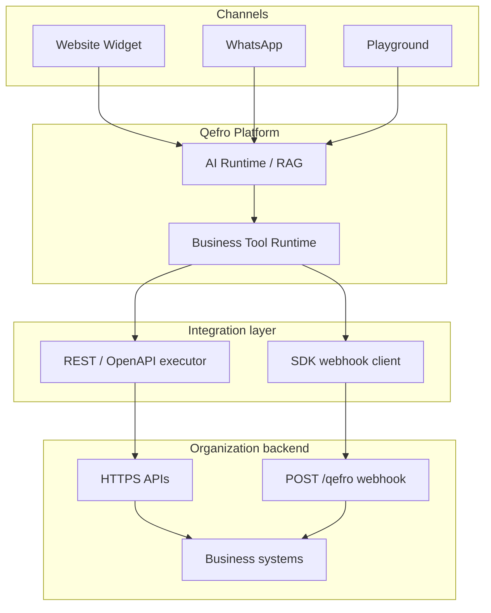
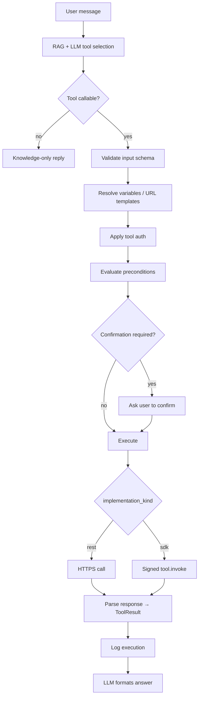

import { InfoBox, Warning, RelatedTopics } from '@site/src/components';

# Business Tool Runtime

This is the **single canonical explanation** of how Business Tools execute. REST/OpenAPI and Backend SDK share one pipeline; they diverge only at the outbound execution step.

## System architecture



| Path | Qefro role | Your backend |
| --- | --- | --- |
| **REST / OpenAPI** | HTTP client with encrypted credentials | Existing HTTPS API |
| **Backend SDK** | Signed webhook caller | `@qefro-ai/backend` handlers |

Admin model: **Workspace** → **Integration** → **Business Tool** (`implementation_kind`: `rest` or `sdk`). SDK Connections are org-scoped until Sync Tools registers handlers into a workspace.

## Execution pipeline



### Stage reference

| Stage | REST | Backend SDK |
| --- | --- | --- |
| Tool selection | Workspace-scoped enabled tools | Same |
| Callable filter | Channel, auth level, `END_USER_IDENTITY` rules | Same |
| Input validation | `input_schema` | Same |
| Variable resolution | URL `{placeholders}`, conversation vars | `parameters` + `lookup.required` |
| Authentication | API_KEY, BEARER_TOKEN, END_USER_IDENTITY | Connection signing secret |
| Preconditions | `lookup.required`, org challenge | Same |
| Confirmation | Optional explicit confirm for writes | Same |
| Execution | HTTPS to your API | `tool.invoke` / `tool.resume` |
| Logging | `tool_execution_logs` | Same |

## Workspace binding

```text
tenant_id + workspace_id → list_enabled_tools → filter tool_callable_from_chat(auth_ctx)
```

Without a workspace on the Widget, **no Business Tools load** — answers come from the knowledge base only.

<Warning>
Set `workspaceId` / `data-workspace-id` on the Website Widget when testing Business Tools.
</Warning>

## Authentication layers

Do not confuse these — full philosophy: [Authentication](/docs/business-tools/authentication).

| Layer | Example |
| --- | --- |
| Tool credential | API key, service bearer, SDK signing secret |
| End-user identity | `widget.identify()` → REST `END_USER_IDENTITY` |
| Organization challenge | SDK `customer.authorize()` OTP |
| Required auth level | `public`, `verified_channel`, `organization_challenge` |

## Preconditions and Challenge / Resume

- **`lookup.required`** — Runtime resolves email/phone before SDK invoke. See [Identity resolution](/docs/business-tools/identity-resolution).
- **Challenge / Resume** — SDK `authorize()` returns challenge → user replies → `tool.resume`. See [Challenge / Resume](/docs/business-tools/challenge-resume).

## Confirmation

High-risk writes may require an explicit user confirmation before execution. Prefer idempotent APIs; confirmation complements — does not replace — API-side authorization.

## ToolResult

The LLM grounds replies in structured JSON from your API or SDK handler. Return clear `found` / error codes and optional `message` fields.

## Debugging

| Symptom | Likely cause |
| --- | --- |
| Knowledge-base-only answers | Missing workspace or disabled tools |
| Portal blocks tool | `END_USER_IDENTITY` is Widget/WhatsApp-only |
| REST 401 | Wrong encrypted secret — use Test Tool |
| `customer_not_found` | SDK directory lookup mismatch |
| OTP stuck | Challenge/resume not handled |

Full table: [Troubleshooting](/docs/troubleshooting).

## Related topics

<RelatedTopics
  topics={[
    {label: 'Authentication', to: '/docs/business-tools/authentication'},
    {label: 'REST vs SDK', to: '/docs/business-tools/rest-vs-sdk'},
    {label: 'Parameters reference', to: '/docs/business-tools/parameters-reference'},
    {label: 'Admin API endpoints', to: '/docs/api/rest-apis'},
  ]}
/>
