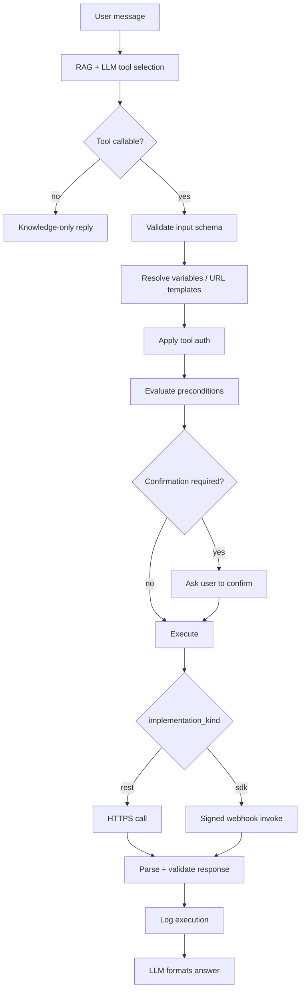

import { InfoBox, Warning, RelatedTopics } from '@site/src/components';

# Business Tool Runtime

Every Business Action — REST or SDK — passes through the same **Business Tool Runtime** before the assistant replies.

Understanding this pipeline helps you debug auth failures, missing parameters, and unexpected RAG-only answers.

## Execution stages



## Stage reference

| Stage | What happens | REST | SDK |
| --- | --- | --- | --- |
| **Tool selection** | LLM picks from workspace-enabled tools the user may call | Same | Same |
| **Callable filter** | Channel, `allow_from_chat`, auth level, `END_USER_IDENTITY` rules | Same | Same |
| **Input validation** | JSON Schema on `input_schema` | Same | Same |
| **Variable resolution** | `{order_id}` in URL, conversation vars, identity lookup attrs | URL templates | Passed as `parameters` |
| **Authentication** | Service credentials + optional end-user forward | API_KEY, BEARER, END_USER_IDENTITY | Signing secret on connection |
| **Preconditions** | Org auth challenge, `lookup.required`, custom gates | Same | Same |
| **Confirmation** | High-risk writes may require explicit user confirm | Same | Same |
| **Execution** | Outbound call | `GET`/`POST` to your API | `tool.invoke` / `tool.resume` |
| **Result** | Success, error, challenge, ask_user | HTTP body → ToolResult | SDK JSON response |
| **Logging** | `tool_execution_logs` | Same | Same |

## Tool selection and workspace binding

Tools are loaded with:

```text
tenant_id + workspace_id → list_enabled_tools → filter tool_callable_from_chat(auth_ctx)
```

If the widget or playground has **no workspace**, no tools are offered — the assistant answers from the knowledge base only.

<Warning>
Always bind the Website Widget to a workspace (`data-workspace-id` / `workspaceId`) when testing Business Tools.
</Warning>

## Authentication layers (do not confuse)

| Layer | Purpose | Example |
| --- | --- | --- |
| **Tool credential** | How Qefro calls your API | API key, service bearer |
| **End-user identity** | Who the customer is | `widget.identify()` JWT → `END_USER_IDENTITY` |
| **Organization challenge** | SDK OTP / login via your backend | `customer.authorize()` challenge |
| **Required auth level** | Minimum trust to offer the tool | `public`, `verified_channel`, `organization_challenge` |

See [Authentication](/docs/business-tools/authentication).

## Preconditions

Preconditions pause execution and return `ask_user` or an auth challenge instead of calling your backend.

Common preconditions:

- **`lookup.required`** — SDK advertises required identity attributes (`email`, `phone`); runtime resolves or asks the user. See [Identity resolution](/docs/business-tools/identity-resolution).
- **`authentication_required`** — Force org auth service path for SDK tools.
- **Custom JSON** — Legacy gates; prefer SDK `lookup` for new integrations.

## Challenge / resume (SDK)

When your `customer.authorize()` returns a **challenge**, the runtime:

1. Surfaces the challenge message to the user (chat).
2. Stores a `resume_token`.
3. Sends the user's next message as `tool.resume`.

Details: [Challenge / Resume](/docs/business-tools/challenge-resume).

## Confirmation flow

Sensitive writes may require an explicit confirmation token before execution resumes. See [Confirmation flow](/docs/business-tools/confirmation-flow).

## ToolResult → AI response

The LLM receives structured tool output (JSON). It must ground the user-facing answer in that output — not invent order IDs or statuses.

Best practices:

- Return `{ "found": true, ... }` or clear error codes.
- Include a human-readable `message` field when helpful.
- Keep responses bounded (runtime enforces max response size).

## Debugging checklist

| Symptom | Likely cause |
| --- | --- |
| AI only cites knowledge base | No workspace, no tools enabled, or tool filtered by auth level |
| “Tool not available” on Portal | `END_USER_IDENTITY` tools blocked on Portal channel |
| 401 from REST tool | Wrong API key / bearer; test with **Test Tool** |
| `customer_not_found` (SDK) | Identity attribute not in your directory lookup |
| OTP never completes | Challenge/resume path; verify `tool.resume` handler |

More: [Troubleshooting](/docs/business-tools/troubleshooting).

## Related topics

<RelatedTopics
  topics={[
    {label: 'Authentication', to: '/docs/business-tools/authentication'},
    {label: 'Challenge / Resume', to: '/docs/business-tools/challenge-resume'},
    {label: 'Parameters reference', to: '/docs/business-tools/parameters-reference'},
    {label: 'Execution logs API', to: '/docs/platform/business-tools'},
  ]}
/>
