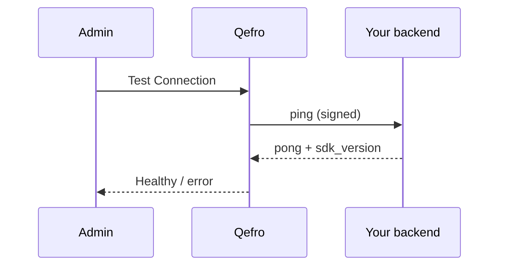

import { Warning, RelatedTopics, ApiEndpointCard } from '@site/src/components';

# SDK Synchronization

**SDK Connections** link Qefro to your `@qefro-ai/backend` webhook. **Sync Tools** discovers handlers via `tools.list` and registers them as workspace Business Tools.

Guide: [Register SDK Business Tools](/docs/guides/register-sdk-business-tools).

## SDK Connection

| Field | Purpose |
| --- | --- |
| Name | Admin label |
| Webhook URL | Public HTTPS `POST /qefro` |
| Signing secret | Shared HMAC secret (`QEFRO_SIGNING_SECRET`) |
| Enabled | Kill switch |

Org-scoped — not tied to one workspace until sync.

## Health check (ping)



<ApiEndpointCard method="POST" path="/api/v1/org/sdk-connections/:id/test" description="Signed ping; updates last_seen and connection status." />

Fix signature mismatches, clock skew, TLS, and path routing before syncing.

## Sync Tools

<ApiEndpointCard method="POST" path="/api/v1/org/sdk-connections/:id/sync-tools" description="tools.list + optional auto_register into workspace." />

```json
{
  "workspace_id": "uuid",
  "auto_register": true,
  "enable_new_tools": true
}
```

### What Sync writes

| Business Tool field | Source |
| --- | --- |
| `implementation_kind` | `sdk` |
| `sdk_connection_id` | Connection id |
| `sdk_handler_name` | Tool `name` |
| `description`, `input_schema` | From `tools.list` |
| `preconditions.lookup_required` | From tool `lookup.required` |
| `required_auth_level` | `organization_challenge` if auth methods set |
| `allow_from_chat` | Sync policy + auth flags |

Integration auto-created: `SDK: {connection name}`.

<Warning>
Sync **without** `workspace_id` + `auto_register` only refreshes the connection snapshot — tools will **not** appear in chat until registered to a workspace.
</Warning>

## Versioning and updates

| Event | Action |
| --- | --- |
| Add/rename handler | Deploy backend → Sync Tools |
| Change `input_schema` | Sync merges; re-test in console |
| Change `lookup.required` | Sync merges preconditions |
| Rotate signing secret | Update connection + env together |

Protocol version: `X-Qefro-Protocol: 1` — breaking changes will bump protocol with migration notes.

## Related topics

<RelatedTopics
  topics={[
    {label: 'Backend SDK', to: '/docs/business-tools/backend-sdk'},
    {label: 'Register SDK (guide)', to: '/docs/guides/register-sdk-business-tools'},
    {label: 'SDK Framework', to: '/docs/v1/sdk-framework'},
  ]}
/>
