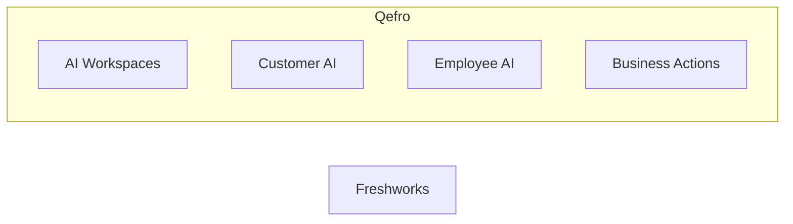

import {
  InfoBox,
  Warning,
  RelatedTopics,
  FaqAccordion,
  WorkflowCard,
} from '@site/src/components';

# Freshworks vs Qefro

**Freshworks vs Qefro** compares CRM/support suites with AI assistants with Qefro’s AI Workspace Platform (Customer AI, Employee AI, Business Actions).

## Introduction

This comparison is educational. Product capabilities change; verify details on each vendor’s site before purchasing. Qefro focuses on organization-wide AI Workspaces with shared knowledge, RBAC, and Business Actions — not on replacing every CRM or ticketing system of record.

## Why it exists

Buyers evaluating AI support tools need clear capability boundaries rather than slogans.

## Concepts

- **Qefro**: AI Workspaces, Customer AI, Employee AI, Business Tools/Actions, Internal Portal
- **Freshworks**: CRM/support suites with AI assistants
- Overlap often exists in conversational Q&A; divergence appears in employee portals, action execution, and workspace isolation models

## Architecture

Qefro centralizes Admin Console configuration and deploys multiple experiences from one knowledge/permission plane.



## Workflow

<WorkflowCard
  title="Evaluation workflow"
  steps={[
    {title: 'List must-haves', description: 'Channels, actions, employee portal, isolation.'},
    {title: 'Pilot knowledge', description: 'Test citation quality and refusals.'},
    {title: 'Pilot actions', description: 'Connect one read-only API if needed.'},
    {title: 'Review security', description: 'Tenant isolation, secrets, logs.'},
  ]}
/>

## Code examples

```json
{
  "evaluation_criteria": [
    "workspace_isolation",
    "employee_portal",
    "business_actions",
    "whatsapp",
    "rbac",
    "citations"
  ]
}
```

## Best practices

- Compare against your required channels and identity model
- Prefer read-only tool scopes during pilots
- Document gaps honestly for stakeholders

## Security notes

<InfoBox>
Do not migrate production secrets into a pilot until DPA/security review is complete for either vendor.
</InfoBox>

## FAQ

<FaqAccordion items={[
  {
    "question": "Does Qefro replace Freshworks?",
    "answer": "Not necessarily. Qefro may complement systems of record. Freshworks may remain the system for tickets/CRM depending on your stack."
  },
  {
    "question": "Where can I learn Qefro specifics?",
    "answer": "Start with AI Workspaces and Business Actions documentation."
  }
]} />

## Related topics

<RelatedTopics topics={[
  {
    "label": "AI Workspaces",
    "to": "/docs/platform/ai-workspaces"
  },
  {
    "label": "Business Actions",
    "to": "/docs/platform/business-actions"
  },
  {
    "label": "Security Overview",
    "to": "/docs/security/overview"
  },
  {
    "label": "Pricing",
    "to": "https://qefro.com/pricing"
  }
]} />

