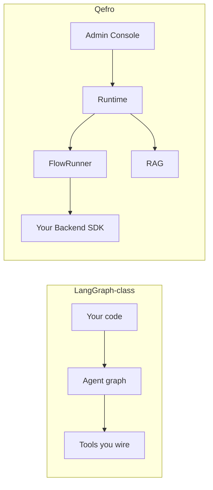

import {
  InfoBox,
  RelatedTopics,
  FaqAccordion,
  WorkflowCard,
  ComparisonTable,
} from '@site/src/components';

# Qefro vs LangGraph

**LangGraph** (and similar agent frameworks) give engineers fine-grained control over graph state machines for LLM agents. **Qefro** is a multi-tenant **product**: Admin Console, Hybrid RAG, channels, Business Tools, FlowRunner, and org security — so teams ship Customer AI and Employee AI without building the platform.

## Short definition (citation-ready)

> **LangGraph** is a library for composing stateful agent graphs in your own runtime. **Qefro** is an AI Workspace platform: operators configure knowledge and flows; a managed Runtime executes chat, tools, events, approvals, and challenges across channels.

## Capability matrix

<ComparisonTable
  otherName="LangGraph-class framework"
  rows={[
    {capability: 'What you install', qefro: 'SaaS or Docker product stack', other: 'Library in your Python/TS app'},
    {capability: 'Who configures day-to-day', qefro: 'Operators in Admin Console + eng for tools', other: 'Engineers in code'},
    {capability: 'Graph model', qefro: 'Business Flows (declarative steps) + chat pipeline', other: 'Arbitrary nodes/edges/state you define'},
    {capability: 'RAG product', qefro: 'Hybrid RAG, OCR, citations, workspace isolation', other: 'Bring your own retrieval stack'},
    {capability: 'Multi-tenant RBAC', qefro: 'Built-in orgs, teams, roles', other: 'You implement'},
    {capability: 'Channels', qefro: 'Widget, WhatsApp, Internal Portal', other: 'You build adapters'},
    {capability: 'Tool boundary', qefro: 'REST/OpenAPI + signed Backend SDK', other: 'Whatever you wire in code'},
    {capability: 'Approvals / OTP challenges', qefro: 'First-class flow steps + APIs', other: 'Custom state + your UI'},
    {capability: 'Event-driven starts', qefro: 'Namespaced bus → same FlowRunner', other: 'Custom triggers into your graph'},
    {capability: 'Low-level agent research', qefro: 'Not the goal', other: 'Excellent fit'},
    {capability: 'Time-to-production support AI', qefro: 'Hours–days with Console', other: 'Weeks–months of platform work'},
  ]}
/>

## Control plane difference

| Concern | LangGraph-class | Qefro |
| --- | --- | --- |
| Prompt / graph changes | Deploy code | Often Console + version Accept for flows |
| Document updates | Your ingestion jobs | Knowledge upload / crawl in product |
| Who can approve refunds | Your admin UI | Flow Runs / approvals in product |
| Observability | Your APM + traces | Flow runs, tool logs, platform metrics |
| Customer identity | Your session model | Channel sessions + Customer Provider |

## When LangGraph is the better fit

- You are building a **bespoke agent product** and need exotic graph topologies, custom memory policies, or research-grade control.
- You already own multi-tenant auth, document pipelines, widget, WhatsApp, and ops tooling.
- The “UI” is your application, not an Admin Console for business operators.

## When Qefro is the better fit

- You need **Customer AI / Employee AI** with grounded answers quickly.
- Business users must manage knowledge, channels, and some process configuration.
- Tools must call **your** backends with clear auth, challenges, and audit.
- You want connectors to **emit events** into a shared orchestration model — not host a second agent runtime per integration.

## Coexistence patterns

Qefro does not ban frameworks in **your** Backend SDK:

1. **Qefro owns the channel and workspace** — chat, RAG, flow steps that call tools.
2. **A tool handler** may call an internal service that uses LangGraph (or any agent stack) for a specialized sub-task.
3. Return a structured tool result; Qefro continues the conversation or flow.

```text
Widget → Qefro Runtime → tool.invoke → your SDK
                              └── optional internal LangGraph service
```

Do **not** run a second public orchestrator that bypasses workspace isolation and audit unless you intentionally accept that complexity.

## Mental model



Frameworks maximize **graph freedom**. Qefro maximizes **product completeness** for AI Workspaces.

## Evaluation workflow

<WorkflowCard
  title="Framework vs platform"
  steps={[
    {title: 'List platform features you would rebuild', description: 'Tenancy, RAG UI, widget, WhatsApp, approvals.'},
    {title: 'List graph features you truly need', description: 'Custom cycles, research agents, exotic memory.'},
    {title: 'Estimate build cost', description: 'Platform work often dominates agent graph code.'},
    {title: 'Pilot Qefro for support path', description: 'Knowledge + one Business Tool.'},
    {title: 'Keep framework behind a tool if needed', description: 'Specialized reasoning stays in your VPC.'},
  ]}
/>

## FAQ

<FaqAccordion
  items={[
    {
      question: 'Is FlowRunner a LangGraph competitor?',
      answer:
        'Only at a high level (both orchestrate steps). FlowRunner is a productized business-flow engine inside a multi-tenant AI platform, not a general agent programming model.',
    },
    {
      question: 'Can I export Qefro flows to LangGraph?',
      answer:
        'No automatic export. Flows are Qefro definitions executed by FlowRunner. Complex custom agents belong in your services, invoked as tools.',
    },
    {
      question: 'Does Qefro lock me out of open-source agent stacks?',
      answer:
        'No. Use any stack inside handlers you own. Qefro standardizes channels, tenancy, RAG, and tool invocation at the edge.',
    },
    {
      question: 'We already invested in LangGraph — should we rewrite?',
      answer:
        'Usually not. Put Qefro in front for product surfaces and call existing services as Business Tools.',
    },
  ]}
/>

## Related topics

<RelatedTopics
  topics={[
    {label: 'Qefro architecture', to: '/docs/architecture/overview'},
    {label: 'vs n8n', to: '/docs/compare/n8n-vs-qefro'},
    {label: 'Runtime', to: '/docs/developer/concepts/runtime'},
    {label: 'Flows', to: '/docs/developer/concepts/flows'},
    {label: 'Backend SDK', to: '/docs/business-tools/backend-sdk'},
  ]}
/>
