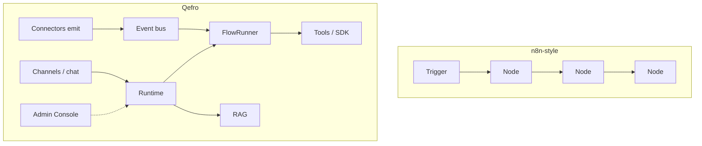

import {
  InfoBox,
  RelatedTopics,
  FaqAccordion,
  WorkflowCard,
  ComparisonTable,
} from '@site/src/components';

# Qefro vs n8n

Teams often ask whether Qefro replaces **n8n** (or Make, Zapier, Windmill). Short answer: **usually no — different jobs.** n8n is a general automation canvas. Qefro is an **AI Workspace platform** with grounded chat, Business Tools, and FlowRunner for customer/employee processes.

## Short definition (citation-ready)

> **n8n** optimizes for flexible, developer-operated workflow automation across hundreds of apps. **Qefro** optimizes for multi-tenant AI Workspaces — hybrid RAG assistants, channel delivery, authorized tools, and business flows with approvals — with connectors that only emit events into one Runtime.

## Capability matrix

<ComparisonTable
  otherName="n8n-class automation"
  rows={[
    {capability: 'Primary user', qefro: 'Operators + backend engineers shipping AI products', other: 'Automation builders / ops engineers'},
    {capability: 'Core artifact', qefro: 'AI Workspace (knowledge + tools + flows + channels)', other: 'Workflow graph of nodes'},
    {capability: 'Chat / WhatsApp product', qefro: 'First-class channels + widget CDN', other: 'Possible via nodes; you build UX'},
    {capability: 'Grounded answers (RAG)', qefro: 'Hybrid RAG, citations, workspace isolation', other: 'DIY (vector DB + prompts)'},
    {capability: 'Multi-tenant SaaS model', qefro: 'Organizations, RBAC, workspaces built-in', other: 'You design tenancy'},
    {capability: 'Tool execution', qefro: 'Business Tools + signed Backend SDK webhook', other: 'Node credentials + custom code nodes'},
    {capability: 'Human approval in product', qefro: 'Flow approvals in Admin Console / Flow Runs', other: 'Possible; not a support product UX'},
    {capability: 'Event ingress', qefro: 'Namespaced events → same FlowRunner', other: 'Triggers / webhooks start workflows'},
    {capability: 'Visual ETL / app glue', qefro: 'Not the focus', other: 'Core strength'},
    {capability: 'Replace ERP?', qefro: 'No — calls systems of record', other: 'No — orchestrates them'},
  ]}
/>

## Architecture difference

- **n8n:** the workflow *is* the product surface. You own hosting, auth UX, chat UI, and RAG if you need them.
- **Qefro:** the **Workspace + Runtime** are the product. Flows are one execution path alongside chat and knowledge — not a generic node marketplace.

## When to choose which

| Situation | Lean toward |
| --- | --- |
| Sync Shopify → Sheets → Slack with no AI product | n8n-class |
| Customer-facing AI with citations + WhatsApp | Qefro |
| Employee AI portal with RBAC | Qefro |
| Heavy multi-app back-office glue | n8n-class |
| AI that must call your APIs with audit + approvals | Qefro |
| Both AI support product and messy SaaS glue | **Often both** |

## Typical coexistence

1. **n8n** handles back-office integrations (billing exports, internal alerts, data sync).
2. **Qefro** owns customer/employee AI, knowledge, and guided business processes.
3. Bridge options:
   - n8n HTTP node → Qefro [org events API](/docs/guides/event-driven-triggers)
   - Qefro Business Tool → internal API that n8n also uses
   - Shared system of record (Shopify, Odoo, Postgres)

## What confuses people

| Confusion | Reality |
| --- | --- |
| “Qefro is just another workflow tool” | Flows are **business process + AI** primitives; RAG and channels are first-class |
| “n8n already has AI nodes” | Useful for experiments; not a multi-tenant workspace product with Admin Console and widget |
| “Connectors run the workflow” | In Qefro, connectors **emit**; FlowRunner executes |

## Evaluation workflow

<WorkflowCard
  title="n8n vs Qefro decision"
  steps={[
    {title: 'List AI product needs', description: 'Widget, WhatsApp, citations, employee portal?'},
    {title: 'List pure automation needs', description: 'Batch syncs, fan-out, no conversation?'},
    {title: 'Assign ownership', description: 'Who maintains graphs vs who owns support AI?'},
    {title: 'Pilot one Qefro workspace', description: 'Knowledge + one tool or one event flow.'},
    {title: 'Keep n8n where glue wins', description: 'Do not force ETL into FlowRunner.'},
  ]}
/>

## FAQ

<FaqAccordion
  items={[
    {
      question: 'Does Qefro replace n8n?',
      answer:
        'Usually no. Keep n8n (or similar) for general automation. Use Qefro for AI Workspaces, channels, grounded answers, and customer/employee business flows.',
    },
    {
      question: 'Can I trigger a Qefro flow from n8n?',
      answer:
        'Yes. Emit a namespaced event to the org events API (authenticated), or call a public entry you expose. See Event-driven triggers.',
    },
    {
      question: 'Can Qefro do arbitrary code nodes like n8n?',
      answer:
        'Business logic runs in your Backend SDK or external APIs — not as unrestricted code inside Qefro. That is intentional for security and tenancy.',
    },
    {
      question: 'Is FlowRunner competing with n8n execution?',
      answer:
        'Only for conversational and business-process orchestration tied to workspaces. It is not positioned as a general iPaaS.',
    },
  ]}
/>

## Related topics

<RelatedTopics
  topics={[
    {label: 'Qefro architecture', to: '/docs/architecture/overview'},
    {label: 'vs LangGraph', to: '/docs/compare/langgraph-vs-qefro'},
    {label: 'Event-driven triggers', to: '/docs/guides/event-driven-triggers'},
    {label: 'Runtime', to: '/docs/developer/concepts/runtime'},
    {label: 'Solutions', to: '/docs/solutions/overview'},
  ]}
/>
