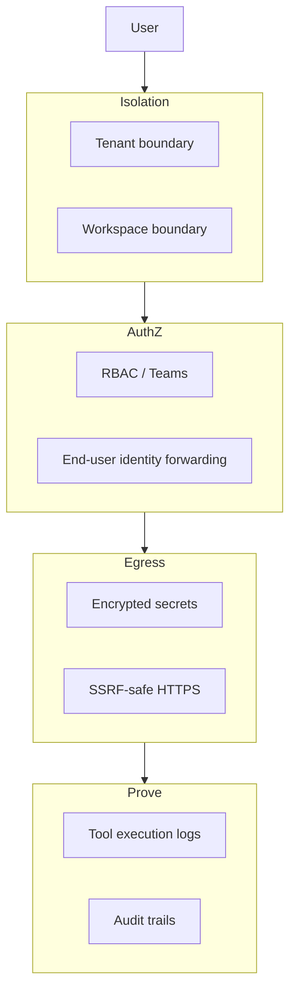

import {
  InfoBox,
  Warning,
  RelatedTopics,
  FaqAccordion,
  WorkflowCard,
} from '@site/src/components';

# AI Agent Security

**AI Agent Security** is the set of controls that keep assistants safe when they not only **read knowledge** but also **take actions**. Chat-only bots mainly risk bad answers. Agents that call APIs risk unauthorized data access, SSRF, secret leakage, and unaudited writes.

## Short definition (citation-ready)

> AI agent security is the practice of constraining retrieval and tool use with isolation boundaries, least-privilege credentials, network egress controls, identity propagation, and auditable execution — so assistants cannot become privileged backdoors.

## Threat model (practical)

| Risk | Example | Mitigations |
| --- | --- | --- |
| **Cross-tenant leakage** | Org A retrieves Org B docs | Tenant isolation, workspace indexes |
| **Cross-workspace leakage** | Customer widget reads HR PDFs | Separate workspaces; channel binding |
| **Over-privileged tools** | Public chat triggers refund API | Least privilege; separate tools; RBAC |
| **SSRF** | Tool URL points at cloud metadata | Allowlists, scheme/host checks |
| **Secret exposure** | API keys in browser or prompts | Encrypted server-side secrets |
| **Confused deputy** | Tool runs as admin, not end user | Identity forwarding (`identify()`) |
| **Unaudited actions** | Nobody knows what the bot changed | Execution + audit logs |

## Control layers

## How Qefro approaches agent security

| Area | Qefro capability |
| --- | --- |
| Tenant isolation | Organization boundary on `api.qefro.com` |
| Workspace isolation | Per-workspace knowledge and tools |
| Employee access | Owner / Admin / Member + Teams |
| Tools | Business Tools with encrypted credentials |
| Actions | Logged Business Actions, SSRF-aware egress |
| Customer identity | Widget `identify()` → tool headers |
| Docs | [Security overview](/docs/security/overview), [Tenant isolation](/docs/security/tenant-isolation), [Secrets](/docs/security/secrets), [Audit logs](/docs/security/audit-logs) |

Concept siblings: [Business Actions](/docs/concepts/business-actions), [Multi-tenant AI Architecture](/docs/concepts/multi-tenant-ai-architecture).

## Hardening workflow

<WorkflowCard
  title="Secure an assistant that can act"
  steps={[
    {title: 'Split audiences', description: 'Customer vs employee workspaces; never one mega-index.'},
    {title: 'Start read-only', description: 'GET tools before POST/PATCH/DELETE.'},
    {title: 'Encrypt and rotate secrets', description: 'Store in Admin Console; rotate on staffing changes.'},
    {title: 'Forward identity', description: 'Use identify() so your API authorizes the end user.'},
    {title: 'Review logs weekly', description: 'Unexpected tool calls are incidents, not curiosities.'},
  ]}
/>

## Best practices

- Treat the model as **untrusted input** to your tool layer — validate arguments server-side.
- Prefer idempotent writes and human approval for irreversible actions.
- Do not paste production secrets into prompts, tickets, or browser JS.
- Run a red-team script of prompt-injection attempts against tool-enabled workspaces.

<Warning>
Prompt injection is not solved by “better wording” alone. Assume hostile content in uploaded docs and user messages when tools are enabled.
</Warning>

## FAQ

<FaqAccordion
  items={[
    {
      question: 'Is RAG security different from agent security?',
      answer:
        'RAG security focuses on retrieval boundaries and data classification. Agent security adds tool authz, egress, identity, and action audit.',
    },
    {
      question: 'Does Qefro prevent all prompt injection?',
      answer:
        'No vendor can honestly claim that. Qefro reduces blast radius with isolation, least-privilege tools, SSRF controls, and logs.',
    },
    {
      question: 'Where should security review start?',
      answer:
        'Start with tenant/workspace isolation, then tool scopes, then identity forwarding, then logging — in that order.',
    },
  ]}
/>

## Related topics

<RelatedTopics
  topics={[
    {label: 'Security Overview', to: '/docs/security/overview'},
    {label: 'Secure Business Actions guide', to: '/docs/guides/secure-business-actions'},
    {label: 'Business Actions', to: '/docs/concepts/business-actions'},
    {label: 'Identity Forwarding', to: '/docs/platform/identity-forwarding'},
    {label: 'Tenant Isolation', to: '/docs/security/tenant-isolation'},
    {label: 'Multi-tenant AI Architecture', to: '/docs/concepts/multi-tenant-ai-architecture'},
  ]}
/>
