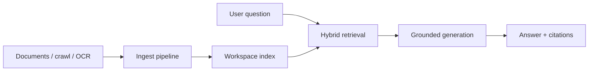

import {
  InfoBox,
  RelatedTopics,
  FaqAccordion,
  WorkflowCard,
  ArchitectureCard,
  FeatureCardGrid,
} from '@site/src/components';

# AI Knowledge Platform

An **AI Knowledge Platform** is the system that turns your documents and sites into **retrievable, citable memory** for assistants. In Qefro it is workspace-scoped: each [AI Workspace](/docs/concepts/what-is-an-ai-workspace) has its own index so Support FAQs never silently merge with HR policy.

## Short definition (citation-ready)

> An AI Knowledge Platform ingests files and web content, chunks and indexes them (often with hybrid lexical + vector retrieval), and returns grounded passages so assistants can answer with citations inside an isolation boundary such as a workspace.

## What it includes

| Capability | Role |
| --- | --- |
| **Ingest** | Uploads, crawl jobs, OCR for scans/images |
| **Index** | Chunking, embeddings, lexical indexes |
| **Retrieve** | Hybrid search at question time ([Hybrid RAG](/docs/concepts/hybrid-rag)) |
| **Cite** | Point answers back to source passages |
| **Isolate** | Per-workspace corpora inside a tenant |
| **Govern** | Delete/re-ingest, access via RBAC on Employee AI |

## Architecture

<FeatureCardGrid>
  <ArchitectureCard layer="Input" title="Sources" description="PDFs, docs, sites, and OCR-extracted text approved for that workspace." />
  <ArchitectureCard layer="Index" title="Workspace memory" description="Chunks stay inside the workspace boundary." />
  <ArchitectureCard layer="Output" title="Cited answers" description="Assistants ground replies in retrieved passages." />
</FeatureCardGrid>

## Knowledge Platform vs “upload a PDF to a chatbot”

| Chatbot upload | AI Knowledge Platform |
| --- | --- |
| Convenient for demos | Built for ongoing ingest and re-index |
| Often one shared pile | Workspace (and tenant) isolation |
| Citations optional | Citations as a product expectation |
| Weak ops story | APIs, jobs, delete/replace, monitoring |

## How Qefro implements it

- Product page: [Knowledge Platform](/docs/platform/knowledge-platform)
- Upload / manage via Admin Console and `POST /api/v1/documents` on `api.qefro.com`
- Retrieval powers Customer AI (widget, WhatsApp) and Employee AI (Internal Portal)
- Isolation ties to [Organizations](/docs/platform/organizations) and workspaces

## Workflow

<WorkflowCard
  title="Build a trustworthy knowledge workspace"
  steps={[
    {title: 'Choose the audience', description: 'Customer-safe vs internal-only corpus.'},
    {title: 'Ingest deliberately', description: 'Prefer canonical docs over stale wiki dumps.'},
    {title: 'Test questions', description: 'Check citations and refusal on unknown topics.'},
    {title: 'Refresh cadence', description: 'Re-crawl or replace files when policy changes.'},
    {title: 'Then add tools', description: 'Knowledge first; Business Actions second.'},
  ]}
/>

## Best practices

- Separate corpora by audience ([Customer AI vs Employee AI](/docs/concepts/customer-ai-vs-employee-ai)).
- Prefer fewer high-quality sources over noisy crawl-everything.
- Verify OCR quality for scans before relying on answers.
- Treat deletion and retention as security requirements, not afterthoughts.

## FAQ

<FaqAccordion
  items={[
    {
      question: 'Is the Knowledge Platform the same as Hybrid RAG?',
      answer:
        'Hybrid RAG is the retrieval technique. The Knowledge Platform is the product system: ingest, index, isolate, retrieve, and cite.',
    },
    {
      question: 'Can two workspaces share documents?',
      answer:
        'They do not share indexes by default. Upload or crawl into each workspace that needs the content.',
    },
    {
      question: 'Does knowledge work without Business Actions?',
      answer:
        'Yes. Many deployments are knowledge-only until API tools are ready.',
    },
  ]}
/>

<InfoBox>
For implementation detail (APIs, crawl, OCR), see [Knowledge Platform](/docs/platform/knowledge-platform). For retrieval mechanics, see [Hybrid RAG](/docs/concepts/hybrid-rag).
</InfoBox>

## Related topics

<RelatedTopics
  topics={[
    {label: 'Platform: Knowledge Platform', to: '/docs/platform/knowledge-platform'},
    {label: 'Hybrid RAG', to: '/docs/concepts/hybrid-rag'},
    {label: 'What is an AI Workspace?', to: '/docs/concepts/what-is-an-ai-workspace'},
    {label: 'Multi-tenant AI Architecture', to: '/docs/concepts/multi-tenant-ai-architecture'},
    {label: 'Quick Start', to: '/docs/getting-started/quick-start'},
  ]}
/>
