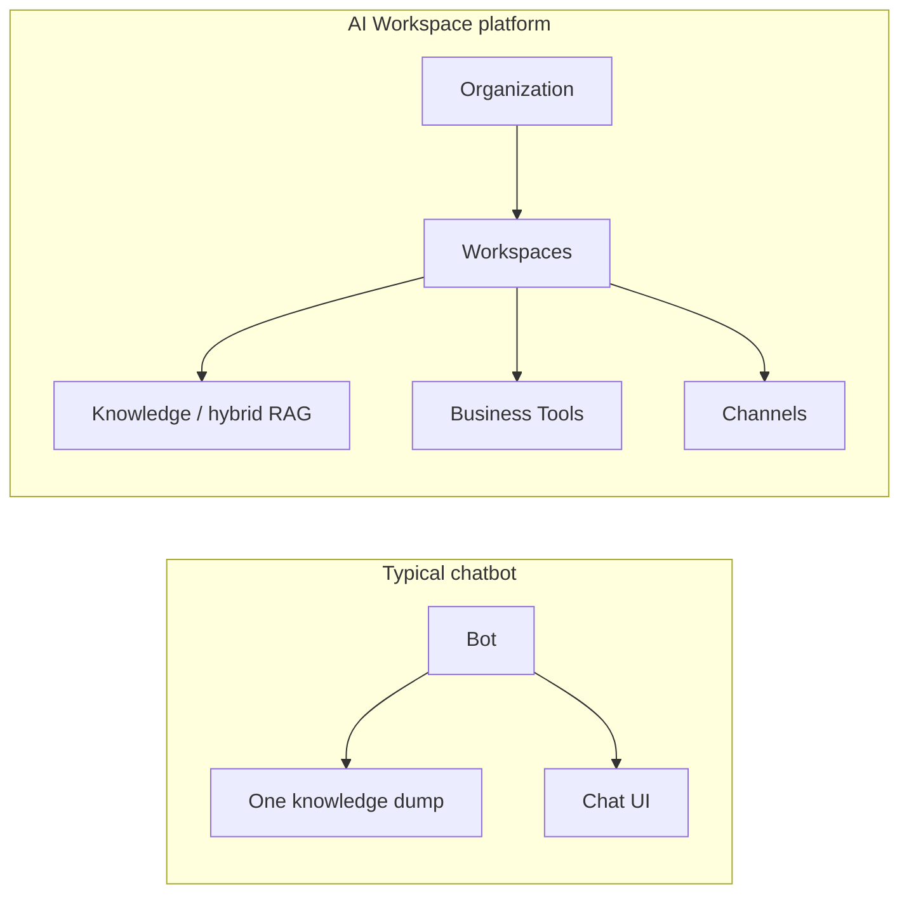

import {
  InfoBox,
  RelatedTopics,
  FaqAccordion,
  ComparisonTable,
  WorkflowCard,
} from '@site/src/components';

# AI Workspace vs AI Chatbot

**AI Workspace vs AI Chatbot** is the difference between a **scoped operating unit for assistants and actions** and a **conversational UI over one knowledge dump**. Chatbots answer questions. AI Workspaces organize knowledge, permissions, tools, and channels so customer and employee AI can run safely inside a company.

## Short definition (citation-ready)

> An AI chatbot is typically a conversational interface with a knowledge source. An AI Workspace is an isolated product unit — knowledge, instructions, tools, conversations, and channel bindings — designed for multi-team, multi-tenant use.

## Capability comparison

<ComparisonTable
  otherName="Typical AI chatbot"
  rows={[
    {
      capability: 'Primary unit',
      qefro: 'Workspace (knowledge + tools + conversations)',
      other: 'Bot / project / single knowledge base',
    },
    {
      capability: 'Multi-team isolation',
      qefro: 'First-class workspaces per use case',
      other: 'Often one bot or weak project boundaries',
    },
    {
      capability: 'Employee experience',
      qefro: 'Branded Internal Portal + RBAC',
      other: 'Usually website widget only',
    },
    {
      capability: 'Business Actions',
      qefro: 'Authorized REST/OpenAPI tools with logs',
      other: 'Optional plugins; authz varies widely',
    },
    {
      capability: 'Identity for tools',
      qefro: 'Widget identify() / end-user forwarding',
      other: 'Rare or custom',
    },
    {
      capability: 'Channels',
      qefro: 'Website, WhatsApp, Internal Portal',
      other: 'Primarily website embed',
    },
    {
      capability: 'Tenant model',
      qefro: 'Organization → workspaces → teams',
      other: 'Account → bots',
    },
  ]}
/>

## When a chatbot is enough

Choose a simple chatbot when:

- One public FAQ site is the only surface
- No employee portal or internal tools are required
- No multi-team isolation or RBAC is needed
- You will not call privileged APIs from the assistant

## When you need an AI Workspace

Choose an AI Workspace platform when:

- Support, HR, and IT must not share one index
- Employees need a branded portal with workspace grants
- Assistants must call systems of record safely ([Business Actions](/docs/concepts/business-actions))
- You need hybrid RAG, citations, and audit-friendly tool logs
- You operate multi-tenant SaaS-style isolation ([Multi-tenant AI Architecture](/docs/concepts/multi-tenant-ai-architecture))

## Architecture contrast

## How Qefro positions this

Qefro is an **AI Workspace Platform**, not a single-bot builder:

- [What is an AI Workspace?](/docs/concepts/what-is-an-ai-workspace)
- [Customer AI](/docs/platform/customer-ai) on widget + WhatsApp
- [Employee AI](/docs/platform/employee-ai) on Internal Portal
- [Business Actions](/docs/concepts/business-actions) via Business Tools

Vendor comparisons (Chatbase, Intercom, Zendesk, …) live under [Compare](/docs/compare/chatbase-vs-qefro).

## Evaluation workflow

<WorkflowCard
  title="Decide chatbot vs workspace"
  steps={[
    {title: 'List audiences', description: 'Customers only, employees only, or both?'},
    {title: 'List tools', description: 'Read-only FAQ, or API actions against live systems?'},
    {title: 'List isolation needs', description: 'Can Support and HR share one index?'},
    {title: 'Pilot one workspace', description: 'Ingest knowledge, test citations, add one safe tool.'},
    {title: 'Review security', description: 'Tenant isolation, secrets, SSRF, audit logs.'},
  ]}
/>

## FAQ

<FaqAccordion
  items={[
    {
      question: 'Is every AI Workspace a chatbot?',
      answer:
        'Chat is a common interface, but a workspace also includes knowledge isolation, tools, RBAC, and channel bindings — more than a chat widget.',
    },
    {
      question: 'Can Qefro replace a simple website chatbot?',
      answer:
        'Yes. Start with one Customer Support workspace and the website widget. You can add WhatsApp, Employee AI, and tools later.',
    },
    {
      question: 'Do chatbots use RAG too?',
      answer:
        'Many do. The differentiator is usually isolation, multi-channel deployment, authorized actions, and organization-level RBAC — not RAG alone.',
    },
  ]}
/>

<InfoBox>
Marketing one-liners blur these terms. When evaluating vendors, ask: What is the isolation unit? Who can call which tools? Is there an employee portal with RBAC?
</InfoBox>

## Related topics

<RelatedTopics
  topics={[
    {label: 'What is an AI Workspace?', to: '/docs/concepts/what-is-an-ai-workspace'},
    {label: 'Customer AI vs Employee AI', to: '/docs/concepts/customer-ai-vs-employee-ai'},
    {label: 'Hybrid RAG', to: '/docs/concepts/hybrid-rag'},
    {label: 'AI Agent Security', to: '/docs/concepts/ai-agent-security'},
    {label: 'Chatbase vs Qefro', to: '/docs/compare/chatbase-vs-qefro'},
    {label: 'CustomGPT vs Qefro', to: '/docs/compare/customgpt-vs-qefro'},
  ]}
/>
