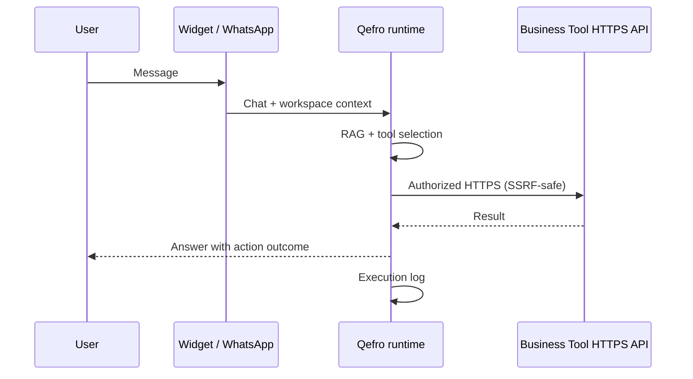

import {
  InfoBox,
  Warning,
  RelatedTopics,
  FaqAccordion,
  WorkflowCard,
} from '@site/src/components';

# What are Business Actions?

A **Business Action** is what happens when an assistant **calls a Business Tool** during a conversation — for example looking up an order, creating a ticket, or reading account status from your system of record. Answers alone are not enough for many support and employee workflows; actions close the loop.

## Short definition (citation-ready)

> A Business Action is an authorized, logged runtime invocation of a configured Business Tool (REST/OpenAPI connector) during an AI conversation, subject to workspace scope, SSRF controls, and optional end-user identity forwarding.

## Business Actions vs Business Tools

| Term | Meaning |
| --- | --- |
| **Business Tool** | The connector definition: URL, method, auth credentials, schema |
| **Business Action** | One execution of that tool at conversation time |

Configure tools once; the model selects and runs actions when the dialog requires them.

## Why they matter for GEO and buyers

Search and AI assistants increasingly answer “can the AI *do* things, or only chat?” Business Actions are the product concept for:

- Order / shipment lookups
- Ticket or lead creation
- Internal runbook automation for Employee AI
- Any HTTPS API your organization already trusts

## Architecture

<InfoBox title="Internal Portal (V1)">
  Business Actions are not executed from the Internal Portal. Employees use the portal as a knowledge assistant (RAG / document Q&amp;A). Live API actions remain on the Website Widget and WhatsApp until employee delegated authentication is available.
</InfoBox>

## Security properties (required for production)

| Control | Purpose |
| --- | --- |
| **Workspace binding** | Tools only exist inside a workspace |
| **Encrypted secrets** | Credentials stored encrypted at rest |
| **SSRF protections** | Block unsafe destinations / schemes |
| **Identity forwarding** | Optional end-user JWT/session to your API |
| **Execution logs** | Audit what was called and when |
| **Least privilege** | Prefer read-only methods in pilots |

Deep dive: [AI Agent Security](/docs/concepts/ai-agent-security) and [Secure Business Actions](/docs/guides/secure-business-actions).

## How Qefro implements Business Actions

1. Create a [Business Tool](/docs/platform/business-tools) under a workspace (REST, [OpenAPI import](/docs/guides/import-openapi), or [SDK Sync](/docs/guides/register-sdk-business-tools)).
2. Store credentials in the Admin Console (encrypted).
3. Test the tool before enabling it for the assistant.
4. On Customer AI, use [`identify()`](/docs/platform/identity-forwarding) when your API needs the end user.
5. Review tool execution logs after pilot traffic.

Platform reference: [Business Actions](/docs/platform/business-actions).

## Workflow

<WorkflowCard
  title="Add one safe Business Action"
  steps={[
    {title: 'Pick a read-only API', description: 'GET order status beats POST refunds for day one.'},
    {title: 'Create the tool', description: 'Workspace → integrations/tools; encrypt secrets.'},
    {title: 'Test in console', description: 'Verify response shape and error handling.'},
    {title: 'Enable for chat', description: 'Confirm the assistant only calls when needed.'},
    {title: 'Monitor logs', description: 'Watch executions before expanding write tools.'},
  ]}
/>

## Best practices

- Separate customer-facing tools from internal-only tools via workspaces.
- Never put long-lived admin secrets in the browser; use server-side tool credentials + optional end-user forwarding.
- Document idempotency for any write action the model can trigger.
- Fail closed: if authz fails, the assistant should explain limits — not invent success.

<Warning>
Treat every Business Action as production API traffic. Rate limits, auth failures, and PII in responses are your responsibility to design for.
</Warning>

## FAQ

<FaqAccordion
  items={[
    {
      question: 'Are Business Actions the same as “AI agents”?',
      answer:
        'Agent is a broad term. In Qefro, Business Actions are the concrete, auditable tool calls the assistant makes — not an unconstrained autonomous loop.',
    },
    {
      question: 'Do I need Business Actions to use Qefro?',
      answer:
        'No. Many teams start with knowledge-only Customer AI or Employee AI, then add tools when Q&A is stable.',
    },
    {
      question: 'Which plans include tools / WhatsApp?',
      answer:
        'Plan limits apply (for example WhatsApp on Growth+). Check current pricing on qefro.com/pricing and billing in the Admin Console.',
    },
  ]}
/>

## Related topics

<RelatedTopics
  topics={[
    {label: 'Business Tools', to: '/docs/platform/business-tools'},
    {label: 'Platform: Business Actions', to: '/docs/platform/business-actions'},
    {label: 'Connect REST APIs', to: '/docs/guides/connect-rest-apis'},
    {label: 'Import OpenAPI', to: '/docs/guides/import-openapi'},
    {label: 'Identity Forwarding', to: '/docs/platform/identity-forwarding'},
    {label: 'AI Agent Security', to: '/docs/concepts/ai-agent-security'},
  ]}
/>
