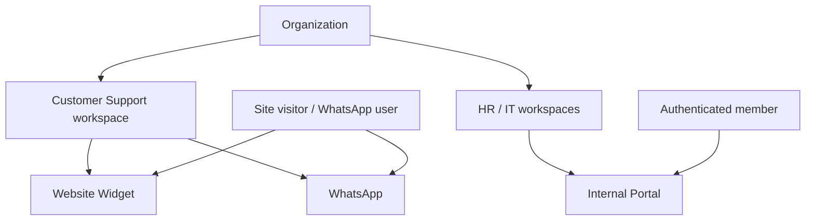

import {
  InfoBox,
  RelatedTopics,
  FaqAccordion,
  WorkflowCard,
} from '@site/src/components';

# Customer AI vs Employee AI

**Customer AI** and **Employee AI** are the two audience modes of an AI Workspace Platform. Both can use the same underlying workspace technology (knowledge, tools, conversations), but they differ in **who** is talking, **where** the UI lives, and **what** identity and permissions apply.

## Short definition (citation-ready)

> Customer AI assists external users (visitors, shoppers, ticket askers) on public channels. Employee AI assists authenticated organization members on an internal portal with role- and workspace-scoped access.

## Side-by-side

| Dimension | Customer AI | Employee AI |
| --- | --- | --- |
| **Audience** | External customers / visitors | Organization members |
| **Primary surfaces** | Website widget, WhatsApp | Internal Portal (`*.qefro.com` or custom domain) |
| **Auth** | Widget token; optional `identify()` for end users | Email/password session JWT; Teams + workspace grants |
| **Knowledge** | Usually public or customer-safe docs | Often internal policies, runbooks, HR/IT |
| **Tools** | Order status, ticket create — careful scopes | Internal systems with stricter RBAC |
| **Risk if mixed** | Leaking internal docs to the public | Exposing customer tools without need |

## Architecture

## Customer AI in Qefro

- Product page: [Customer AI](/docs/platform/customer-ai)
- Channels: [Website Widget](/docs/platform/website-widget) (`cdn.qefro.com/widget.js`), [WhatsApp](/docs/platform/whatsapp)
- Optional identity: [Identity Forwarding](/docs/platform/identity-forwarding) via `identify()` so Business Tools receive a verified end-user token

## Employee AI in Qefro

- Product page: [Employee AI](/docs/platform/employee-ai)
- Surface: [Internal Portal](/docs/platform/internal-portal)
- Access: [RBAC](/docs/platform/rbac) — Owner / Admin / Member; Members only see granted workspaces
- Branding & domains: [Branding](/docs/platform/branding), [Custom Domains](/docs/platform/custom-domains)

## Should they share a workspace?

| Approach | Use when |
| --- | --- |
| **Separate workspaces (recommended)** | Knowledge sensitivity differs (public FAQ vs internal HR) |
| **Shared workspace** | Rare — only when the corpus is intentionally identical and tools are safe for both audiences |

<InfoBox title="Default recommendation">
Use a Customer Support workspace for widget/WhatsApp and separate HR/IT workspaces for the Internal Portal. Shared indexes are a common source of accidental disclosure.
</InfoBox>

## Workflow

<WorkflowCard
  title="Ship both without mixing risk"
  steps={[
    {title: 'Map audiences', description: 'List what customers vs employees are allowed to know.'},
    {title: 'Create two workspace sets', description: 'Customer Support vs internal teams.'},
    {title: 'Bind channels', description: 'Widget/WhatsApp → customer workspaces; Portal → employee workspaces.'},
    {title: 'Grant RBAC', description: 'Invite Members; attach Teams to workspaces.'},
    {title: 'Add tools last', description: 'Customer tools with identify(); employee tools with least privilege.'},
  ]}
/>

## FAQ

<FaqAccordion
  items={[
    {
      question: 'Is Employee AI just Customer AI behind a login?',
      answer:
        'No. Employee AI adds organization membership, Teams, workspace grants, and a branded portal — not only authentication.',
    },
    {
      question: 'Can one organization run both?',
      answer:
        'Yes. That is the default Qefro model: configure once in the Admin Console, deploy Customer AI and Employee AI from workspaces.',
    },
    {
      question: 'Does WhatsApp count as Customer AI?',
      answer:
        'Yes. WhatsApp is a Customer AI channel bound to a workspace, typically the same Support knowledge as the website widget.',
    },
  ]}
/>

## Related topics

<RelatedTopics
  topics={[
    {label: 'What is an AI Workspace?', to: '/docs/concepts/what-is-an-ai-workspace'},
    {label: 'Customer AI', to: '/docs/platform/customer-ai'},
    {label: 'Employee AI', to: '/docs/platform/employee-ai'},
    {label: 'Internal Portal', to: '/docs/platform/internal-portal'},
    {label: 'Website Widget', to: '/docs/platform/website-widget'},
    {label: 'RBAC', to: '/docs/platform/rbac'},
  ]}
/>
