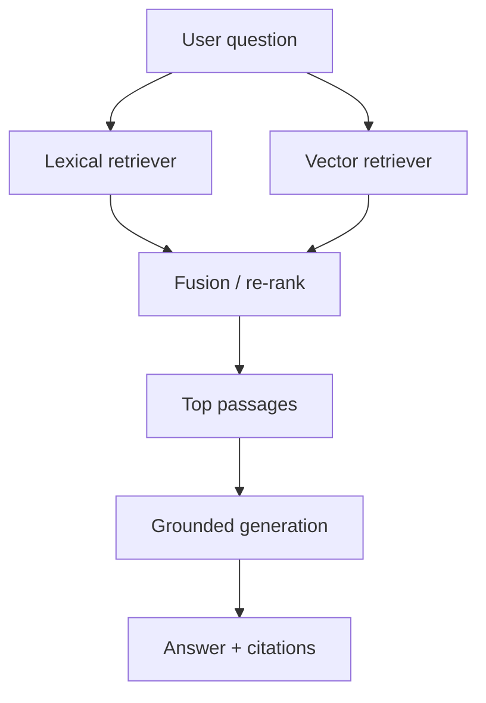

import {
  InfoBox,
  RelatedTopics,
  FaqAccordion,
  WorkflowCard,
} from '@site/src/components';

# Hybrid RAG

**Hybrid RAG** (Retrieval-Augmented Generation) mixes **lexical search** (exact tokens, SKUs, error codes, policy IDs) with **vector / semantic search** (paraphrases and conceptual similarity). The merged results ground the model so answers stay tied to your documents instead of free-form guessing.

## Short definition (citation-ready)

> Hybrid RAG retrieves supporting passages using both keyword-oriented and embedding-oriented search, fuses ranked results, and passes them to a language model to generate an answer — ideally with citations back to sources.

## Why hybrid beats “vectors only”

| Query type | Vectors alone | Lexical alone | Hybrid |
| --- | --- | --- | --- |
| “What is your refund policy?” | Strong | Medium | Strong |
| “Error E-4421 meaning” | Weak/medium | Strong | Strong |
| “SKU A12-900 warranty” | Weak | Strong | Strong |
| “How do I change billing email?” | Strong | Medium | Strong |

Enterprise corpora are full of **identifiers**. Pure semantic search misses them; pure keyword search misses paraphrase. Hybrid covers both.

## Architecture

## Hybrid RAG inside an AI Knowledge Platform

Hybrid RAG is the **retrieval engine**. An [AI Knowledge Platform](/docs/concepts/ai-knowledge-platform) wraps it with ingest, workspace isolation, OCR, and ops. In Qefro:

- Indexes are **per workspace** inside a tenant
- Customer AI and Employee AI both consume hybrid retrieval
- Citations help operators verify groundedness

Platform detail: [Knowledge Platform](/docs/platform/knowledge-platform).

## Quality loop

<WorkflowCard
  title="Improve Hybrid RAG quality"
  steps={[
    {title: 'Curate sources', description: 'Remove duplicates and contradictory drafts.'},
    {title: 'Test identifier queries', description: 'SKUs, error codes, policy numbers.'},
    {title: 'Test paraphrase queries', description: 'Natural language variants of the same intent.'},
    {title: 'Inspect citations', description: 'Wrong citation ⇒ fix chunking or source, not only the prompt.'},
    {title: 'Refuse when empty', description: 'Prefer honest gaps over hallucinated policy.'},
  ]}
/>

## Best practices

- Keep chunk sizes appropriate for your docs (too large → noisy; too small → broken identifiers).
- Re-index after major policy edits; do not rely on chat memory.
- Separate customer-safe and internal corpora ([Customer AI vs Employee AI](/docs/concepts/customer-ai-vs-employee-ai)).
- Pair RAG with [Business Actions](/docs/concepts/business-actions) only when live data is required — docs for policy, APIs for state.

## FAQ

<FaqAccordion
  items={[
    {
      question: 'Is Hybrid RAG the same as an agent?',
      answer:
        'No. RAG retrieves knowledge for answering. Agents/tools (Business Actions) call APIs. Production systems often use both.',
    },
    {
      question: 'Does Hybrid RAG prevent hallucinations?',
      answer:
        'It reduces unsupported answers when retrieval and prompting are solid, but it does not eliminate model error. Citations and refusals are essential.',
    },
    {
      question: 'Do I need Hybrid RAG for Employee AI?',
      answer:
        'Yes if employees ask against internal docs. The same retrieval stack powers Internal Portal workspaces.',
    },
  ]}
/>

<InfoBox>
For security of retrieval boundaries (tenant/workspace isolation), see [Multi-tenant AI Architecture](/docs/concepts/multi-tenant-ai-architecture) and [Tenant Isolation](/docs/security/tenant-isolation).
</InfoBox>

## Related topics

<RelatedTopics
  topics={[
    {label: 'AI Knowledge Platform', to: '/docs/concepts/ai-knowledge-platform'},
    {label: 'Knowledge Platform (product)', to: '/docs/platform/knowledge-platform'},
    {label: 'What is an AI Workspace?', to: '/docs/concepts/what-is-an-ai-workspace'},
    {label: 'AI Agent Security', to: '/docs/concepts/ai-agent-security'},
    {label: 'Build AI Customer Support', to: '/docs/guides/build-ai-customer-support'},
  ]}
/>
