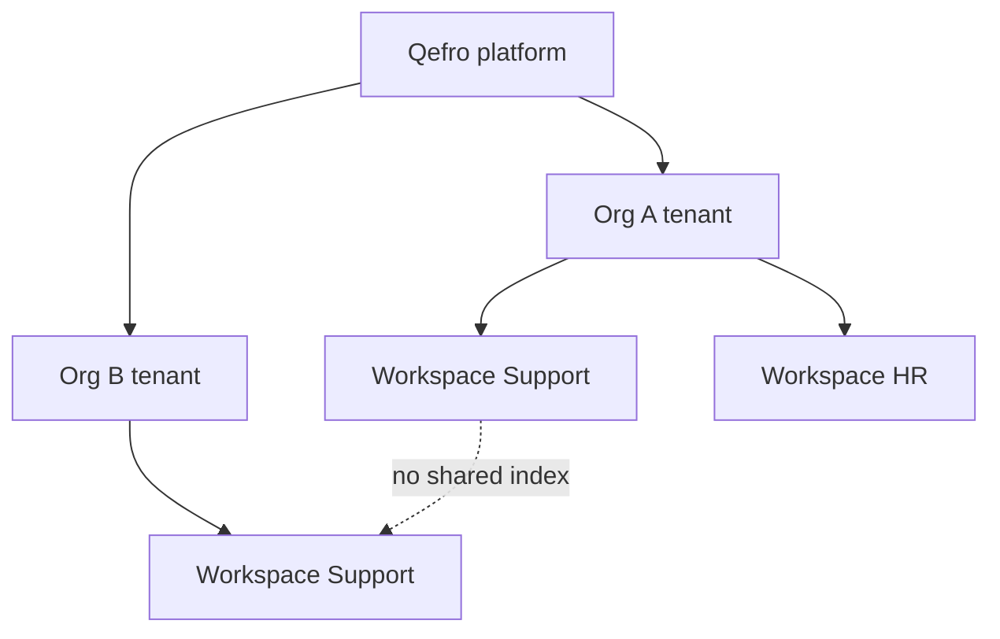

import {
  InfoBox,
  RelatedTopics,
  FaqAccordion,
  WorkflowCard,
  ArchitectureCard,
  FeatureCardGrid,
} from '@site/src/components';

# Multi-tenant AI Architecture

**Multi-tenant AI architecture** is how a SaaS AI platform serves many organizations from one control plane without mixing their data, tools, or conversations. In Qefro the top boundary is the **organization (tenant)**; inside it, **AI Workspaces** isolate teams and use cases.

## Short definition (citation-ready)

> Multi-tenant AI architecture enforces hard isolation between customer organizations — and usually softer isolation between workspaces inside an organization — across knowledge indexes, tool credentials, conversations, and administrative APIs.

## Why it matters

Without tenancy:

- Customer A’s documents could appear in Customer B’s answers
- Tool credentials could be invoked across orgs
- Analytics and billing would be unreliable
- Enterprise buyers cannot pass security review

Tenancy is therefore both a **security** and a **product** requirement for AI Workspace platforms.

## Layered model

| Layer | Qefro unit | Isolates |
| --- | --- | --- |
| **Platform** | Qefro cloud (`api.qefro.com`, `app.qefro.com`) | Shared infra, per-tenant logical isolation |
| **Tenant** | Organization | Users, billing, branding, widget token |
| **Workspace** | AI Workspace | Knowledge, tools, conversations |
| **Access** | Teams + RBAC | Which members see which Employee AI workspaces |
| **Channel** | Widget / WhatsApp / Portal | How external or internal users attach |

<FeatureCardGrid>
  <ArchitectureCard layer="Control plane" title="Admin Console" description="Configure workspaces, knowledge, tools, RBAC per tenant." />
  <ArchitectureCard layer="Data plane" title="Runtime" description="Chat, RAG, and Business Actions resolve tenant + workspace first." />
  <ArchitectureCard layer="Experience" title="Channels" description="Widget, WhatsApp, and Internal Portal inherit those scopes." />
</FeatureCardGrid>

## Request path (conceptual)

1. Authenticate (user JWT, widget token, or channel webhook).
2. Resolve **tenant** from the credential / host.
3. Resolve **workspace** from channel binding or portal selection.
4. Retrieve only from that workspace’s knowledge index.
5. Allow only that workspace’s Business Tools.
6. Emit logs attributed to tenant + workspace (+ actor when known).

Security deep dive: [Tenant Isolation](/docs/security/tenant-isolation).

## Single-tenant / enterprise variants

Some enterprises require private deployment. Conceptually the isolation model stays the same; the difference is **where** the control/data planes run. See [Deployment](/docs/platform/deployment) and [Production Deployment](/docs/guides/production-deployment).

## Design workflow

<WorkflowCard
  title="Design tenancy for your AI rollout"
  steps={[
    {title: 'One org per customer', description: 'Never share an Admin Console org across legal entities that must be isolated.'},
    {title: 'Workspaces per audience', description: 'Customer vs employee corpora stay split.'},
    {title: 'Bind channels carefully', description: 'Widget workspace IDs and portal grants are security boundaries.'},
    {title: 'Review custom domains', description: 'Portal hostnames still map to one tenant.'},
    {title: 'Audit', description: 'Use execution and admin audit logs in security reviews.'},
  ]}
/>

## FAQ

<FaqAccordion
  items={[
    {
      question: 'Is a workspace a tenant?',
      answer:
        'No. The organization is the tenant. Workspaces are sub-scopes for knowledge and tools inside that tenant.',
    },
    {
      question: 'Can two organizations share knowledge?',
      answer:
        'Not by default. Each org’s indexes and tools are isolated. Sharing requires deliberate export/import of content.',
    },
    {
      question: 'How does this relate to Hybrid RAG?',
      answer:
        'Hybrid RAG runs inside a workspace index. Tenancy ensures retrieval never searches another org’s index.',
    },
  ]}
/>

<InfoBox>
Product entry points: [Organizations](/docs/platform/organizations), [AI Workspaces](/docs/platform/ai-workspaces), [Security Overview](/docs/security/overview).
</InfoBox>

## Related topics

<RelatedTopics
  topics={[
    {label: 'What is an AI Workspace?', to: '/docs/concepts/what-is-an-ai-workspace'},
    {label: 'AI Agent Security', to: '/docs/concepts/ai-agent-security'},
    {label: 'Organizations', to: '/docs/platform/organizations'},
    {label: 'Tenant Isolation', to: '/docs/security/tenant-isolation'},
    {label: 'Hybrid RAG', to: '/docs/concepts/hybrid-rag'},
    {label: 'Compliance', to: '/docs/security/compliance'},
  ]}
/>
