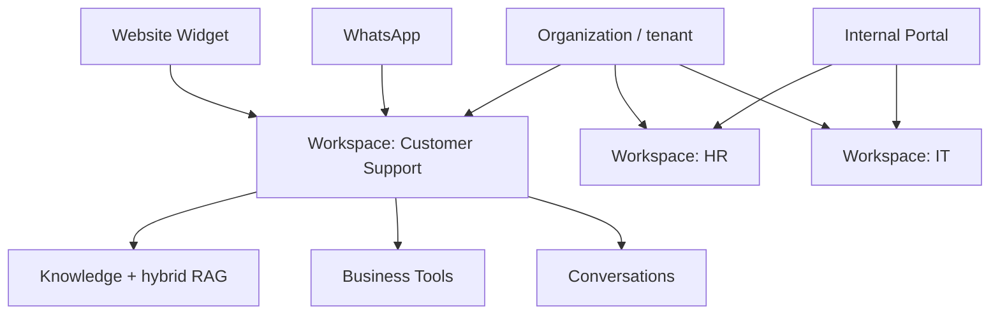

import {
  InfoBox,
  RelatedTopics,
  FaqAccordion,
  WorkflowCard,
  ArchitectureCard,
  FeatureCardGrid,
} from '@site/src/components';

# What is an AI Workspace?

An **AI Workspace** is a scoped AI environment inside an organization. It owns its own **knowledge base**, **assistant instructions**, **Business Tools**, and **conversations**. Unlike a single shared chatbot, workspaces keep Support, HR, IT, and other teams from mixing policies, tools, and chat history.

In [Qefro](https://qefro.com), every Customer AI and Employee AI experience binds to one or more workspaces you configure in the [Admin Console](https://app.qefro.com).

## Short definition (citation-ready)

> An AI Workspace is an isolated context for retrieval-augmented assistants and tool calls: documents, instructions, connectors, and conversations stay inside that workspace unless you deliberately share them.

## Why AI Workspaces exist

Organizations rarely need “one bot for everything.” They need:

| Need | Workspace answer |
| --- | --- |
| Different audiences | Customer Support vs Internal HR |
| Different knowledge | Public FAQs vs confidential policy |
| Different tools | Order lookup vs payroll APIs |
| Different permissions | Widget visitors vs authenticated employees |

Without workspaces, a single chatbot index becomes a privacy and accuracy risk: internal docs leak into customer answers, or tools meant for staff become callable from a public widget.

## Core components

| Component | Role |
| --- | --- |
| **Knowledge** | Uploaded files, crawled sites, OCR — indexed for hybrid RAG |
| **Instructions** | Tone, language, refusal rules, product voice |
| **Business Tools** | REST / OpenAPI connectors with encrypted credentials |
| **Business Actions** | Runtime tool invocations during a conversation |
| **Conversations** | Channel-bound chat history for that workspace |
| **Channels** | Website widget, WhatsApp, Internal Portal |

## Architecture

<FeatureCardGrid>
  <ArchitectureCard layer="Tenant" title="Organization" description="Billing, members, branding, and the publishable widget token." />
  <ArchitectureCard layer="Scope" title="AI Workspace" description="Isolated knowledge, tools, instructions, and conversations." />
  <ArchitectureCard layer="Access" title="RBAC + Teams" description="Members only see workspaces they are granted." />
</FeatureCardGrid>

## AI Workspace vs related ideas

| Concept | How it differs from an AI Workspace |
| --- | --- |
| **AI chatbot** | Often one bot + one knowledge dump; weak multi-team isolation |
| **Custom GPT / project** | Usually personal or single-team; not a multi-tenant org platform |
| **Helpdesk ticket bot** | Focused on tickets; may lack employee portal + general RAG workspaces |
| **Agent framework** | Code-first orchestration; Qefro workspaces are productized with Admin Console + channels |

See also: [AI Workspace vs AI Chatbot](/docs/concepts/ai-workspace-vs-ai-chatbot).

## How Qefro implements AI Workspaces

1. Sign up at [app.qefro.com](https://app.qefro.com) and create an **organization** (tenant).
2. Create workspaces for each use case (Support, HR, IT, …).
3. Ingest knowledge (`POST /api/v1/documents`) and configure instructions.
4. Attach [Business Tools](/docs/platform/business-tools) when the assistant must call APIs.
5. Bind channels: [website widget](/docs/platform/website-widget), [WhatsApp](/docs/platform/whatsapp), or [Internal Portal](/docs/platform/internal-portal).

Admin Console APIs expose workspaces under `/api/v1/org/workspaces`. Day-to-day console operations also use GraphQL on `api.qefro.com`.

## Workflow

<WorkflowCard
  title="Stand up one AI Workspace"
  steps={[
    {title: 'Name the audience', description: 'Customer-facing or employee-only?'},
    {title: 'Create the workspace', description: 'Name it after the team or use case.'},
    {title: 'Ingest knowledge', description: 'Upload docs or crawl approved URLs; verify citations.'},
    {title: 'Add tools carefully', description: 'Start read-only; encrypt secrets; review logs.'},
    {title: 'Bind a channel', description: 'Widget, WhatsApp, or Internal Portal with RBAC.'},
  ]}
/>

## Best practices

- One primary audience per workspace (do not mix public FAQs with confidential HR).
- Prefer citations and refusals over guessing when knowledge is thin.
- Scope Business Tools to the minimum HTTP methods and paths required.
- Use Teams so Members only access granted Employee AI workspaces.
- Monitor analytics, feedbacks, and tool execution logs before expanding channels.

## Common misconceptions

| Myth | Reality |
| --- | --- |
| “An AI Workspace is just a chatbot skin.” | Workspaces isolate knowledge, tools, and conversations — not only UI. |
| “One workspace for the whole company is fine.” | Cross-team mixing increases leakage and wrong-tool risk. |
| “RAG alone is enough.” | Production assistants also need authz, SSRF controls, and identity forwarding for actions. |

## FAQ

<FaqAccordion
  items={[
    {
      question: 'Is an AI Workspace the same as an organization?',
      answer:
        'No. The organization (tenant) is the billing and isolation boundary. Workspaces live inside it and isolate use cases.',
    },
    {
      question: 'Can one workspace power both website and WhatsApp?',
      answer:
        'Yes. Customer AI channels can bind to the same Support workspace so knowledge stays consistent.',
    },
    {
      question: 'Do employees and customers share a workspace?',
      answer:
        'Usually no. Use separate workspaces (and often separate knowledge) for Customer AI vs Employee AI.',
    },
    {
      question: 'Where do I configure workspaces?',
      answer:
        'In the Admin Console at app.qefro.com, or via organization workspace APIs on api.qefro.com.',
    },
  ]}
/>

<InfoBox title="Product deep dive">
For Admin Console workflows, APIs, and channel binding details, see the platform page [AI Workspaces](/docs/platform/ai-workspaces).
</InfoBox>

## Related topics

<RelatedTopics
  topics={[
    {label: 'AI Workspace vs AI Chatbot', to: '/docs/concepts/ai-workspace-vs-ai-chatbot'},
    {label: 'Customer AI vs Employee AI', to: '/docs/concepts/customer-ai-vs-employee-ai'},
    {label: 'AI Knowledge Platform', to: '/docs/concepts/ai-knowledge-platform'},
    {label: 'Business Actions', to: '/docs/concepts/business-actions'},
    {label: 'Multi-tenant AI Architecture', to: '/docs/concepts/multi-tenant-ai-architecture'},
    {label: 'Quick Start', to: '/docs/getting-started/quick-start'},
  ]}
/>
