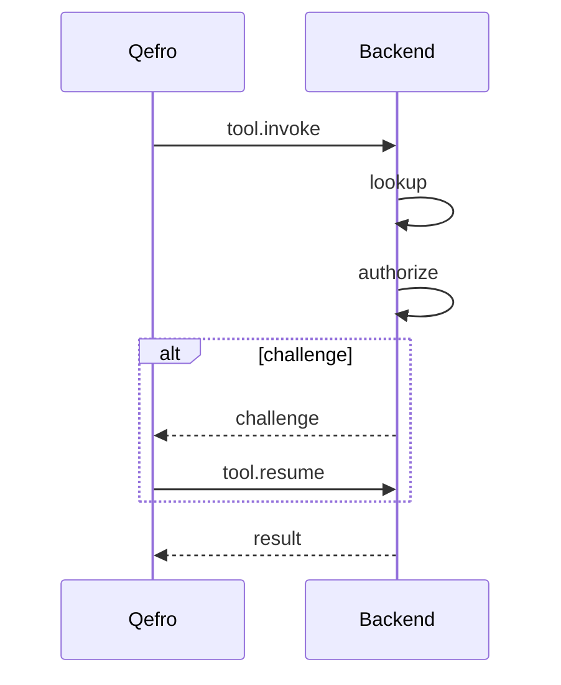

Customer Provider separates identity from authentication.

## lookup
Resolve customer from channel identity.

## authorize
Return one of:
- success
- challenge
- denied
- not_found

## Lifecycle

## Common patterns
- OTP
- JWT reuse
- OAuth session
- passkey gateway integration
