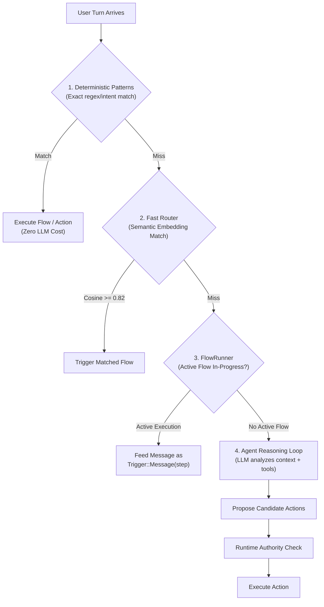

import { InfoBox, RelatedTopics } from '@site/src/components';

# Qefro Runtime Architecture

The **Qefro Runtime** (`ai-customer-support`) is the core multi-tenant execution engine powering the platform. It executes conversational chat, Hybrid RAG, FlowRunner state machines, Marketplace App entity operations, and external tool invocations.

```text
                                  Qefro Runtime
                                        │
    ┌──────────────────┬────────────────┼─────────────────┬─────────────────┐
    ▼                  ▼                ▼                 ▼                 ▼
Conversation          RAG          FlowRunner      Runtime Actions       Event
 Execution         Retrieval      Orchestrator        & Storage           Bus
    │                  │                │                 │                 │
Intent Match      BM25 + Dense    Step State        Entity CRUD /       Postgres
& Fast Router     Vector Ground   Machine           HTTP Executor       Idempotent
```

---

## 1. Core Responsibilities

The Runtime engine strictly separates responsibilities across the execution stack:

```text
Qefro Runtime
├── Conversation execution       # WebSocket/HTTP chat turn loop, slot harvesting
├── RAG / knowledge execution    # Query vectorization, hybrid fusion, context chunking
├── Tool/action execution        # Validation, RBAC checks, parameter stripping, invocation
├── FlowRunner                   # Deterministic multi-step state machine
├── Event handling               # Event bus persistence, idempotency, and dispatch
├── Marketplace App runtime      # Interpretation of installed YAML metadata packages
├── Entity operations            # CRUD and availability against triple-keyed storage
├── Runtime actions              # Native entity tools and generic HTTP executor calls
├── Approval/wait/resume         # Non-blocking pause for human input, upload, or approval
├── Execution state              # Durable state tracking in PostgreSQL and Redis
├── Idempotency                  # Duplicate detection via hashes and operation tokens
├── Audit logging                # Immutable security, turn, and tool invocation logs
└── Security & authority         # Runtime authority stripping and role enforcement
```

---

## 2. Model Reasoning vs. Runtime Authority

A core architectural principle of Qefro is:

> **The model is not the authority boundary.**

The LLM is a reasoning and natural-language engine, **not** an authorization or execution authority. The platform separates intent from execution through a rigorous verification pipeline:

```text
[End User Message or Event]
            │
            ▼
   Model Reasoning / Intent
   (Proposes intent and candidate action parameters)
            │
            ▼
    Candidate Action
   (e.g., `entity.reservation.create`, `tools.cancel_order`)
            │
            ▼
┌───────────────────────────────────────────────────────────┐
│              RUNTIME AUTHORIZATION BOUNDARY               │
│                                                           │
│  1. Authority Stripping:                                  │
│     Silently strips `tenant_id`, `workspace_id`,          │
│     `installation_id`, `person_id`, `created_by`          │
│                                                           │
│  2. RBAC & Permissions:                                   │
│     Verifies Org Role (Owner/Admin/Member) and App Role   │
│     (`require_entity_permission()`)                       │
│                                                           │
│  3. Expand Trust Boundary:                                │
│     Discards user/LLM `expand` controls; only accepts      │
│     admin-authored flow constants                         │
│                                                           │
│  4. Identity Injection:                                   │
│     Injects verified `person_id` from authenticated       │
│     session identity (Customer Hub)                       │
│                                                           │
│  5. Input Validation:                                     │
│     Schema types, required constraints, positive limits   │
└───────────────────────────────────────────────────────────┘
            │
            ▼
     Actual Execution
  (RuntimeAdapter mutates database or calls external SDK)
            │
            ▼
     Event Emission
  (Emits `reservation.created` onto PostgreSQL event bus)
```

### What the LLM Can and Cannot Do

| Capability | LLM Authority | Runtime Authority |
|---|---|---|
| Propose tool parameters (name, dates, notes) | **Yes** (candidate values) | Validated against entity schema |
| Specify `tenant_id` or `workspace_id` | **No** (unconditionally stripped) | Injected from authenticated context |
| Specify `person_id` or Customer Identity | **No** (unconditionally stripped) | Injected from verified Customer Hub session |
| Execute arbitrary backend queries | **No** | Denied (only registered capabilities allowed) |
| Join/expand related entity trees | **No** (LLM expand discarded) | Controlled by admin-authored flow constants |
| Trigger database mutations directly | **No** | Routed through `RuntimeAdapter` with RBAC |

---

## 3. Four-Tier Message Routing

Every message entering the Runtime is routed through four execution tiers, maximizing performance and determinism while minimizing model compute:



1. **Deterministic Patterns:** Exact string or slash-command matches (`/cancel`, `/help`, preset options). Fast and zero LLM cost.
2. **Fast Router:** Uses dense embedding vector similarity (`cosine >= 0.82`) to map user utterances to declared flow triggers without running a full LLM turn.
3. **FlowRunner:** If an active conversation execution exists in PostgreSQL/Redis, the message is fed into the active step as a `Trigger::Message`.
4. **Agent Reasoning Loop:** If no deterministic match or active flow applies, the LLM reasons over the grounded RAG context and available tools, returning candidate tool invocations.

---

## 4. Execution State & Durability

The Runtime engine ensures resilience across long-running interactions:

### State Persistence
- **PostgreSQL:** Durable record of all conversation turns, messages, flow executions (`flow_executions` table), entity mutations, and audit events.
- **Redis:** Fast cache for active execution sessions (`active_flow_execution:{conversation_id}`) with automatic 30-day TTL and session token tracking.

### Idempotency
- Every mutation request and event carries an idempotency key (`idempotency_key` or message UUID).
- Duplicate requests return the cached result rather than re-executing steps or double-charging transactions.

### Concurrency Protection
- **Single Active Flow:** Enforced by partial unique index in PostgreSQL (`WHERE status = 'running'`). A conversation cannot run conflicting flows concurrently.
- **Optimistic Locking:** Entities support `concurrency: optimistic`, using version integers (`version: N`) to prevent lost updates during simultaneous writes.

---

## 5. Runtime Adapters: Dispatching Tool Execution

When an action is approved for execution, the Runtime dispatches it via `ExecutionBackend`:

```rust
pub enum ExecutionBackend {
    Sdk,                          // External ERP / POS / CRM tools via signed webhook
    Runtime { solution: String }, // Metadata Marketplace Apps executed by Qefro
}
```

- **Runtime (Metadata Apps):** Handled by `RuntimeAdapter`. Translates `entity.{name}.{create|list|get|update|delete|availability}` operations directly to the storage service against triple-scoped collections `(tenant_id, workspace_id, installation_id)`.
- **SDK (External Systems):** Handled by `SDKAdapter`. Dispatches an HMAC-signed HTTPS POST request (`POST /qefro`) to the external server running `@qefro-ai/backend` or `qefro-backend-sdk`.
- **Security Isolation:** Security gates (`deny_sdk_runtime_entity`, `deny_sdk_http_runtime`) strictly prevent external SDK backends from accessing or mutating native Marketplace storage entities.

---

## Related Documentation

<RelatedTopics
  topics={[
    {label: 'FlowRunner Architecture', to: '/docs/developer/concepts/flows'},
    {label: 'Architecture Overview', to: '/docs/architecture/overview'},
    {label: 'AI Agent Security', to: '/docs/concepts/ai-agent-security'},
    {label: 'Entity Schemas', to: '/docs/solutions/entity-schema'},
    {label: 'External SDK Connections', to: '/docs/developer/external-sdk-connection'},
  ]}
/>
