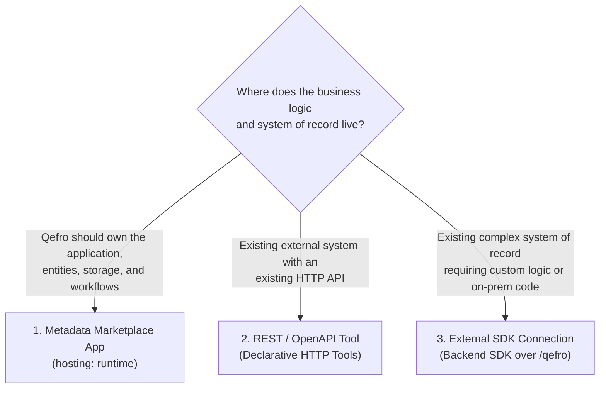

# Integration Models & Decision Guide

Qefro provides three distinct ways to build capabilities and integrate software systems. Choosing the right model depends on **who owns the application and where the system of record lives**:



---

## 1. The Three Models Compared

| Dimension | 1. Marketplace App | 2. REST / OpenAPI Tool | 3. External SDK Connection |
|---|---|---|---|
| **Primary Intent** | Build a domain application native to Qefro. | Call an existing third-party or internal REST API. | Bridge an existing enterprise backend or on-prem ERP. |
| **Execution Engine** | **Qefro Runtime** (FlowRunner + RuntimeAdapter). | **Generic HTTP Executor** in Qefro Runtime. | **External Server** running Qefro Backend SDK. |
| **Data Plane** | Qefro managed storage (triple-keyed). | External system API. | External system database. |
| **Hosting Requirement** | **None** (zero servers or containers). | **None** in Qefro (calls existing API). | Customer or partner infrastructure. |
| **Authentication** | Runtime RBAC & platform identity. | Encrypted API keys, Bearer tokens, Basic auth. | Shared HMAC secret (`X-Qefro-Signature`). |
| **Packaging** | Metadata package (`manifest.yaml`, `entities/`, etc.). | OpenAPI 3.0/3.1 spec or HTTP tool YAML. | NPM/PyPI/Cargo library running in service. |

---

## 2. Model 1: Metadata Marketplace App

### Choose this when
> **You are building a domain application that Qefro can own and operate natively.**

You do not have an existing backend for this business function, or you want a turnkey application that runs across workspaces without infrastructure management.

### Examples
- **Hospitality & Restaurants:** Table management, reservation scheduling, menu catalogs, takeaway ordering.
- **Appointments & Clinics:** Patient intake, doctor scheduling, slot availability, consultations.
- **Real Estate:** Property listings, lead management, viewing appointment booking.
- **Internal Operations:** Equipment checkout, maintenance request tracking, internal approvals.
- **Commerce Extensions:** Catalog management with native entity storage.

### Architecture

```text
Developer ──▶ qefro app init ──▶ Metadata Package ──▶ Publish ──▶ Install ──▶ Qefro Runtime
```

- No server code.
- Declarative entities, workflows, and UI.
- Learn more: **[Marketplace App Development Tutorial](/docs/developer/managed-marketplace-app)** · **[Build Your First App](/docs/solutions/build-your-first-app)**.

---

## 3. Model 2: REST / OpenAPI Integration

### Choose this when
> **The external system already exposes a usable, documented HTTP/REST API.**

You have an existing cloud SaaS product, microservice, or webhook provider with an accessible HTTP endpoint, and you want AI assistants or workflows to call it directly.

### Examples
- Querying weather or flight status APIs.
- Triggering marketing emails via SendGrid or Postmark.
- Creating support tickets in Zendesk or Freshdesk.
- Fetching product catalog data from an existing microservice.

### Architecture

```text
Qefro Runtime ──▶ Encrypted HTTP Call (Bearer/API Key) ──▶ External REST API
```

- Import an OpenAPI 3.0/3.1 specification directly in the Admin Console or define HTTP tool YAML.
- Credentials stored encrypted with AES-256-GCM.
- Learn more: **[Connect REST APIs](/docs/guides/connect-rest-apis)** · **[Import OpenAPI](/docs/guides/import-openapi)**.

---

## 4. Model 3: External SDK Connection

### Choose this when
> **The business already has an established external system of record requiring custom logic, on-prem access, or complex transactions.**

The data cannot or should not be duplicated into Qefro, or requires specialized adapters, proprietary database drivers, or private VPC networking.

### Examples
- **Enterprise ERPs:** Focus ERP, SAP, Microsoft Dynamics, ERPNext, Odoo.
- **Legacy POS Systems:** On-premise retail POS or hospitality point-of-sale servers.
- **Custom Backends:** Internal core banking, insurance claims engines, or proprietary databases.

### Architecture

```text
Customer Infrastructure (ERP / POS / DB)
            │
            ▼
   Custom SDK Backend
    (POST /qefro)
            │
            ▼
      SDKAdapter
            │
            ▼
      Qefro Runtime
```

- Developer implements handlers using `@qefro-ai/backend` (TypeScript), `qefro-backend` (Python), or `qefro-backend-sdk` (Rust).
- Qefro communicates with the backend via signed HTTPS webhooks with HMAC validation.
- Learn more: **[External SDK Connection Guide](/docs/developer/external-sdk-connection)** · **[Backend SDK Reference](/docs/business-tools/backend-sdk)**.

---

## 5. Summary Decision Tree

```text
Are you building a domain application from scratch?
 ├─ YES ──▶ Metadata Marketplace App (hosting: runtime)
 └─ NO  ──▶ Does the system expose a standard REST API?
             ├─ YES ──▶ REST / OpenAPI Tool
             └─ NO  ──▶ External SDK Connection (POST /qefro)
```

---

## Related Documentation

- [Runtime vs SDK Comparison](/docs/solutions/runtime-vs-sdk)
- [Marketplace App Development](/docs/developer/managed-marketplace-app)
- [External SDK Connection](/docs/developer/external-sdk-connection)
- [Connect REST APIs](/docs/guides/connect-rest-apis)
