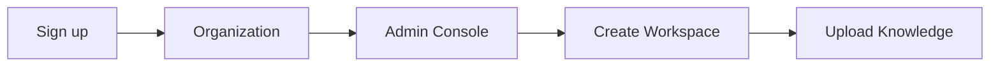

import {
  InfoBox,
  Warning,
  RelatedTopics,
  FaqAccordion,
  WorkflowCard,
} from '@site/src/components';

# Installation

**Installation** means creating your Qefro organization and accessing the Admin Console at app.qefro.com — no self-hosted infrastructure is required for the cloud product.

## Introduction

Qefro is delivered as a multi-tenant cloud platform. You sign up, create an organization, and configure AI Workspaces from the Admin Console. Optional self-hosted and private deployment options are available for Enterprise customers.

## Why it exists

Teams need a low-friction path from signup to a working workspace without standing up vector databases, LLM gateways, or RAG pipelines themselves.

## Concepts

- **Organization** — your company tenant on Qefro
- **Admin Console** — `https://app.qefro.com` for configuration
- **Workspace** — an isolated AI context (for example Customer Support or HR)
- **Plan** — Free, Starter, Growth, or Enterprise limits

## Architecture

Cloud signup creates a tenant, default Free plan, and empty workspace capacity ready for knowledge and tools.



## Workflow

<WorkflowCard
  title="Install (cloud)"
  steps={[
    {title: 'Create account', description: 'Register at app.qefro.com with a work email.'},
    {title: 'Verify email', description: 'Confirm ownership so invitations and billing work.'},
    {title: 'Name organization', description: 'Choose a display name and optional subdomain.'},
    {title: 'Invite admins', description: 'Add Owners/Admins before production changes.'},
  ]}
/>

## Code examples

```bash
# Open the Admin Console
open https://app.qefro.com

# API base (authenticated requests)
export QEFRO_API=https://api.qefro.com
```

```typescript
// Example: health check against the public API host
const res = await fetch('https://api.qefro.com/health');
console.log(await res.text());
```

## Best practices

- Use a shared admin mailbox only if audit ownership is clear
- Enable MFA for Owner accounts before connecting production APIs
- Create separate workspaces for Customer Support vs internal HR/IT

## Security notes

<Warning>
Never embed long-lived API secrets in website JavaScript. Use the widget JWT flow and server-side Business Tools credentials instead.
</Warning>

## FAQ

<FaqAccordion items={[
  {
    "question": "Do I need to install Docker locally?",
    "answer": "Not for the cloud product. Docker is relevant only for private/Enterprise deployments."
  },
  {
    "question": "Is there a free plan?",
    "answer": "Yes. Free includes limited conversations and one business system connection for evaluation."
  }
]} />

## Related topics

<RelatedTopics topics={[
  {
    "label": "Quick Start",
    "to": "/docs/getting-started/quick-start"
  },
  {
    "label": "Organizations",
    "to": "/docs/platform/organizations"
  },
  {
    "label": "Deployment",
    "to": "/docs/platform/deployment"
  }
]} />

