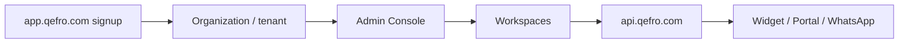

import {
  InfoBox,
  Warning,
  Success,
  RelatedTopics,
  FaqAccordion,
  WorkflowCard,
  ApiEndpointCard,
  ComparisonTable,
} from '@site/src/components';
import Tabs from '@theme/Tabs';
import TabItem from '@theme/TabItem';

# Installation


**Installation** for Qefro cloud means signing up at [app.qefro.com](https://app.qefro.com), verifying email, and creating an organization (tenant). You do not install vector databases, LLM gateways, or RAG infrastructure yourself.

## Introduction

Qefro is a multi-tenant SaaS platform. Production hosts:

| Surface | URL |
| --- | --- |
| Marketing | https://qefro.com |
| Admin Console | https://app.qefro.com |
| API | https://api.qefro.com |
| Widget CDN | https://cdn.qefro.com/widget.js |
| Internal Portal | `your-company.qefro.com` (or custom domain) |

## Why it exists

Teams need Customer AI and Employee AI without operating embedding pipelines, hybrid search, or tool-execution sandboxes.

## Concepts

- **Organization / tenant** — billing and isolation boundary created at signup
- **Admin Console** — configure workspaces, knowledge, Business Tools, channels, RBAC
- **Workspace** — isolated knowledge + tools + conversations (e.g. Customer Support, HR)
- **Plan** — Free, Starter, Growth, Enterprise (Razorpay billing)

## Architecture



## Workflow

<WorkflowCard
  title="Cloud setup"
  steps={[
    {title: 'Register', description: 'Create an account at app.qefro.com with a work email.'},
    {title: 'Verify email', description: 'Complete OTP / email verification before inviting teammates.'},
    {title: 'Create organization', description: 'Choose a display name and tenant slug (used for your-company.qefro.com).'},
    {title: 'Open Admin Console', description: 'Create your first workspace and upload knowledge.'},
  ]}
/>

## Code examples

<Tabs>
  <TabItem value="bash" label="Bash" default>

```bash
# Health (no auth)
curl -sS https://api.qefro.com/health

# Ready (dependencies)
curl -sS https://api.qefro.com/ready
```

  </TabItem>
  <TabItem value="ts" label="TypeScript">

```typescript
const res = await fetch('https://api.qefro.com/health');
console.log(await res.text());
```

  </TabItem>
</Tabs>

## Best practices

- Use a real company email for ownership and billing
- Enable MFA / strong passwords on Owner accounts before connecting production APIs
- Prefer separate workspaces for Customer Support vs internal HR/IT

## Security notes

<Warning>
Never put long-lived Business Tool secrets or Admin Console JWTs in website JavaScript. Widget embeds use a publishable widget token; tool credentials stay encrypted server-side.
</Warning>

## FAQ

<FaqAccordion items={[
  {question: 'Do I need Docker?', answer: 'Not for Qefro cloud. Private / Enterprise deployment is a separate conversation with Sales.'},
  {question: 'Where is GraphQL?', answer: 'Primary Admin Console API is GraphQL at POST https://api.qefro.com/graphql (authenticated). REST covers uploads, billing, tools, widget, WhatsApp, and org RBAC.'},
]} />

## Related topics

<RelatedTopics topics={[
  {label: 'Quick Start', to: '/docs/getting-started/quick-start'},
  {label: 'Organizations', to: '/docs/platform/organizations'},
  {label: 'Authentication', to: '/docs/platform/authentication'},
  {label: 'API Authentication', to: '/docs/api/authentication'},
]} />


