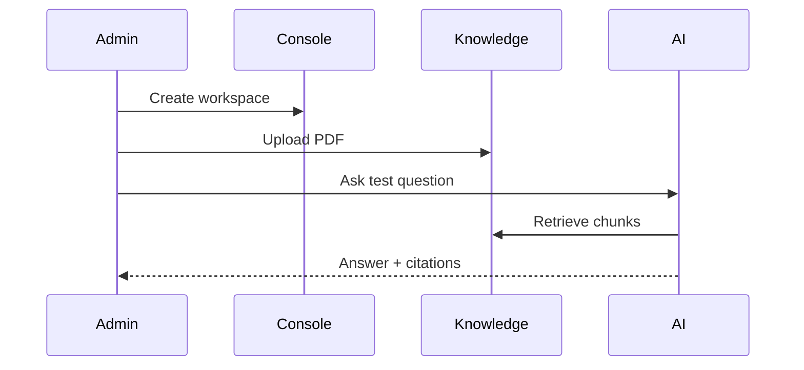

import {
  InfoBox,
  Warning,
  RelatedTopics,
  FaqAccordion,
  WorkflowCard,
} from '@site/src/components';

# Quick Start

**Quick Start** walks through creating a workspace, adding documents, and testing Customer AI in the Admin Console.

## Introduction

This guide produces a working AI Workspace grounded on your documents. You will not yet expose a public widget or WhatsApp channel — that comes in the deploy guides.

## Why it exists

A short path from empty tenant to cited answers validates retrieval quality before you connect actions or channels.

## Concepts

- **Document** — PDF, DOCX, Markdown, TXT, or crawled page
- **Citation** — source reference returned with answers
- **Instruction** — system guidance for tone and scope

## Architecture

Upload → chunk/embed → hybrid retrieve → generate with citations.



## Workflow

<WorkflowCard
  title="First workspace"
  steps={[
    {title: 'Create workspace', description: 'Name it (e.g. Customer Support).'},
    {title: 'Upload docs', description: 'Add policies, FAQs, and product guides.'},
    {title: 'Set instructions', description: 'Define tone, language, and refusal behavior.'},
    {title: 'Test chat', description: 'Ask questions that should and should not be answerable.'},
  ]}
/>

## Code examples

```json
{
  "workspace": "customer-support",
  "instructions": "Answer only from knowledge. Cite sources. Refuse when unsure."
}
```

## Best practices

- Start with 5–20 high-quality documents, not an entire drive dump
- Test refusal: ask something outside the corpus
- Keep Customer Support and Employee AI in separate workspaces

## Security notes

<InfoBox>
Workspace knowledge is isolated. Documents in HR must not appear in Customer Support answers.
</InfoBox>

## FAQ

<FaqAccordion items={[
  {
    "question": "How long until documents are searchable?",
    "answer": "Usually seconds to a few minutes depending on size and OCR."
  },
  {
    "question": "Can I use website crawl instead of upload?",
    "answer": "Yes — see Knowledge Platform."
  }
]} />

## Related topics

<RelatedTopics topics={[
  {
    "label": "AI Workspaces",
    "to": "/docs/platform/ai-workspaces"
  },
  {
    "label": "Knowledge Platform",
    "to": "/docs/platform/knowledge-platform"
  },
  {
    "label": "Build AI Customer Support",
    "to": "/docs/guides/build-ai-customer-support"
  }
]} />

