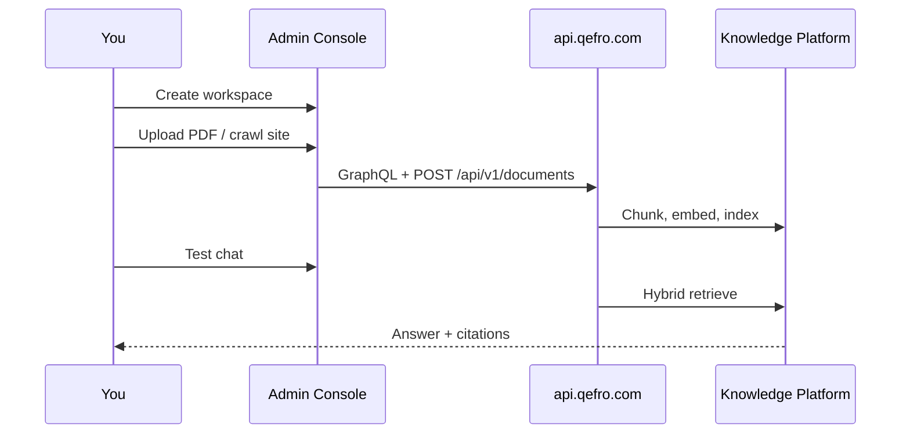

import {
  InfoBox,
  Warning,
  Success,
  RelatedTopics,
  FaqAccordion,
  WorkflowCard,
  ApiEndpointCard,
  ComparisonTable,
} from '@site/src/components';
import Tabs from '@theme/Tabs';
import TabItem from '@theme/TabItem';

# Quick Start


**Quick Start** gets you from an empty organization to cited answers in the Admin Console, then optionally to a live website widget.

## Introduction

In Qefro, knowledge is scoped to a **workspace**. Customer AI (widget / WhatsApp) and Employee AI (Internal Portal) both bind to workspaces you configure in the Admin Console.

## Why it exists

Validating retrieval quality before connecting Business Tools or public channels avoids shipping an inaccurate assistant.

## Concepts

- **Document** — PDF, DOCX, Markdown, TXT, or crawled pages; chunked and indexed with hybrid BM25 + vector retrieval
- **Citation** — answers include source references; the model is instructed to refuse when no relevant source exists
- **Widget token** — publishable embed key from **Widget** in the Admin Console (rotatable)

## Architecture



## Workflow

<WorkflowCard
  title="First productive workspace"
  steps={[
    {title: 'Create workspace', description: 'Admin Console → Workspaces (e.g. Customer Support).'},
    {title: 'Add knowledge', description: 'Documents → upload files or start a website crawl.'},
    {title: 'Set instructions', description: 'Define tone, languages, and refusal behavior for the assistant.'},
    {title: 'Test in console', description: 'Ask in-scope and out-of-scope questions; check citations.'},
    {title: 'Embed widget (optional)', description: 'Widget page → copy script with data-token and data-workspace-id.'},
  ]}
/>

## Code examples

Website embed (values come from Admin Console → Widget):

```html
<script
  src="https://cdn.qefro.com/widget.js"
  data-token="YOUR_WIDGET_TOKEN"
  data-endpoint="https://api.qefro.com"
  data-theme="auto"
  data-position="bottom-right"
  data-workspace-id="YOUR_WORKSPACE_ID">
</script>
```

## Best practices

- Start with 5–20 high-quality docs, not a full drive dump
- Keep customer-facing and employee knowledge in separate workspaces
- Test refusal: ask something outside the corpus

## Security notes

<InfoBox>
Workspace knowledge is isolated. HR documents must not answer Customer Support widget questions.
</InfoBox>

## FAQ

<FaqAccordion items={[
  {question: 'How long until uploads are searchable?', answer: 'Usually seconds to a few minutes depending on size and OCR.'},
  {question: 'Is chat WebSocket or HTTP?', answer: 'The widget prefers WebSocket at /ws/chat?token=… with HTTP SSE fallback at POST /api/v1/widget/chat.'},
]} />

## Related topics

<RelatedTopics topics={[
  {label: 'AI Workspaces', to: '/docs/platform/ai-workspaces'},
  {label: 'Knowledge Platform', to: '/docs/platform/knowledge-platform'},
  {label: 'Website Widget', to: '/docs/platform/website-widget'},
  {label: 'Build AI Customer Support', to: '/docs/guides/build-ai-customer-support'},
]} />


