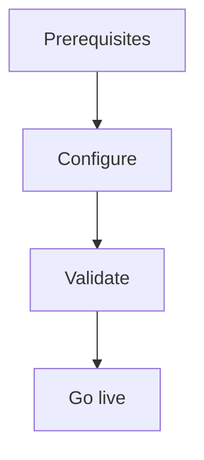

import {
  InfoBox,
  Warning,
  RelatedTopics,
  FaqAccordion,
  WorkflowCard,
} from '@site/src/components';

# Build AI Customer Support


**Build AI Customer Support** — Ship a Support workspace with knowledge, widget, and optional tools.

## Introduction

Follow this guide using the Admin Console at [app.qefro.com](https://app.qefro.com) and APIs on [api.qefro.com](https://api.qefro.com).

## Why it exists

Guides encode the recommended path so teams avoid insecure shortcuts.

## Concepts

See linked platform pages for definitions used in this guide.

## Architecture




Build a **Customer Support** workspace, ingest FAQs, embed the widget, then optionally add Business Tools.

## Workflow

<WorkflowCard title="Customer Support launch" steps={[
  {title: 'Create workspace', description: 'Name it Customer Support.'},
  {title: 'Upload knowledge', description: 'Policies, FAQs, product docs.'},
  {title: 'Test citations', description: 'In-console chat.'},
  {title: 'Embed widget', description: 'Admin Console → Widget with data-workspace-id.'},
  {title: 'Optional tools', description: 'Read-only order lookup + identify().'},
]} />

## Code examples

```html
<script
  src="https://cdn.qefro.com/widget.js"
  data-token="YOUR_WIDGET_TOKEN"
  data-endpoint="https://api.qefro.com"
  data-workspace-id="YOUR_WORKSPACE_ID">
</script>
```

## Security notes

<Warning>
Keep HR knowledge out of this workspace.
</Warning>

## FAQ

<FaqAccordion items={[
  {question: 'WhatsApp?', answer: 'Add on Growth+ using the same workspace if desired.'},
]} />

## Related topics

<RelatedTopics topics={[
  {label: 'Customer AI', to: '/docs/platform/customer-ai'},
  {label: 'Website Widget', to: '/docs/platform/website-widget'},
  {label: 'Knowledge Platform', to: '/docs/platform/knowledge-platform'},
]} />


