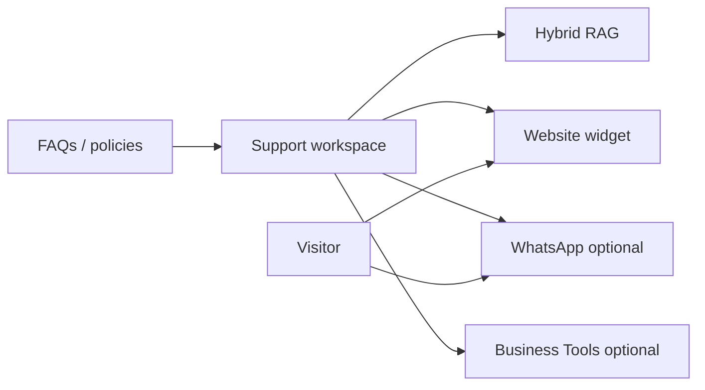

import {
  InfoBox,
  Warning,
  Success,
  RelatedTopics,
  FaqAccordion,
  WorkflowCard,
} from '@site/src/components';

# Build AI Customer Support

This guide ships **Customer AI** for support: one Support workspace, grounded answers with citations, a website widget, and optional WhatsApp / Business Tools.

## Outcome

When you finish, you will have:

- A **Customer Support** AI Workspace on [app.qefro.com](https://app.qefro.com)
- Knowledge ingested and citation-checked
- The [website widget](/docs/platform/website-widget) bound to that workspace
- A clear path to WhatsApp (Growth+) and read-only tools

## Prerequisites

- Organization account at [app.qefro.com](https://app.qefro.com)
- Owner or Admin role
- Customer-safe documents (FAQs, policies, product docs) — **not** HR/payroll files

## Architecture



## Step 1 — Create the Support workspace

1. Open Admin Console → Workspaces.
2. Create a workspace named **Customer Support** (or similar).
3. Set instructions: tone, language, and “refuse when sources are missing.”

Platform background: [AI Workspaces](/docs/platform/ai-workspaces), [What is an AI Workspace?](/docs/concepts/what-is-an-ai-workspace).

## Step 2 — Ingest knowledge

1. Upload PDFs/docs or crawl approved public URLs.
2. Prefer canonical sources over stale wiki dumps.
3. Wait for indexing to finish; reindex if you replace a file.

Platform: [Knowledge Platform](/docs/platform/knowledge-platform), [Hybrid RAG](/docs/concepts/hybrid-rag).

## Step 3 — Validate answers

Ask at least ten real support questions in the console:

| Check | Pass criteria |
| --- | --- |
| Citations | Answer points at the right doc |
| Identifiers | SKUs / error codes resolve |
| Unknown topics | Assistant refuses instead of inventing policy |
| Isolation | HR canaries (if any) never appear |

## Step 4 — Embed the website widget

```html
<script
  src="https://cdn.qefro.com/widget.js"
  data-token="YOUR_WIDGET_TOKEN"
  data-endpoint="https://api.qefro.com"
  data-workspace-id="YOUR_SUPPORT_WORKSPACE_ID">
</script>
```

Copy the token and workspace id from Admin Console → Widget. Full guide: [Deploy Website Widget](/docs/guides/deploy-website-widget).

## Step 5 — Optional: WhatsApp

On Growth+, bind the **same** Support workspace to WhatsApp so answers stay consistent. Guide: [Deploy WhatsApp AI](/docs/guides/deploy-whatsapp-ai).

## Step 6 — Optional: Business Tools

Only after citations are solid:

1. Add a **read-only** tool (e.g. order status).
2. Use [`identify()`](/docs/platform/identity-forwarding) when the API needs the logged-in customer.
3. Monitor tool logs for a week before enabling writes.

Guides: [Connect REST APIs](/docs/guides/connect-rest-apis), [Secure Business Actions](/docs/guides/secure-business-actions).

## Workflow checklist

<WorkflowCard
  title="Customer Support launch"
  steps={[
    {title: 'Create Support workspace', description: 'Customer-safe corpus only.'},
    {title: 'Ingest + cite-test', description: 'Ten real questions minimum.'},
    {title: 'Embed widget', description: 'Token + workspace id + api.qefro.com.'},
    {title: 'Optional WhatsApp', description: 'Same workspace on Growth+.'},
    {title: 'Optional read-only tools', description: 'identify() + logs before writes.'},
  ]}
/>

<Warning>
Keep HR, payroll, and internal incident docs out of this workspace. Use a separate Employee AI workspace for those.
</Warning>

## FAQ

<FaqAccordion
  items={[
    {
      question: 'Can Support and HR share one workspace?',
      answer:
        'Not recommended. Public channels must not retrieve internal HR content. See Customer AI vs Employee AI.',
    },
    {
      question: 'When should I add WhatsApp?',
      answer:
        'After website citation quality is acceptable. WhatsApp multiplies a bad knowledge base.',
    },
    {
      question: 'Do I need Business Tools on day one?',
      answer: 'No. Many teams ship knowledge-only Customer AI first.',
    },
  ]}
/>

<Success>
Next: [Production Deployment](/docs/guides/production-deployment) before inviting real traffic.
</Success>

## Related topics

<RelatedTopics
  topics={[
    {label: 'Customer AI', to: '/docs/platform/customer-ai'},
    {label: 'Customer AI vs Employee AI', to: '/docs/concepts/customer-ai-vs-employee-ai'},
    {label: 'Deploy Website Widget', to: '/docs/guides/deploy-website-widget'},
    {label: 'Deploy WhatsApp AI', to: '/docs/guides/deploy-whatsapp-ai'},
    {label: 'Secure Business Actions', to: '/docs/guides/secure-business-actions'},
    {label: 'Tutorial: widget to WhatsApp', to: '/blog/widget-to-whatsapp'},
  ]}
/>
