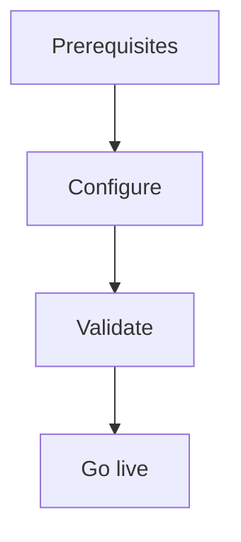

import {
  InfoBox,
  Warning,
  RelatedTopics,
  FaqAccordion,
  WorkflowCard,
} from '@site/src/components';

# Configure RBAC

**Configure RBAC** — Owners, Admins, Members, teams, and workspace grants.

## Introduction

Follow this guide using the Admin Console at [app.qefro.com](https://app.qefro.com) and APIs on [api.qefro.com](https://api.qefro.com).

## Why it exists

Guides encode the recommended path so teams avoid insecure shortcuts.

## Concepts

See linked platform pages for definitions used in this guide.

## Architecture

## Workflow

<WorkflowCard title="RBAC" steps={[
  {title: 'Invite users', description: '/api/v1/team/invite.'},
  {title: 'Assign roles', description: 'Owner/Admin/Member.'},
  {title: 'Create teams', description: '/api/v1/org/teams.'},
  {title: 'Grant workspaces', description: 'Team ↔ workspace mapping.'},
  {title: 'Optional write', description: 'Document write per member.'},
]} />

## Related topics

<RelatedTopics topics={[
  {label: 'RBAC', to: '/docs/platform/rbac'},
  {label: 'Teams', to: '/docs/platform/teams'},
]} />

