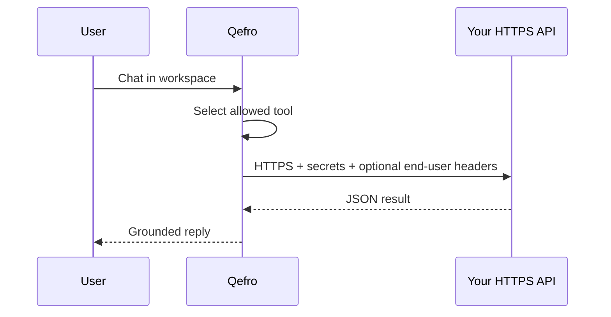

import {
  InfoBox,
  Warning,
  RelatedTopics,
  FaqAccordion,
  WorkflowCard,
  ApiEndpointCard,
} from '@site/src/components';

# Connect REST APIs

This guide creates a **Business Tool** that calls your HTTPS API so the assistant can run **Business Actions** during chat.

## Outcome

- A REST tool bound to one workspace
- Credentials stored encrypted (not in the browser)
- A successful console test
- Awareness of SSRF limits and logging

## Prerequisites

- Owner/Admin access
- An HTTPS endpoint you control (or vendor API with a scoped key)
- Decision: which workspace may use this tool (Support vs HR, etc.)

## Concepts

| Term | Meaning |
| --- | --- |
| Business Tool | Connector definition |
| Business Action | One runtime invocation |

Read: [What are Business Actions?](/docs/concepts/business-actions), [Business Tools](/docs/platform/business-tools).

## Architecture



## Step 1 — Pick a safe first endpoint

Prefer **read-only** `GET` (order status, ticket status). Avoid refunds, deletes, or bulk exports on day one.

## Step 2 — Create the tool in the workspace

In Admin Console → workspace → Business Tools / integrations:

1. Choose REST.
2. Set method + URL template.
3. Add encrypted auth (Bearer, header API key, etc.).
4. Describe parameters the model may fill.

## Step 3 — Test

Use the console test action or:

<ApiEndpointCard
  method="POST"
  path="/api/v1/tools/:id/test"
  description="Execute a dry-run / test invocation for a Business Tool."
/>

```bash
curl -sS -X POST \
  -H "Authorization: Bearer $USER_JWT" \
  -H "Content-Type: application/json" \
  https://api.qefro.com/api/v1/tools/$TOOL_ID/test \
  -d '{"arguments":{"order_id":"123"}}'
```

## Step 4 — Review logs

```bash
curl -sS -H "Authorization: Bearer $USER_JWT" \
  https://api.qefro.com/api/v1/tools/$TOOL_ID/logs
```

See [Audit Logs](/docs/security/audit-logs).

## Step 5 — Enable for chat carefully

- Customer AI: add [`identify()`](/docs/platform/identity-forwarding) if your API authorizes end users
- Employee AI: ensure only internal workspaces have internal tools

## Workflow checklist

<WorkflowCard
  title="REST tool launch"
  steps={[
    {title: 'Choose read-only HTTPS API', description: 'Scoped vendor key.'},
    {title: 'Create tool in one workspace', description: 'Encrypt credentials.'},
    {title: 'Test + fix errors', description: 'Do not enable chat yet.'},
    {title: 'Enable for assistants', description: 'Monitor logs for a week.'},
    {title: 'Consider writes later', description: 'Idempotency + human approval.'},
  ]}
/>

<Warning>
Tool URLs are SSRF-checked. Private IPs, link-local, and many metadata endpoints are blocked. Use public HTTPS APIs or approved allowlisted destinations.
</Warning>

## FAQ

<FaqAccordion
  items={[
    {
      question: 'REST vs OpenAPI import?',
      answer:
        'Use this guide for one-off endpoints. Use Import OpenAPI when you have a spec with many operations to preview/apply. Use Register SDK Business Tools when auth or custom logic belongs in your backend code.',
    },
    {
      question: 'Where do secrets live?',
      answer: 'Encrypted in Qefro tool config — never in widget JavaScript. See Secrets.',
    },
  ]}
/>

## Related topics

<RelatedTopics
  topics={[
    {label: 'Import OpenAPI', to: '/docs/guides/import-openapi'},
    {label: 'Register SDK Business Tools', to: '/docs/guides/register-sdk-business-tools'},
    {label: 'Secure Business Actions', to: '/docs/guides/secure-business-actions'},
    {label: 'Business Tools', to: '/docs/platform/business-tools'},
    {label: 'Secrets', to: '/docs/security/secrets'},
    {label: 'AI Agent Security', to: '/docs/concepts/ai-agent-security'},
    {label: 'Identity Forwarding', to: '/docs/platform/identity-forwarding'},
  ]}
/>
